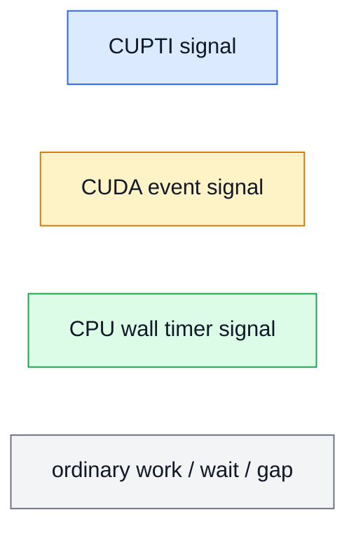
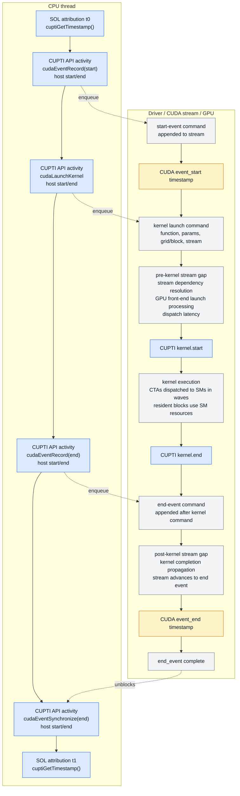
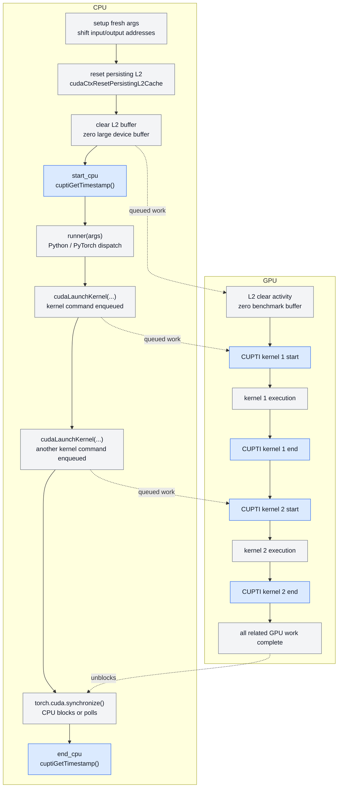
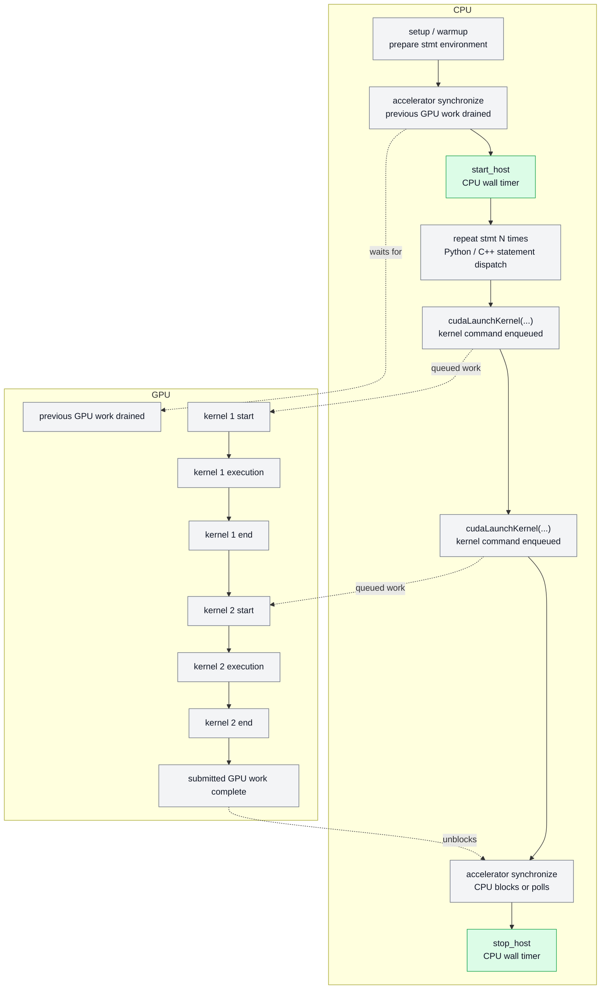

# GPU Benchmark 方法与 TileOps 计时实验调研笔记

更新日期：2026-08-03

这份笔记是 TileOps benchmark timing 讨论中的背景材料和实验归档，不是最终决策文档。它包含两部分内容：一是整理 GPU kernel 连续调度、初始化与计时边界，以及 NV SOL、PyTorch、Triton、FlashAttention / FA3 等常见 benchmark 方法的差异；二是记录 TileOps 本轮对 Kineto、SOL native CUPTI、CUDA event 和 CPU wall 等计时路径的本地实验结果。

## 1. GPU kernel 调度与计时基础

### 1.1 Kernel 在 GPU 上如何启动

CUDA kernel launch 对 CPU 是异步的。CPU 发出 launch 后通常很快返回；CUDA runtime / driver 会把 kernel function、grid/block 形状、参数地址、stream dependency 等信息提交到 GPU 可见的工作队列。GPU 侧调度器随后从队列中取出 work，把 thread blocks 分派到 SM 上执行。

一次 kernel 真正开始跑之前，通常已经需要满足几类前提。它们不是严格按下面顺序逐项发生；更准确地说，它们分布在 host runtime、CUDA driver、CUDA context、stream queue 和 GPU 执行侧。对 benchmark 来说，重要的是知道哪些可能落在第一次调用或 warmup 中，哪些才属于正式 kernel 的 GPU activity。

| 前提 | 主要发生位置 | 典型发生时间 | 是否严格排在 kernel launch 前 |
| --- | --- | --- | --- |
| kernel code 已经编译 | NVCC/AOT build、JIT compiler、Triton/TileLang compiler | 安装/构建时，或第一次调用/autotune 时 | 是。没有可执行 device code 就不能 launch |
| kernel code / module 已加载到当前 CUDA context | CUDA runtime / driver module management | 第一次调用该 kernel、显式 module load，或 lazy loading 触发时 | 逻辑上在该 kernel 执行前；可能由第一次 launch 隐式触发 |
| kernel 参数和输入/输出 tensor 地址已经确定 | host 侧 Python/C++ runtime、CUDA launch API | 每次 launch 时 | 是。launch command 需要携带参数值、指针、grid/block、shared memory、stream 等信息 |
| CUDA stream 里排在它前面的依赖已经完成 | GPU work queue / stream scheduler | GPU 执行前，由 stream 顺序和 event dependency 决定 | 是。它决定 kernel 何时能开始执行，但不一定阻塞 CPU launch 返回 |
| 必要的 library / handle 初始化已经发生 | host runtime、library runtime，例如 cuBLAS/cuDNN/FlashAttention wrapper | 通常在第一次调用、warmup 或显式 setup 阶段 | 对使用该 library 的 callable 是前置条件；不一定是每个底层 kernel 的前置步骤 |
| GPU 可以访问对应显存页和页表映射 | CUDA memory manager、GPU MMU、Unified Memory/page migration 机制 | `cudaMalloc`/allocator 分配后；managed memory 可能在首次 GPU 访问时迁移或 fault | 普通 device memory 通常已满足；managed/oversubscription 场景可能在 kernel 执行中触发 page fault |

这些动作不都发生在被测 kernel 的 GPU duration 里。比如 JIT 编译、module load、allocator 扩容、library handle 初始化通常发生在第一次调用或 warmup 阶段；CPU launch path 和 driver submit 通常在 host 侧；kernel activity duration 一般从 GPU 上 kernel 开始执行算起。

因此它们更像一组依赖关系，而不是每次 launch 都重复执行的线性步骤。steady-state benchmark 关心的是：正式计时前这些一次性或偶发性动作是否已经被 warmup/setup 吸收；正式窗口里留下的是 CPU submit、stream 排队、GPU kernel/memcpy/memset activity，还是纯 kernel activity。

先只看 **一个 kernel 被调用一次**。下面这张图的时间轴是从上到下；左侧是 CPU thread 发起 CUDA API，右侧是 CUDA driver / stream / GPU 侧逐步处理这些 work。图里同时标出了四类容易混淆的 timing marker：

```text
CUPTI Runtime/Driver API activity：每个 CUDA API 调用自己的 host-side start/end
SOL-style cupti.get_timestamp()：CPU 侧手动取 timestamp，形成 activity attribution window
CUDA event timestamp：event record 在 stream 上执行时产生的 start/end
CUPTI activity timestamp：kernel/memcpy/memset 等 GPU activity 的 start/end
```

图中的颜色在全文保持一致：



这是一个对比图：实际 benchmark backend 通常只选择其中一种或两种机制，不一定同时记录 CUDA events、SOL attribution timestamps 和 CUPTI API activities。尤其要注意，`cupti.get_timestamp()` 包住的是 CPU attribution window，不是 `cudaLaunchKernel` 这条 Runtime API 的 CUPTI activity；普通异步 launch 的 API end 通常早于 kernel 在 GPU 上执行完成。



读这张图时要注意四点：

- `cudaEventRecord()` 的 CPU 调用只是在 stream 里放一个 event command；真正的 CUDA event timestamp 是 event command 在 GPU stream 上执行时产生的。
- CUPTI Runtime/Driver API activity 是 host 侧 API 调用的 start/end。`cudaLaunchKernel` 的 API end 只表示 CPU launch 调用返回，不表示 GPU kernel 已经结束。
- CUPTI kernel activity 的 `kernel_start/kernel_end` 对应 GPU 上 kernel activity 的开始和结束。single-kernel 的 pure kernel time 通常就是 `kernel_end - kernel_start`。
- SOL-style 的 `cupti.get_timestamp()` 在 CPU 侧取 timestamp，用来形成 attribution window `[t0, t1]`；它本身不是 kernel duration，而是帮助从 CUPTI activity buffer 中挑出属于这次 logical call 的 activity。
- CPU 线上的 `cudaEventRecord(end)` 可能在 GPU kernel 真正开始前就已经返回；它只是把 end-event command 追加到 kernel command 后面。end event 的 timestamp 仍然要等 stream 顺序推进到它时才产生。

这几条虚线箭头只表示 CPU 侧 CUDA API 调用导致 driver 向 stream 追加 work command，不表示 CPU 直接控制 GPU SM 执行。更具体地说：

| CPU 阶段 | 发给 CUDA runtime / driver 的请求 | 追加到 CUDA stream 的 work |
| --- | --- | --- |
| `cuptiGetTimestamp()` | 读取 CUPTI 时间基准上的 host timestamp | 不追加 stream work |
| `cudaEventRecord(start, stream)` | 请求在指定 stream 的当前位置记录 event | start-event record command；它执行时产生 `event_start_timestamp` |
| `cudaLaunchKernel(..., stream)` | 提交 kernel function、grid/block、dynamic shared memory、参数指针/值和目标 stream；driver 可能做参数打包、lazy module/context 检查、launch descriptor / command buffer 准备 | kernel launch command；GPU 前端按 stream 顺序处理后，首批 CTA 开始执行时形成 CUPTI `kernel.start` |
| `cudaEventRecord(end, stream)` | 请求在同一 stream 中、排在 kernel command 之后记录 event | end-event record command；它执行时产生 `event_end_timestamp` |
| `cudaEventSynchronize(end)` | CPU 等待这个 event complete；通常是 host blocking/polling 和 driver 状态查询 | 通常不追加新的业务 stream work；等 GPU 执行完 end-event command 后返回 |

对于一个 single-kernel callable，CUDA event span 比 CUPTI single-kernel duration 多包了两个 stream gap：

```text
CUDA event span =
  pre-kernel stream gap
  + CUPTI kernel duration
  + post-kernel stream gap

CUPTI kernel duration =
  kernel_end - kernel_start
```

这两个 gap 里通常不是业务计算，而是 stream event command、kernel command 和 event command 之间的设备侧过渡时间。`pre-kernel stream gap` 可能包含 stream dependency resolution、launch command processing、kernel 被 GPU 前端接受到首批 CTA 开始在 SM 上执行之间的 dispatch latency；`post-kernel stream gap` 可能包含 kernel completion 状态向 stream 推进，以及 stream 执行到 end-event record command 并写入 event timestamp 的时间。对于几十或几百微秒的大 kernel，它们占比很小；对于几微秒的 fast kernel，它们会变成可见的偏差和抖动来源。

这里的 `CTA dispatch / resident block resources` 也不是说 GPU 会在 kernel_start 前为整个 grid 一次性预分配寄存器和 shared memory。更准确地说，grid/block shape、dynamic shared memory、kernel metadata 等已经随 launch command 提交；kernel 执行期间，thread blocks 分批被调度到 SM，成为 resident block 时才占用该 SM 上的 registers、shared memory、thread slots 等资源。

这张图表达的是一个 steady-state launch 的常见逻辑顺序，不表示每次 launch 都会重新执行所有 setup 动作，也不承诺 driver 内部一定按图中每一行串行发生。比如 module load、JIT/autotune、allocator 扩容和 library handle 初始化通常应被 warmup 吸收；正式计时要么测 CPU host wall-time，要么测 CUDA event span，要么测 CUPTI activity，取决于 benchmark 选择的 start/stop 机制。

Cache 状态也需要单独看。GPU 不需要在启动 kernel 前把业务数据“预装”进 cache，kernel 会在执行时按访存指令自然填充 L1/L2。但 benchmark 需要决定 cache 初始状态是否受控：

```text
warm cache：多次运行同一输入，可能复用 L2 / library cache 状态
cold-ish cache：每次运行前清 L2 cache buffer，减少上一轮数据残留
stable cache policy：固定 warmup、flush、同步和输入地址扰动
```

所以 cache 不是 kernel 启动的必需准备项，但它是 benchmark 可重复性和数据口径的一部分。SOL / Triton / TileOps 这类 microbenchmark 通常会用 warmup 和 L2 flush 来控制这个状态。

### 1.2 为什么要区分不同计时窗口

CPU 发出 launch 后，GPU work 被排入 CUDA stream；同一 stream 内的 work 按提交顺序执行，不同 stream 之间可能并发或通过 event / dependency 同步。因此 benchmark 必须明确区分：

```text
CPU 提交窗口：Python/C++ 从开始调用到返回，包含 launch/runtime overhead
GPU 执行窗口：GPU stream 上真正执行 kernel/memcpy/memset 的时间段
逻辑 op 窗口：一次用户 callable _run(i) 希望代表的一次 operator 调用
```

一个 logical op 可能对应一个 kernel，也可能对应多个 kernel、memset、memcpy 或内部 library dispatch。单 kernel 时，operator latency、kernel duration、GPU span 往往接近；多 kernel 时，`sum(kernel durations)`、`max(end)-min(start)`、CUDA event span 和 CPU wall-time 是不同口径。

## 2. 计时前需要移出的开销

GPU benchmark 前通常需要让以下开销尽量退出正式计时窗口：

```text
CUDA context 初始化
module/kernel load
JIT 编译或 TileLang/Triton autotune
library handle / algorithm cache 初始化
cudaMalloc / allocator 扩容
输入输出 tensor 分配
cache / persisting L2 状态准备
```

常见手段是 warmup、预分配、输入 clone/address rotation、L2 flush、必要的 `torch.cuda.synchronize()`，以及在可控环境中锁 GPU clocks。

## 3. 常见 start/stop 机制

| 机制 | start/stop 信号 | 测量口径 | 优点 | 风险 |
| --- | --- | --- | --- | --- |
| CPU wall timer | CPU `timer()` 前后包住 callable，通常前后同步 | host 视角 wall-time | 简单，适合 end-to-end | 包含 launch、Python/runtime、sync overhead |
| CUDA events | 在 stream 中 enqueue start/end event | GPU stream span | 低成本，适合 operator wall latency | 对 fast single-kernel 会受 launch/queue 行为和多 kernel gap 影响 |
| CUPTI activity | CUPTI 记录 kernel/memcpy/memset start/end | GPU activity duration/span | 可以得到 kernel-only 或 activity sequence | 需要可靠 attribution、activity selection 和 buffer 管理 |
| PyTorch/Kineto profiler | Kineto 收集 CUPTI activity，并可投影 CPU annotation | profiler event timeline | 接入简单，能从 Python 使用 | annotation projection 没有公开 ready semaphore |
| NCU/Nsight | 外部 profiler 采集 kernel/profile metric | profiler report | 诊断能力强 | 启动成本高，不适合默认 nightly 全量路径 |

这里的关键不是“哪个时间更正确”，而是 benchmark history 必须保持同一口径。

## 4. NV SOL

NV SOL 当前 main 分支的默认 timing backend 是 native CUPTI activity timing。它使用 Python CUPTI binding 开启 GPU activity collection，timing 路径主要采集：

```text
CONCURRENT_KERNEL
MEMCPY
MEMSET
```

SOL 论文 §4.4 描述的 evaluation protocol 使用 CUDA events：10 次 warmup、50 次 timed iterations、3 trials；每个 timed iteration 前通过 zero 一个 256 MB device buffer 清 L2 cache，并 clone tensor arguments，让每轮从 fresh inputs / new addresses 开始。当前 SOL-ExecBench main 分支实现已经默认走 CUPTI timing，但仍保留同样的 cache-control 思路：每次 warmup、discovery、timed iteration 的 user runner 之前，先 reset persisting L2，再 zero 一个约 `2 * L2_cache_size` 的 device buffer 来冲刷 L2。这里没有声称显式清 L1。

SOL 当前 main 分支 CUPTI timing 的关键流程是：

```text
1. warmup
     setup fresh args
     reset persisting L2
     clear L2 buffer
     run
2. discovery iteration:
     setup fresh args
     reset persisting L2
     clear L2 buffer
     collect native CUPTI activity
     derive expected activity identity sequence/counts
3. timed iterations:
     setup fresh args
     reset persisting L2
     clear L2 buffer
     start_cpu = cupti.get_timestamp()
     runner(args)
     torch.cuda.synchronize()
     end_cpu = cupti.get_timestamp()
4. attribution:
     select expected activity sequence inside timestamp window
     validate activity identity counts
     latency = max(activity.end) - min(activity.start)
```

把第 3 步展开看，SOL timed iteration 的时序更像下面这样。左侧的 `start_cpu/end_cpu` 是 `cuptiGetTimestamp()` 取到的 CPU-side attribution window；右侧的 `kernel start/end` 是 CUPTI activity 记录到的 GPU activity 时间。SOL 最终不是用 `end_cpu - start_cpu` 当 latency，而是在这个 attribution window 里选择符合 discovery sequence 的 GPU activities。



因此 SOL 的 `start_cpu/end_cpu` 更像“归因边界”，不是最终的 GPU latency 本身。CUPTI 路径里 timed iteration 的 cache clear 后没有额外 synchronize，所以 clear-buffer activity 可能出现在 `[start_cpu, end_cpu]` window 内；SOL 依赖 discovery 得到的 activity identity sequence 只选择 user runner 对应的 kernel / memcpy / memset，把 cache-management activity 排除出 latency。CUDA event 路径则把 `start_event.record()` 放在 cache clear 之后，因此 event elapsed time 也不包含 cache clear 本身。

如果不清 L2，重复 benchmark 同一输入或相邻地址时，上一轮留下的数据可能被下一轮复用，memory-bound 或 small working-set kernel 会测到偏 warm-cache 的 latency；不同实现也可能因为 cache residency 差异而不公平。清 L2 和 fresh addresses 的目的不是模拟所有生产场景，而是固定 benchmark 的 cache 口径，减少跨 iteration 状态泄漏。

SOL 的特点是用 discovery activity sequence 做归因，并用 activity span 表示一次 logical call 的 GPU 侧 latency。当前实现中的 activity identity 不只是 kernel name，还包括 activity kind，以及 memcpy/memset 的 copy kind、bytes、value 等字段。对于 single-kernel call，span 退化为 kernel duration；对于 multi-activity call，它比简单相加 kernel duration 更接近 operator GPU span。

## 5. PyTorch `torch.utils.benchmark`

PyTorch `Timer` 基于 Python `timeit.Timer`，但增加了 PyTorch runtime 相关处理：warmup、线程数控制、accelerator 同步和 replicate/median 统计。CUDA 场景下，默认 timer 会在读取 host 时间前同步 accelerator。

典型流程是：

```text
setup outside stmt
warmup
start host timer, with accelerator synchronize
repeat stmt N 次
stop host timer, with accelerator synchronize
report Measurement
```

展开成时序图，大致如下。这里的 `start_host/stop_host` 是 CPU wall timer，不是 CUDA event，也不是 CUPTI kernel activity timestamp；前后的 synchronize 用来保证 GPU 上已有 work 不污染本轮计时，以及本轮提交的 GPU work 在 stop 前全部完成。



这个方法适合比较 PyTorch statement / module 的 end-to-end 执行时间；它不区分一个 statement 内部到底发了几个 kernel，也不是 kernel-only timing。FlashAttention 早期 benchmark helper 的 `benchmark_forward` / `benchmark_backward` 也主要包了一层 `torch.utils.benchmark.Timer`。

## 6. Triton `do_bench`

Triton `do_bench` 使用 CUDA event 计时。它会先运行一次函数并同步，再用 event 粗估 runtime，根据 `warmup` / `rep` 的毫秒预算计算 warmup 次数和 repeat 次数。正式测量时，在默认 flush L2 的配置下，每次 repeat 清 L2 cache、记录 start event、执行 `fn()`、记录 end event，最后统一同步并统计 event elapsed time。

典型流程是：

```text
fn()
synchronize()
estimate runtime with CUDA events
n_warmup = warmup_ms / estimate
n_repeat = rep_ms / estimate
warmup loop
for each repeat:
  clear L2 cache, if enabled
  start_event.record()
  fn()
  end_event.record()
synchronize()
summarize event elapsed times
```

它的结果是 stream 上 start/end event 之间的 GPU span。对于 single-kernel callable，这通常接近 kernel duration；对于 multi-kernel callable，它更接近 operator GPU span，而不是每个 kernel 的 pure duration。

## 7. FlashAttention / FA3 benchmark

FlashAttention 仓库中同时存在几类 benchmark 写法：

- `flash_attn.utils.benchmark` 使用 `torch.utils.benchmark.Timer` 包装 forward/backward/combined；
- Hopper/FA3 的 `benchmark_attn.py` 中，forward timing 使用 `triton.testing.do_bench`；
- `benchmark_mla_decode.py` 使用 `do_bench` 或 `do_bench_cudagraph`，并显式建议锁 GPU clocks；
- 部分脚本在不同 case 之间 `sleep(1)`，避免上一个 benchmark 的功耗/温度状态影响下一项；
- decode/MLA 场景会预先计算 scheduler metadata，把可复用的准备工作移出被测 callable。

这类算子库 benchmark 的核心目标通常是 operator-level latency 和 throughput comparison，而不是 nightly history 中严格的 kernel-only attribution。它们适合比较 FA2/FA3/FlashInfer/cuDNN/PyTorch 等实现的端到端 op 延迟。

## 8. TileOps 计时路径实验事实

本节记录 TileOps timing 路径选择过程中做过的本地实验事实，只作为方法调研和技术决策的依据，不在这里给出最终 policy。

相关 TileOps 讨论与实现背景：[tile-ai/TileOps#1797](https://github.com/tile-ai/TileOPs/pull/1797)、[tile-ai/TileOps#1796](https://github.com/tile-ai/TileOPs/issues/1796)。

### 8.1 Kineto 与 SOL native 的流程差异

Kineto 路径更快，不是因为它完全不做 discovery，也不是因为 native CUPTI 必须每个 repeat 都重新启动 profiler。两者都可以用一段 collection 覆盖多个 repeats。差别在于两条路径要完成的归因工作不同。

| 路径 | 主要做法 | 省略或增加的工作 |
| --- | --- | --- |
| Kineto/#1797-style | 先用小 profiler pass 判断 single-kernel eligibility；正式 timing 时在 projected windows 中聚合 business kernel duration，并除以 captured kernel count | 省掉 per-repeat `start_cpu/end_cpu` attribution window、timestamp slicing、逐 window sequence matching 和 count validation |
| SOL native sequence attribution | discovery 得到 expected activity identity sequence/counts；正式 timing 为每个 repeat 记录 CUPTI timestamp window，并在 window 内匹配 expected sequence | 多了 logical-call 级归因和校验，能更直接识别每次 logical call 的完整 activity 结构 |

所以 Kineto 路径主要省下的是 **per-repeat attribution / validation** 的工程成本；代价是依赖 Kineto projection window，而这个 projection 没有公开 ready semaphore，可能导致窗口计数或 activity 归因不稳定。

### 8.2 全量 benchmark 对比

第一轮全量 benchmark 对比了两条路径：

| 路径 | 总耗时 | 说明 |
| --- | ---: | --- |
| Kineto/#1797-style | 2195s | single-kernel 尽量走 Kineto/CUPTI；异常或 multi-kernel fallback 到 CUDA event |
| SOL native | 2520s | native CUPTI discovery / attribution 路径 |

SOL native 慢约 `325s / 14.8%`。这个成本存在，但没有大到不可接受。

当两条路径都测到 single-kernel CUPTI activity 时，latency 基本一致：

| 对比集合 | 记录数 | median abs relative diff | p90 abs relative diff | p99 abs relative diff | max abs relative diff |
| --- | ---: | ---: | ---: | ---: | ---: |
| Kineto CUPTI vs SOL native CUPTI, single-kernel matched records | 1317 | 0.319% | 1.109% | 3.336% | 17.696% |

`17.696%` 的最大相对差来自一个极小 kernel：`SSDStatePassingFwdOp` / `mamba` / `b1-c2-h4-d32-fp16`。Kineto 测到 `0.00269056 ms`，SOL native 测到 `0.00228602 ms`，绝对差约 `0.00040454 ms`，也就是 `0.405 us`。因为 denominator 只有约 `2.3 us`，相对差被放大。同一批 1317 条记录中，超过 `10%` 的相对差只有 2 条。

相应地，当 Kineto fallback 到 CUDA event，而 SOL native CUPTI 成功时，latency 口径明显改变：

| 对比集合 | 记录数 | median abs diff | p90 abs diff | median abs relative diff | p90 abs relative diff | p99 abs relative diff |
| --- | ---: | ---: | ---: | ---: | ---: | ---: |
| Kineto fallback CUDA event vs SOL native CUPTI activity/span | 993 | 44.722 us | 211.063 us | 19.700% | 169.138% | 562.692% |

这批样本中 CUDA event 大多比 CUPTI 更慢：993 条里有 871 条 `cuda_event_latency > cupti_latency`。这符合 CUDA event 的测量口径：它测的是 stream 上 start/end event 之间的 span，会包含 kernel 前后的 stream gap、launch/queue 影响，以及 multi-kernel op 的 operator-level span。

### 8.3 同 case 四路计时对比

为了比较 `SOL native CUPTI`、`Kineto/#1797`、`CUDA event` 和 `CPU wall` 的同 case 差异，补做了一组小规模实验。配置为 `n_warmup=10`、`n_repeat=50`、`n_trials=3`，使用官方 runner 环境的本地实验镜像，只增加 Python CUPTI binding，不升级 `torch` / `tilelang`。

single-kernel 范围选择 GEMM 小、中、大三档：

| case | SOL native CUPTI | Kineto/#1797 | CUDA event | CPU wall |
| --- | ---: | ---: | ---: | ---: |
| small single-kernel GEMM | 0.004858 ms | 0.004846 ms, -0.24% | 0.027452 ms, +465% | 0.029869 ms, +515% |
| medium single-kernel GEMM | 0.100944 ms | 0.100850 ms, -0.09% | 0.119418 ms, +18.3% | 0.127450 ms, +26.3% |
| large single-kernel GEMM | 1.958222 ms | 1.963246 ms, +0.26% | 1.993260 ms, +1.79% | 2.000512 ms, +2.16% |

这组数据说明：single-kernel 下，SOL native 和 Kineto/CUPTI 都是 kernel activity duration 口径；CUDA event 和 CPU wall 在小 kernel 上会被固定 gap / launch / synchronize overhead 放大。

multi-kernel 范围选择较大的 GQA split 和 GDN forward。下表里的 `SOL native CUPTI` 是捕到的 business activity span / call，也就是选中 activity sequence 后的 `max(end) - min(start)`；它不是把每个 kernel duration 简单相加。

| case | SOL native CUPTI | Kineto/#1797 | CUDA event | CPU wall |
| --- | ---: | ---: | ---: | ---: |
| GQA split 256k | 0.138000 ms, `300/150` kernels | fallback: 0.190268 ms | 0.184812 ms | 0.193686 ms |
| GDN forward 32k | 1.308143 ms, `900/150` kernels | fallback: 1.373955 ms | 1.365596 ms | 1.353642 ms |

这里的 `300/150` 表示 150 次 logical calls 捕到 300 个 business kernels，也就是每 call 2 个 kernel；`900/150` 表示每 call 6 个 kernel。Kineto/#1797 按预期识别为 multi-kernel 并 fallback 到 CUDA event。

multi-kernel 下，SOL native 的 CUPTI 数字是 activity span，能覆盖第一个选中 activity start 到最后一个选中 activity end 之间的 GPU 侧执行跨度。CUDA event / CPU wall 还会额外包含 event command、stream gap、host launch 和同步等待等开销。GDN forward 这类较大的 multi-kernel op 中，几种口径差距只有几个百分点；GQA split 仍然较短，event span 中固定 gap 占比仍然明显。

### 8.4 Kineto projection 不稳定性定位实验

为了判断 `49/50`、`48/50` 这类现象是不是 CPU annotation 与 GPU activity 整体错位，补做了一个 targeted probe。实验使用同一个 GQA sliding-window long case，分别记录两类信息：

- Kineto trace：每个 repeat 使用唯一 CPU annotation name，保存 CPU annotation、CPU CUDA runtime API、GPU projected annotation、GPU CUDA kernel activity、CUDA event elapsed time。
- Native CUPTI probe：不使用 Kineto projection；每个 repeat 通过 `cuptiGetTimestamp()` 记录 CPU window，并用 CUPTI external correlation id 直接关联 CUDA runtime API 与 GPU kernel activity。

Kineto trace 抓到一轮 baseline partial sample：

```text
cpu annotations       50
cpu cudaLaunchKernel  100
gpu business kernels  47
gpu projected anns    47
missing projected ids [0, 1, 2]
```

前几轮时序如下，时间单位为 `us`，以 repeat 0 CPU annotation start 为零点：

| repeat | CPU annotation | cudaLaunchKernel | GPU business kernel | projected | CUDA event |
| ---: | --- | --- | --- | --- | ---: |
| 0 | `[0.0, 249.9]` | `corr=4801 [158.0, 180.0]` | none | no | 0.536320 ms |
| 1 | `[411.0, 509.4]` | `corr=4864 [472.6, 485.7]` | none | no | 0.237888 ms |
| 2 | `[706.7, 790.3]` | `corr=4927 [757.5, 769.7]` | none | no | 0.221088 ms |
| 3 | `[985.2, 1084.0]` | `corr=4990 [1046.6, 1064.1]` | `corr=4990 [1063.0, 1216.0]` | yes | 0.236448 ms |
| 4 | `[1282.1, 1355.0]` | `corr=5053 [1325.8, 1336.7]` | `corr=5053 [1334.6, 1487.2]` | yes | 0.211616 ms |

这个结果说明：repeat 0/1/2 的 CUDA launch API 存在，CUDA event 也记录到非零 operator span；因此这组数据不支持“这些 logical calls 没有运行”的解释。与此同时，Kineto event list 中没有对应 correlation id 的 GPU business kernel activity，所以 projected annotation 也无法产出。

为了验证这不是“GPU activity 整体往后错几轮，导致前几个 CPU annotation 没匹配上”，用 native CUPTI probe 直接记录同类 baseline 的原始时序。结果为：

```text
cpu windows 50
kernels     100 = 50 L2 flush + 50 business
dropped     0
missing     []
```

前几轮 native CUPTI 时序如下，同样以 repeat 0 CPU window begin 为零点：

| repeat | CPU CUPTI window | cudaLaunchKernel | GPU business kernel |
| ---: | --- | --- | --- |
| 0 | `[0.0, 126.9]` | `corr=2023 [95.3, 113.2]` | `corr=2023 [108.0, 262.1]` |
| 1 | `[306.2, 362.9]` | `corr=2055 [343.6, 355.0]` | `corr=2055 [352.8, 506.6]` |
| 2 | `[547.1, 595.1]` | `corr=2087 [576.9, 588.3]` | `corr=2087 [586.1, 739.0]` |
| 3 | `[778.6, 824.2]` | `corr=2119 [806.2, 817.6]` | `corr=2119 [815.7, 968.4]` |

Native CUPTI probe 这一次看到的 kernel start/end 顺序正常，前几轮 business kernel 都能通过 correlation id 归属到对应 repeat；kernel start 通常发生在该 repeat 的 CPU window 内，kernel end 在 CPU window 之后，这是异步 launch 的正常结果。

因此，这组实验不支持“GPU activity 整体错位几轮”的解释。更准确的结论是：Kineto partial trace 中，缺失 repeat 的 CPU annotation、CUDA launch API 和 CUDA event elapsed time 都存在，但 Kineto result 中没有对应 correlation id 的 GPU business kernel activity；另一次 native CUPTI probe 在同一 case 上可以把前几轮 GPU activity 正常归属到对应 repeat。这个对照倾向支持问题与 Kineto profiler/projection 路径的 session 头部 activity 覆盖或归因有关。该机制没有公开 ready semaphore 或更细的诊断接口，所以继续依赖 `record_function` projection 作为 nightly timing gate 具有不稳定性。

### 8.5 CUDA event / CPU wall 额外延迟的定量实验

为了定量回答 `CUDA event` 相对 `CUPTI kernel activity`、以及 `CPU wall` 相对 `CUDA event` 各自多出多少时间，补做了一个同次调用实验。实验使用 `torch.add(fp16)` single-kernel callable，选择小、中、大三档输入；每个 case 跑 `10 cycles * 50 repeats = 500 samples`。每个 repeat 前执行 L2 flush 和 `torch.cuda.synchronize()`，同一次 kernel 调用中同时记录：

```text
CUPTI kernel duration
CUDA event elapsed time
CPU wall time around timestamp sampling + launch + end_event record + synchronize
```

同次记录的目的，是避免把三种 backend 分开运行后再相减时引入 run-to-run 抖动。实验中 native CUPTI 每轮均捕获 `50/50` 个 business kernel。

| case | CUPTI mean / std | CUDA event mean / std | CPU wall mean / std | CUDA event - CUPTI mean / std | CPU wall - CUDA event mean / std |
| --- | ---: | ---: | ---: | ---: | ---: |
| small add 8k | 1.87 us / 0.16 us | 22.32 us / 6.16 us | 35.70 us / 7.12 us | 20.45 us / 6.17 us | 13.38 us / 2.50 us |
| medium add 4M | 9.09 us / 0.24 us | 24.10 us / 5.79 us | 37.09 us / 7.41 us | 15.00 us / 5.80 us | 12.99 us / 2.80 us |
| large add 32M | 49.96 us / 0.66 us | 59.55 us / 3.43 us | 71.07 us / 3.68 us | 9.59 us / 3.40 us | 11.52 us / 1.71 us |

这组实验的直接结论是：对于 single-kernel fast op，CUDA event 相比 CUPTI kernel-only duration 会多出约 `10-20 us`，小 kernel 上甚至远大于 kernel 本身；CPU wall 相比 CUDA event 又多出约 `11-13 us`。因此，当 Kineto/CUPTI 路径 fallback 到 CUDA event 或 CPU wall 时，小 kernel latency 会被固定开销显著放大，且标准差也会变大。

这里的 CPU wall 是为了同次采样而加入 CUPTI timestamp sampling 和 event record 的 instrumented wall time，不能完全等同于生产 benchmark 中最小化 instrumentation 的 wall timer；但它足以展示量级：`CUPTI kernel activity < CUDA event span < CPU wall`，且越小的 kernel 越容易被额外固定开销主导。

## 9. 参考资料

- NVIDIA SOL-ExecBench timing implementation: https://github.com/NVIDIA/SOL-ExecBench/blob/main/src/sol_execbench/core/bench/timing.py
- NVIDIA SOL-ExecBench CUPTI utilities: https://github.com/NVIDIA/SOL-ExecBench/blob/main/src/sol_execbench/core/bench/cupti_utils.py
- NVIDIA SOL-ExecBench paper: https://arxiv.org/html/2603.19173v1
- PyTorch `torch.utils.benchmark.Timer`: https://github.com/pytorch/pytorch/blob/main/torch/utils/benchmark/utils/timer.py
- PyTorch benchmark README: https://github.com/pytorch/pytorch/blob/main/torch/utils/benchmark/README.md
- Triton `triton.testing.do_bench`: https://github.com/triton-lang/triton/blob/main/python/triton/testing.py
- FlashAttention benchmark helpers: https://github.com/Dao-AILab/flash-attention/blob/main/flash_attn/utils/benchmark.py
- FlashAttention Hopper / FA3 benchmark script: https://github.com/Dao-AILab/flash-attention/blob/main/hopper/benchmark_attn.py
