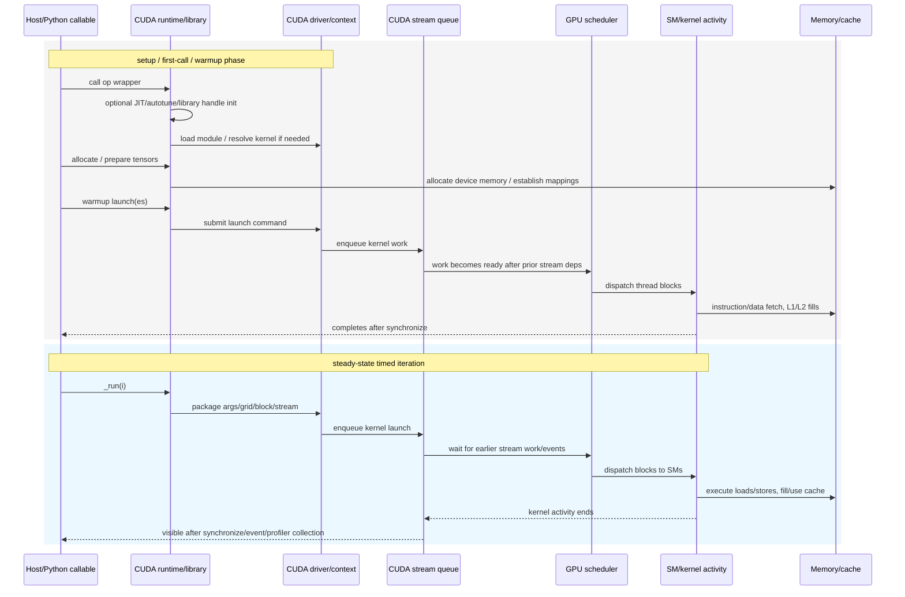

# GPU Benchmark 方法调研笔记：NV SOL / PyTorch / Triton / FA3

更新日期：2026-07-31

这份笔记是 TileOps benchmark timing 讨论中的背景材料，不是最终决策文档。它整理 GPU kernel 连续调度、初始化与计时边界，以及 NV SOL、PyTorch、Triton、FlashAttention / FA3 等常见 benchmark 方法的差异。

## 1. GPU kernel 调度与计时基础

### 1.1 Kernel 在 GPU 上如何启动

CUDA kernel launch 对 CPU 是异步的。CPU 发出 launch 后通常很快返回；CUDA runtime / driver 会把 kernel function、grid/block 形状、参数地址、stream dependency 等信息提交到 GPU 可见的工作队列。GPU 侧调度器随后从队列中取出 work，把 thread blocks 分派到 SM 上执行。

一次 kernel 真正开始跑之前，通常已经需要满足几类前提。它们不是严格按下面顺序逐项发生；更准确地说，它们分布在 host runtime、CUDA driver、CUDA context、stream queue 和 GPU 执行侧。对 benchmark 来说，重要的是知道哪些可能落在第一次调用或 warmup 中，哪些才属于正式 kernel 的 GPU activity。

| 前提 | 主要发生位置 | 典型发生时间 | 是否严格排在 kernel launch 前 |
| --- | --- | --- | --- |
| kernel code 已经编译 | NVCC/AOT build、JIT compiler、Triton/TileLang compiler | 安装/构建时，或第一次调用/autotune 时 | 是。没有可执行 device code 就不能 launch |
| kernel code / module 已加载到当前 CUDA context | CUDA runtime / driver module management | 第一次调用该 kernel、显式 module load，或 lazy loading 触发时 | 逻辑上在该 kernel 执行前；可能由第一次 launch 隐式触发 |
| kernel 参数和输入/输出 tensor 地址已经确定 | host 侧 Python/C++ runtime、CUDA launch API | 每次 launch 时 | 是。launch command 需要携带参数值、指针、grid/block、shared memory、stream 等信息 |
| CUDA stream 里排在它前面的依赖已经完成 | GPU work queue / stream scheduler | GPU 执行前，由 stream 顺序和 event dependency 决定 | 是。它决定 kernel 何时能开始执行，但不一定阻塞 CPU launch 返回 |
| 必要的 library / handle 初始化已经发生 | host runtime、library runtime，例如 cuBLAS/cuDNN/FlashAttention wrapper | 通常在第一次调用、warmup 或显式 setup 阶段 | 对使用该 library 的 callable 是前置条件；不一定是每个底层 kernel 的前置步骤 |
| GPU 可以访问对应显存页和页表映射 | CUDA memory manager、GPU MMU、Unified Memory/page migration 机制 | `cudaMalloc`/allocator 分配后；managed memory 可能在首次 GPU 访问时迁移或 fault | 普通 device memory 通常已满足；managed/oversubscription 场景可能在 kernel 执行中触发 page fault |

这些动作不都发生在被测 kernel 的 GPU duration 里。比如 JIT 编译、module load、allocator 扩容、library handle 初始化通常发生在第一次调用或 warmup 阶段；CPU launch path 和 driver submit 通常在 host 侧；kernel activity duration 一般从 GPU 上 kernel 开始执行算起。

因此它们更像一组依赖关系，而不是每次 launch 都重复执行的线性步骤。steady-state benchmark 关心的是：正式计时前这些一次性或偶发性动作是否已经被 warmup/setup 吸收；正式窗口里留下的是 CPU submit、stream 排队、GPU kernel/memcpy/memset activity，还是纯 kernel activity。

用时序图表示，大致是：



这张图里的箭头表达的是依赖和归属，不表示每次 launch 都会重新执行所有 setup 动作。比如 module load、JIT/autotune、allocator 扩容和 library handle 初始化通常应被 warmup 吸收；正式计时要么测 CUDA event span，要么测 CUPTI activity，要么测 host wall-time，取决于 benchmark 选择的 start/stop 机制。

Cache 状态也需要单独看。GPU 不需要在启动 kernel 前把业务数据“预装”进 cache，kernel 会在执行时按访存指令自然填充 L1/L2。但 benchmark 需要决定 cache 初始状态是否受控：

```text
warm cache：多次运行同一输入，可能复用 L2 / library cache 状态
cold-ish cache：每次运行前清 L2 cache buffer，减少上一轮数据残留
stable cache policy：固定 warmup、flush、同步和输入地址扰动
```

所以 cache 不是 kernel 启动的必需准备项，但它是 benchmark 可重复性和数据口径的一部分。SOL / Triton / TileOps 这类 microbenchmark 通常会用 warmup 和 L2 flush 来控制这个状态。

### 1.2 为什么要区分不同计时窗口

CPU 发出 launch 后，GPU work 被排入 CUDA stream；同一 stream 内的 work 按提交顺序执行，不同 stream 之间可能并发或通过 event / dependency 同步。因此 benchmark 必须明确区分：

```text
CPU 提交窗口：Python/C++ 从开始调用到返回，包含 launch/runtime overhead
GPU 执行窗口：GPU stream 上真正执行 kernel/memcpy/memset 的时间段
逻辑 op 窗口：一次用户 callable _run(i) 希望代表的一次 operator 调用
```

一个 logical op 可能对应一个 kernel，也可能对应多个 kernel、memset、memcpy 或内部 library dispatch。单 kernel 时，operator latency、kernel duration、GPU span 往往接近；多 kernel 时，`sum(kernel durations)`、`max(end)-min(start)`、CUDA event span 和 CPU wall-time 是不同口径。

## 2. 计时前需要移出的开销

GPU benchmark 前通常需要让以下开销尽量退出正式计时窗口：

```text
CUDA context 初始化
module/kernel load
JIT 编译或 TileLang/Triton autotune
library handle / algorithm cache 初始化
cudaMalloc / allocator 扩容
输入输出 tensor 分配
cache / persisting L2 状态准备
```

常见手段是 warmup、预分配、输入 clone/address rotation、L2 flush、必要的 `torch.cuda.synchronize()`，以及在可控环境中锁 GPU clocks。

## 3. 常见 start/stop 机制

| 机制 | start/stop 信号 | 测量口径 | 优点 | 风险 |
| --- | --- | --- | --- | --- |
| CPU wall timer | CPU `timer()` 前后包住 callable，通常前后同步 | host 视角 wall-time | 简单，适合 end-to-end | 包含 launch、Python/runtime、sync overhead |
| CUDA events | 在 stream 中 enqueue start/end event | GPU stream span | 低成本，适合 operator wall latency | 对 fast single-kernel 会受 launch/queue 行为和多 kernel gap 影响 |
| CUPTI activity | CUPTI 记录 kernel/memcpy/memset start/end | GPU activity duration/span | 可以得到 kernel-only 或 activity sequence | 需要可靠 attribution 和 buffer 管理 |
| PyTorch/Kineto profiler | Kineto 收集 CUPTI activity，并可投影 CPU annotation | profiler event timeline | 接入简单，能从 Python 使用 | annotation projection 没有公开 ready semaphore |
| NCU/Nsight | 外部 profiler 采集 kernel/profile metric | profiler report | 诊断能力强 | 启动成本高，不适合默认 nightly 全量路径 |

这里的关键不是“哪个时间更真实”，而是 benchmark history 必须保持同一口径。

## 4. NV SOL

NV SOL 的默认 timing backend 是 native CUPTI activity timing。它使用 Python CUPTI binding 开启 GPU activity collection，主要采集：

```text
CONCURRENT_KERNEL
MEMCPY
MEMSET
```

SOL 的关键流程是：

```text
1. warmup
2. discovery iteration:
     collect native CUPTI activity
     derive expected activity sequence
3. timed iterations:
     start_cpu = cupti.get_timestamp()
     runner(args)
     torch.cuda.synchronize()
     end_cpu = cupti.get_timestamp()
4. attribution:
     select expected sequence inside timestamp window
     validate activity counts
     latency = max(activity.end) - min(activity.start)
```

SOL 的特点是用 discovery sequence 做归因，并用 activity span 表示一次 logical call 的 GPU 侧 latency。对于 single-kernel call，span 退化为 kernel duration；对于 multi-kernel call，它比简单相加 kernel duration 更接近 operator GPU span。

## 5. PyTorch `torch.utils.benchmark`

PyTorch `Timer` 基于 Python `timeit.Timer`，但增加了 PyTorch runtime 相关处理：warmup、线程数控制、accelerator 同步和 replicate/median 统计。CUDA 场景下，默认 timer 会在读取 host 时间前同步 accelerator。

典型流程是：

```text
setup outside stmt
warmup
start host timer, with accelerator synchronize
repeat stmt N 次
stop host timer, with accelerator synchronize
report Measurement
```

这个方法适合比较 PyTorch statement / module 的 end-to-end 执行时间；它不区分一个 statement 内部到底发了几个 kernel，也不是 kernel-only timing。FlashAttention 早期 benchmark helper 的 `benchmark_forward` / `benchmark_backward` 也主要包了一层 `torch.utils.benchmark.Timer`。

## 6. Triton `do_bench`

Triton `do_bench` 使用 CUDA event 计时。它会先运行一次函数并同步，再用 event 粗估 runtime，根据 `warmup` / `rep` 的毫秒预算计算 warmup 次数和 repeat 次数。正式测量时，每次 repeat 清 L2 cache、记录 start event、执行 `fn()`、记录 end event，最后统一同步并统计 event elapsed time。

典型流程是：

```text
fn()
synchronize()
estimate runtime with CUDA events
n_warmup = warmup_ms / estimate
n_repeat = rep_ms / estimate
warmup loop
for each repeat:
  clear L2 cache
  start_event.record()
  fn()
  end_event.record()
synchronize()
summarize event elapsed times
```

它的结果是 stream 上 start/end event 之间的 GPU span。对于 single-kernel callable，这通常接近 kernel duration；对于 multi-kernel callable，它更接近 operator GPU span，而不是每个 kernel 的 pure duration。

## 7. FlashAttention / FA3 benchmark

FlashAttention 仓库中同时存在几类 benchmark 写法：

- `flash_attn.utils.benchmark` 使用 `torch.utils.benchmark.Timer` 包装 forward/backward/combined；
- Hopper/FA3 的 `benchmark_attn.py` 中，forward timing 使用 `triton.testing.do_bench`；
- `benchmark_mla_decode.py` 使用 `do_bench` 或 `do_bench_cudagraph`，并显式建议锁 GPU clocks；
- 部分脚本在不同 case 之间 `sleep(1)`，避免上一个 benchmark 的功耗/温度状态影响下一项；
- decode/MLA 场景会预先计算 scheduler metadata，把可复用的准备工作移出被测 callable。

这类算子库 benchmark 的核心目标通常是 operator-level latency 和 throughput comparison，而不是 nightly history 中严格的 kernel-only attribution。它们适合比较 FA2/FA3/FlashInfer/cuDNN/PyTorch 等实现的端到端 op 延迟。

## 8. 参考资料

- NVIDIA SOL-ExecBench timing implementation: https://github.com/NVIDIA/SOL-ExecBench/blob/main/src/sol_execbench/core/bench/timing.py
- NVIDIA SOL-ExecBench CUPTI utilities: https://github.com/NVIDIA/SOL-ExecBench/blob/main/src/sol_execbench/core/bench/cupti_utils.py
- PyTorch `torch.utils.benchmark.Timer`: https://github.com/pytorch/pytorch/blob/main/torch/utils/benchmark/utils/timer.py
- PyTorch benchmark README: https://github.com/pytorch/pytorch/blob/main/torch/utils/benchmark/README.md
- Triton `triton.testing.do_bench`: https://github.com/triton-lang/triton/blob/main/python/triton/testing.py
- FlashAttention benchmark helpers: https://github.com/Dao-AILab/flash-attention/blob/main/flash_attn/utils/benchmark.py
- FlashAttention Hopper / FA3 benchmark script: https://github.com/Dao-AILab/flash-attention/blob/main/hopper/benchmark_attn.py
