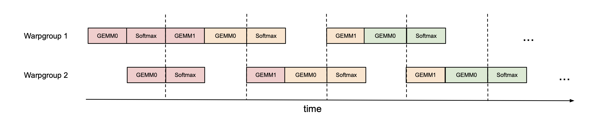
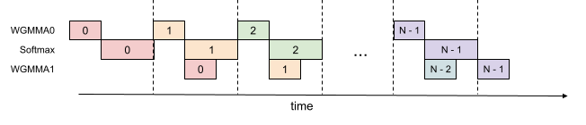
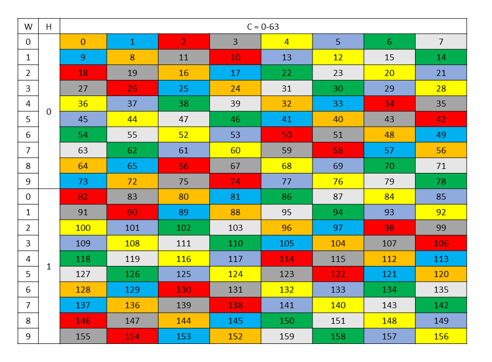
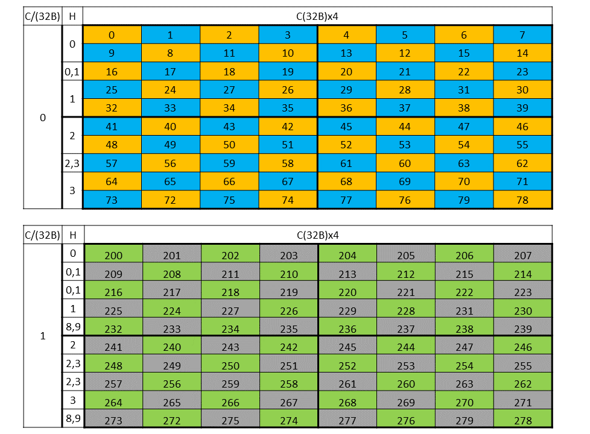
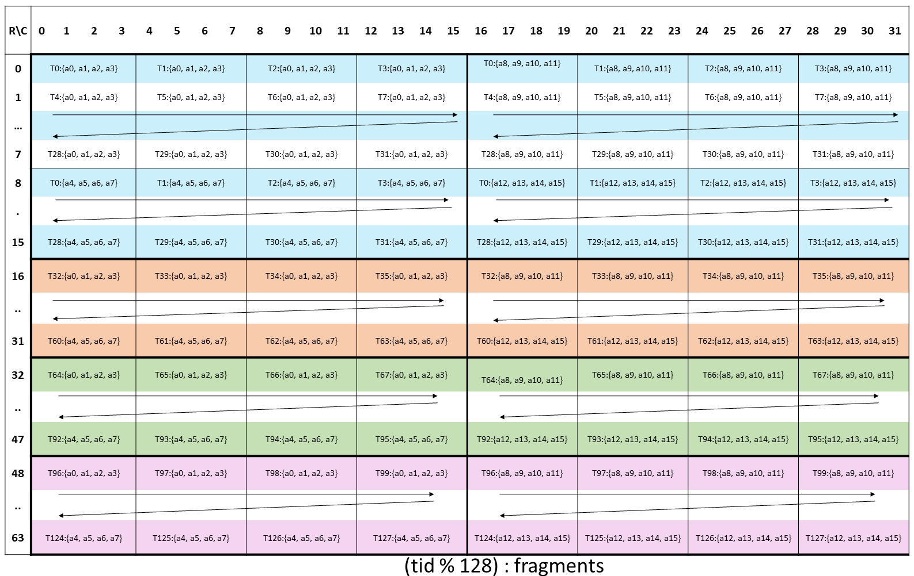
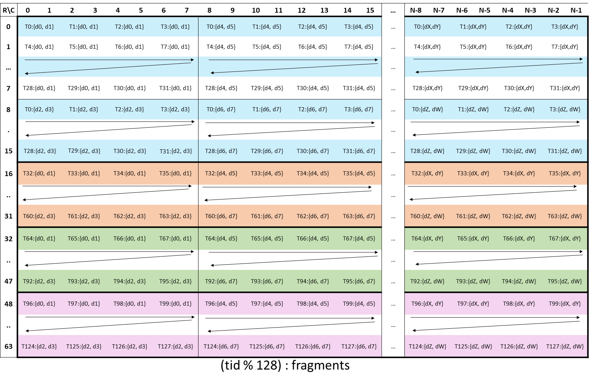

# FP8 GQA BN224 Kernel 开发脉络与技术分析

日期：2026-05-19

本文整理 FP8 GQA BN224 kernel 的开发过程、关键实验结果和当前技术判断。整体叙事从 H200 上 FA3 的 FP16/BF16 pipeline 出发，先建立理想 overlap 的参照系；随后分析 FP8 GQA 相比 FP16/BF16 增加的 scale、swizzle、RS WGMMA fragment 和 TMA descriptor 约束；最后回到本轮实验，说明为什么当前最快实现是一个阶段串行但局部优化充分的 baseline，以及为什么多轮 overlap 尝试没有转化成性能收益。

本文同时作为讨论材料使用：章节顺序保留了开发推进的因果关系，正文中的图示和表格用于支撑现场讲解，而不是提前给出一个脱离过程的结论。

## 1. H200 上的标准参照：FA3 的 FP16/BF16 pipeline

本轮工作的参照系是 H200/Hopper 上 FA3 的 FP16/BF16 pipeline。这里的重点不是 attention 公式本身，而是 tile 内执行模型。FA3 的核心是围绕 Hopper 原生异步能力重新组织 kernel：

- `TMA` 负责把下一拍 K/V 从 global memory 异步送到 shared memory。
- `WGMMA` 负责 QK 和 PV 两段 Tensor Core 主计算。
- 两组 consumer warpgroup 以 ping-pong 方式交替推进。
- barrier/fence 精确管理 K/V shared-memory slot 和 WGMMA accumulator 的生命周期。

FA3 论文的 Fig. 1 和 Fig. 2 可以作为这一节的视觉参照。Fig. 1 展示两个 consumer warpgroup 之间的 ping-pong scheduling；Fig. 2 展示单个 consumer warpgroup 内部的 2-stage WGMMA-softmax pipelining。



*图源：FlashAttention-3 Fig. 1，展示两个 consumer warpgroup 之间的 ping-pong scheduling。*



*图源：FlashAttention-3 Fig. 2，展示单个 consumer warpgroup 内部的 2-stage WGMMA-softmax pipelining。*

如果先忽略 ping-pong，只看算法依赖，一个朴素 attention tile 是：

```text
producer:
  TMA load K/V tiles into shared memory

consumer:
  QK[n] WGMMA
  wait QK[n]
  softmax[n]
  PV[n] WGMMA
  online update O/LSE
```

FA3 的关键不是改变这几个阶段，而是把它们在 steady state 里错开。更接近真实执行节奏的是：

```text
producer:
  TMA(K/V[n+1])                         // 后台喂下一拍数据

consumer group A:
  QK[n]                                 // 当前拍 Tensor Core 主计算
  wait_group<1>
  softmax[n] / update m,l / prepare P[n]

consumer group B:
  PV[n-1]                               // 上一拍 PV 与当前拍 QK/softmax 交错
  wait_group<0>
  update O[n-1]
```

也就是说，真正的 overlap 不是“所有步骤同时做”，而是几类相邻拍的工作被精确错开：

```text
producer 喂数
当前拍 QK
当前拍 softmax-side work
上一拍 PV/update tail
```

这个 pipeline 能跑顺，依赖几个硬件/软件契约：

- 哪些 WGMMA group 是 outstanding 的。
- 什么时候 `wait_group<N>` 之后 accumulator 可以被 scalar code 读取。
- K buffer 在 QK 结果进入 softmax-side 路径后可以较早归还 producer。
- V buffer 必须等对应 PV 完成后才能归还 producer。
- shared-memory layout 必须和 WGMMA descriptor 一致。
- QK/PV/softmax/O update 的 register live range 不能把 ptxas 逼到保守 scoreboard。

FA3 的 FP16/BF16 路径在 H200 上之所以是标准参照，是因为这些契约被手写 pipeline 控得很紧：TMA、WGMMA、barrier handoff、accumulator wait/fence 都围绕 Hopper 的执行模型安排。TileOps 中已有的 FP16/BF16 kernel 也沿着这个结构实现，软件表达和硬件 layout 相对自然。

因此，FP8 GQA BN224 的目标不是只得到一个数值正确的 FP8 attention，而是尽量把 FP8 路径也组织成类似 FA3 的 H200 pipeline。后续遇到的性能问题，本质上都和这个目标有关。

## 2. FP8 GQA：收益、算法与高效实现条件

从 FP16/BF16 走向 FP8，首先是为了获得更高的硬件效率，而不是为了引入一个更复杂的数据格式。对 prefill attention 来说，Q/K/V 的读写、K/V tile 在 shared memory 中的搬运，以及 QK/PV 两段 Tensor Core 计算共同决定性能。FP8 的直接收益主要体现在三点：

- Q/K/V operand 从 FP16/BF16 的 **2 byte/element** 降到 FP8 的 **1 byte/element**，global-memory traffic 和 shared-memory footprint 理论上下降到一半。在 H200 SXM 上，HBM3e 带宽是 **4.8 TB/s**；在相同带宽上，FP8 operand 能提供约 **2 倍**的元素供给率。
- Hopper Tensor Core 对 FP8 WGMMA 提供约 **2 倍于 FP16/BF16** 的理论吞吐。NVIDIA H200 SXM 规格表给出的带 sparsity 峰值是 FP16/BF16 Tensor Core **1,979 TFLOPS**、FP8 Tensor Core **3,958 TFLOPS**；不使用 structured sparsity 时，对应 dense 峰值可按约一半估算，即 FP16/BF16 约 **989.5 TFLOPS**、FP8 约 **1,979 TFLOPS**。
- 在相同 shared-memory budget 下，FP8 更容易支持**更大的 K/V tile**。更大的 tile 可以增加一次 TMA/shared-memory 搬运后参与的 QK/PV WGMMA 工作量，**提高计算访存比**，而不是单纯依赖更多 pipeline stage。

这些收益成立的前提是：FP8 的量化 scale、shared-memory layout、TMA descriptor 和 WGMMA operand contract 都能被正确且高效地表达。否则，省下来的带宽和 Tensor Core 吞吐会被额外的 scalar staging、layout transform 或 backend serialization 抵消。

### 2.1 FP8 attention 的基本算法

FP8 attention 的数学结构仍然是标准 attention，只是 Q/K/V 以 FP8 存储和参与 Tensor Core 主计算，并通过 scale 恢复到合适的数值范围。数学等价上可以写成：

```text
QK = (Q_fp8 * q_descale) @ (K_fp8 * k_descale)
P  = softmax(QK)
O  = P @ (V_fp8 * v_descale)
```

但这个写法不代表 Tensor Core 的实际执行顺序。Hopper FP8 WGMMA 直接消费 FP8 operand，乘加后得到 FP32 accumulator；descale 发生在 FP8 GEMM 之后的 accumulator/softmax 路径上，而不是先把 Q/K/V dequantize 成 FP16/FP32 再送入 Tensor Core。更接近 kernel 的执行顺序是：

```text
acc_s = WGMMA_FP8(Q_fp8, K_fp8)          // FP8 x FP8 -> FP32 accumulator
acc_s = acc_s * (q_descale * k_descale) // descale after QK WGMMA
P     = online_softmax(acc_s)
acc_o = WGMMA_RS(P, V_fp8)              // P x FP8 -> FP32 accumulator
acc_o = online_update(acc_o, v_descale, m, l)
```

这里的 `q_scale`、`k_scale`、`v_scale` 不是编译期常数，而是 FP8 量化后随 Q/K/V 一起传入 kernel 的额外输入张量。FA3 使用的命名是 `q_descale`、`k_descale`、`v_descale`，强调它们表示从 FP8 还原到计算域的 descale factor。

FA3 的 forward API 约定是：

```text
q_descale: float32[batch, heads_kv]   // C++ 注释中特别写明: (b, h_k), not (b, h)
k_descale: float32[batch, heads_kv]
v_descale: float32[batch, heads_kv]
```

也就是说，在 GQA/MQA 下，FA3 不是给每个 query head 单独存一份 Q descale，而是按 KV head 存储。kernel 内部根据当前 query head 算出对应的 `bidh_kv`，再用 `[batch, bidh_kv]` 读取 `q_descale/k_descale/v_descale`。QK 阶段把 `q_descale * k_descale` 乘进 softmax scale；PV/softmax finalize 阶段再读取同一个 KV head 上的 `v_descale`。

需要注意，FA3 kernel 接收的是 descale tensor；真正的 FP8 量化通常在 kernel 外完成。这里的重点不是规定某一种离线量化算法，而是明确 kernel contract：进入 attention kernel 时，Q/K/V 已经是 FP8，kernel 额外接收能把 FP8 accumulator 解释回计算域的 descale metadata。对于本报告讨论的 GQA 路径，对齐 FA3 意味着 descale metadata 以 `[batch, heads_kv]` 组织，Q/K/V 都按 KV head/group 对齐。

这些 descale tensor 表示“把 FP8 值还原到计算域”的缩放因子：

```text
q_real ~= q_fp8 * q_descale
k_real ~= k_fp8 * k_descale
v_real ~= v_fp8 * v_descale
```

因此，TileOps 后续修改 baseline 等 kernel 接口时，应优先对齐 FA3：对外使用 `q_descale/k_descale/v_descale: float32[batch, heads_kv]`，其中 `q_descale` 也按 KV head/group 存储；内部是否展开成其它 shape，是 kernel 实现细节，不应成为对外 contract。

### 2.2 V operand 引出的转置和 swizzle 问题

第 1 节的 FA3 pipeline 图里，consumer warpgroup 用 WGMMA 做两类矩阵乘：

```text
QK: Q shared x K shared -> score accumulator
PV: P register x V shared -> output accumulator
```

这正好对应 Hopper WGMMA 的两种 operand 模式：

- **SS WGMMA**：A operand 和 B operand 都来自 shared memory。
- **RS WGMMA**：A operand 来自 register fragment，B operand 来自 shared memory。

也就是说，QK 是 SS 型 WGMMA，PV 是 RS 型 WGMMA。这里真正把 shared-memory swizzle 变成问题的，不是 QK，而是 **PV 里的 V**。

QK 的 Q/K shared operand 和常见 Hopper WGMMA shared operand 形态比较对齐：producer 把 tile 搬到 shared memory，consumer 通过 WGMMA matrix descriptor 读取它们。这个路径当然也需要正确的 descriptor，但它不是本轮实验里 layout 问题的主要来源。

PV 不一样。从数学形状看，PV 是：

```text
P[BM, BN] x V[BN, D] -> O[BM, D]
```

但在 RS WGMMA 里，`P` 是 register A operand，`V` 是 shared B operand。为了让 WGMMA 高效读取 B operand，V 不能只是按逻辑 `[BN, D]` row-major tile 放进 shared memory；它通常要被组织成 WGMMA B operand 期待的 **transposed / K-major shared tile**。这一步才是整个 V layout 问题的起点。

一旦 V 被组织成 WGMMA B operand，shared-memory swizzle 就不能再随便选。FP8 是 1 byte/element，shared operand 的连续字节维度会直接影响 WGMMA descriptor 应该使用 128B、64B 还是 32B swizzle。这里不需要在第二章展开具体 block 维度；需要先建立的概念是：**V 需要转置成 WGMMA B operand 的 shared layout，并且这个 shared layout 必须带着正确的 swizzle**。

Hopper WGMMA 不是从一块普通 row-major shared memory 里随便读矩阵；对 SS 的 A/B shared operand，以及 RS 的 B shared operand，它都通过 matrix descriptor 解释 shared-memory 地址。这个 descriptor 包含 base address、leading-dimension byte offset、stride-dimension byte offset、base offset、swizzle mode 等字段。因此，PV 的 V operand 一旦确定了 transposed/K-major shared layout，WGMMA B descriptor 就必须按同一套 layout 和 swizzle contract 描述它。

NVIDIA PTX ISA 的 [Swizzling Modes](https://docs.nvidia.com/cuda/parallel-thread-execution/#swizzling-modes) 章节展示了这些模式在 shared memory 里的目标布局。图里的 cell 是 16B chunk；swizzle 会重排这些 chunk 在 shared memory 中的位置。



*图源：NVIDIA PTX ISA，128-byte swizzle mode destination data layout。*



*图源：NVIDIA PTX ISA，32-byte swizzle mode destination data layout。*

swizzle 和 shared-memory bank conflict 直接相关。NVIDIA shared memory 可以理解成 32 个 bank，每个 bank 以 4-byte word 为基本服务粒度；如果同一拍里多个 lane 访问落到同一个 bank 的不同地址，访问会被拆成多拍执行。Tensor Core 相关的 `ldmatrix`/WGMMA 访问模式不是任意标量 load，而是固定的矩阵行列访问模式。一个朴素 row-major tile 在某些列向或转置访问下，很容易让多个 lane 周期性落到同一批 bank 上。swizzle 的作用就是对 shared-memory 地址低位做规则置换，把这些固定访问模式分散到不同 bank，同时保留 16B/32B/64B/128B 这类向量化粒度。对本 kernel 来说，swizzle 不是抽象优化选项，而是 V 转置成 WGMMA shared B operand 以后必须满足的 layout contract。

接着才是 **TMA producer 必须生成同样 swizzle 的 V shared tile**。TMA load 也不是简单的 global-to-shared memcpy；它使用 TMA tensor map descriptor 描述 global tensor 到 shared-memory tile 的搬运方式，包括 tensor shape、global stride、element type、目标 shared-memory swizzle 等。于是这里的“对齐”有非常具体的含义：

```text
V TMA tensor map swizzle == V WGMMA B descriptor swizzle
```

TMA descriptor 决定“V 的字节怎么写进 shared memory”，WGMMA B descriptor 决定“这些字节怎么被解释成 PV 的 B operand”。如果 TMA 和 WGMMA descriptor 使用的 swizzle 不一致，那么 shared memory 里的字节本身可能没有丢，但 WGMMA 会把它解释成错误的矩阵。这就是为什么 visible-PV 路径不能简单复用 baseline 里的 V staging：baseline 的 FA3-style helper 在 opaque 路径里自己维护 layout contract；一旦把 PV 改成 TileLang-visible WGMMA，就必须让 V 的 TMA tensor map、shared-memory layout annotation、WGMMA B descriptor 三者说的是同一种 transposed + swizzled shared layout。

swizzle 是 **shared memory 上的字节布局规则**，不是 register 里的布局规则。数据一旦被 WGMMA 或 `ldmatrix` 读进 register fragment，问题就变成另一个层面的 **thread/register mapping**：哪些 lane 持有哪些 fragment element、accumulator 的 C layout 是什么、RS WGMMA 的 A fragment layout 是什么。这部分会在 2.4 结合 PTX register layout 图展开。

### 2.3 V operand 的特殊约束

上一节讲的是 V 引出的转置、shared swizzle 和 TMA descriptor 对齐问题。除此之外，V 还有几个和 pipeline、数值路径相关的约束：

- **V 的 shared tile 生命周期跨过 softmax/PV overlap 窗口**。在 overlap 形态里，`V[n-1]` 要供 `PV[n-1]` 使用，同时下一轮 QK/softmax 已经在推进；所以 V slot 的 release 必须等 PV 对应的 WGMMA group 真正完成。
- **V descale 属于 PV/O 路径**。`v_descale` 不是 QK softmax 前的 scale，而是在 PV accumulator 或 online update 阶段作用到输出值域上；它的位置会影响 O rescale、late max correction 和最终数值。
- **V 的 layout contract 不能被 opaque helper 隐式吞掉**。baseline 可以借助 FA3-style extern helper 在内部维护 V 的 layout；visible-PV 实验把 PV 暴露给 TileLang WGMMA 后，V 的 shared buffer layout 就必须在 TileLang source、TMA lowering 和 WGMMA lowering 中一致表达。

因此，后面 visible-PV 实验里遇到的 V layout 问题，本质上不是“换一个 shared buffer”这么简单。只要 PV 变成 TileLang-visible WGMMA，V 就必须同时满足 **FP8 transposed/K-major B operand layout、匹配的 shared swizzle、TMA descriptor 对齐、正确生命周期和 v_descale 使用顺序**。

### 2.4 RS WGMMA 的 R operand 也有 register layout 要求

前面讨论的是 shared-memory 侧的 V operand。对 GQA 来说，这还不够，因为 PV 使用的是 RS WGMMA，`P` 不是 shared operand，而是 register operand。这个 register operand 也不是普通 local tensor，它必须满足 RS WGMMA 对 A fragment 的 thread/register mapping 要求。

QK 和 PV 的 operand contract 可以这样对比：

```text
Q shared x K shared -> acc_s
P register/shared-derived fragment x V shared -> acc_o or acc_delta
```

这里的关键不是 `P` 逻辑上是不是一个 `64 x BK` 矩阵，而是 **PTX 指令会如何解释寄存器列表**。以 FP8 使用的 `wgmma.mma_async.m64nNk32` 为例，PTX 手册分别给出了 matrix A register fragment 和 accumulator D register fragment 的布局。对一个具体的 WGMMA 指令变体来说，A fragment 里的 `a0, a1, ...`、D accumulator 里的 `d0, d1, ...` 都不是任意排列；硬件按固定的 lane/register/element mapping 读取它们。



*图源：NVIDIA PTX ISA，WGMMA `.m64nNk32` register fragment layout for matrix A。*



*图源：NVIDIA PTX ISA，WGMMA `.m64nNk32` register fragment layout for accumulator matrix D。*

所以，“是不是只有一种 layout 能被接受”要分层看：**对同一个具体 instruction shape/dtype/operand role，layout 是固定的**；但不同的 role 和指令变体会有不同 layout。这里真正造成麻烦的是，QK 的输出和 PV 的输入恰好处在两个不同 role 上：

- `QK` 结束后，score 存在 **accumulator D layout** 里。
- `PV` 的 RS WGMMA 需要把 softmax 后的 `P` 当作 **matrix A register fragment layout** 来读。

这两张 PTX 图展示的就是这种差异：同样是 warpgroup 内的寄存器，A 和 D 的元素分布不是同一张表。因此，`T.copy(acc_s, p_frag)` 报 layout conflict 是合理的；二者本来就不是同一种 thread->register mapping。FA3 论文在这里使用 byte permute 等手段，把第一个 WGMMA 的 accumulator layout 转成第二个 WGMMA 可接受的 operand A layout。我们在 TileLang 里没有直接可用的同等 primitive 时，就必须经过一个 layout boundary，比如先写 `p_smem`，再用 `ldmatrix` 读成 PV A fragment。

### 2.5 从 FP16/BF16 到 FP8，kernel 额外背负的合同

到这里可以把 FP8 相比 FP16/BF16 多出来的部分收束一下。FP16/BF16 的主要问题是把 QK、softmax、PV、TMA 和 barrier 排成正确 pipeline；FP8 则在同一条 pipeline 上额外引入了几层硬件/软件合同：

- **descale contract**：Q/K/V 以 FP8 存储和参与 Tensor Core 计算，QK accumulator 需要乘 `q_descale * k_descale` 后再进入 softmax，PV/O 路径需要处理 `v_descale`。
- **shared-memory swizzle contract**：QK 的 shared operand 和 PV 的 V shared operand 可能需要不同 swizzle。V 一旦被转置成 WGMMA shared B operand，就要按这个 B operand 的连续字节维度选择 swizzle。
- **TMA descriptor contract**：TMA 是 producer 写 shared memory 的方式，WGMMA descriptor 是 consumer 读 shared memory 的方式。二者的 swizzle、stride、base offset 必须一致，否则 shared memory 里的字节会被 WGMMA 按错误矩阵解释。
- **V operand contract**：V 是 PV 的 shared B operand；它既要满足 transposed/K-major shared layout、匹配的 swizzle 和 TMA descriptor 对齐，又要在 overlap 窗口里保持正确生命周期，并在 PV/O update 阶段应用 `v_descale`。
- **RS register fragment contract**：PV 的 `P` 是 RS WGMMA 的 A register operand，必须满足 PTX 规定的 A fragment layout；而 QK 输出的 `acc_s` 位于 D accumulator layout。两者之间需要高效的 register permutation 或明确的 layout boundary。
- **async scoreboard contract**：FP8 的 descale、softmax、rescale、P layout transform 都夹在 WGMMA group 之间。如果编译器/ptxas 看不清 accumulator 生命周期和 alias 关系，就会用保守 `DEPBAR` 把本来想 overlap 的 GMMA stream 打碎。

因此，FP8 kernel 不是把 FP16/BF16 pipeline 里的数据类型替换一下就结束了。它要求 scale、shared layout、TMA descriptor、register fragment 和 WGMMA async wait 都同时对齐。后面的 baseline 和 overlap 实验，本质上就是在这些合同还不能都被 TileLang 高效表达时，寻找可运行且相对快的实现形态。

## 3. FP8 目标：复现 FA3-style overlap

前两章建立了两个参照：FA3 在 H200 上依靠 producer/consumer warpgroup 和 WGMMA-softmax pipeline 隐藏访存与 Tensor Core latency；FP8 GQA 又额外引入了 descale、V transposed/shared layout、TMA descriptor、RS register fragment 等合同。接下来要复现的不是一个“能跑的 FP8 attention”，而是把这些合同放进 FA3-style overlap steady state 里。

目标 steady state 可以写成：

```text
QK[n] begin
PV[n-1] begin
wait QK[n]
softmax[n]
wait PV[n-1]
merge/update O
pack/store P[n] for next PV
```

这里 `QK[n]` 必须先 issue，`PV[n-1]` 后 issue。原因是 `wait_group<N>` 按 WGMMA group 的 issue 顺序工作：`wait_group<1>` 需要等掉较早发出的 `QK[n]`，同时保留较晚发出的 `PV[n-1]` outstanding。这样 softmax 可以安全读取 `acc_s`，而上一轮 PV 继续在 softmax 窗口里飞行。

因此，“把 PV 藏到 QK/softmax 后面”不等于 instruction stream 里一定先发 PV。对这个实现来说，正确的 steady-state contract 是：

```text
issue QK[n]
issue PV[n-1]
wait_group<1>   // QK done, PV still flying
softmax[n]
wait_group<0>   // PV done
merge/update
```

overlap kernel 的目标就是逼近这个结构。

### 3.1 主要尝试：source-level overlap 被 DEPBAR 打碎

我们的主要尝试方向，是最直接地按目标 schedule 改 source：把上一轮 PV 提前发出，让它和当前 QK/softmax 重叠。早期 direct-overlap kernel 的形态是：

```text
QK[n] begin
PV[n-1] -> acc_o
wait QK[n]
softmax[n]
wait PV[n-1]
rescale acc_o by ss[n]
pack P[n]
```

这里需要先把实现分层说清楚，否则后面讨论 lowering 问题会混在一起。这个 FP8 GQA kernel 不是一段纯手写 CUDA，也不是完全由 TileLang high-level op 自动 lowering 出来，而是一个分层实现：

- **TileLang 负责表达 kernel 的主体结构**：persistent tile ownership、GQA 的 query-head 到 KV-head 映射、producer/consumer warpgroup 分工、shared buffer 分配、K/V stage 轮转、QK WGMMA、online softmax、descale 加载和大部分标量更新逻辑，仍然沿用前面 FP16/BF16 版本里已经展示过的 TileLang 结构。换句话说，外层 pipeline 和很多资源生命周期是 TileLang 可见的。
- **helper 补的是 FP8 相比 FP16/BF16 多出来的 layout 变换表达**：FP8 PV 走 RS WGMMA，`P` 是 register operand A，不是普通矩阵；`V` 是 transposed/swizzled shared operand B，descriptor 必须和 TMA/shared layout 对齐。P 的 accumulator-to-RS-A fragment conversion、BN224 下 7 个 K32 PV atom 的 register list、FA3-style V transpose/swizzle、raw accumulator/O layout，以及更裸的 `wgmma.wait_group`/anchor wait，都通过 inline PTX 或 C++/CUTE helper 补上。
- **helper 不是为了绕开 TileLang 写主体逻辑，而是为了固定 TileLang 还没有稳定 API 的 layout/fragment 边界**：例如 `T.copy(acc_s, p_frag)` 会遇到 accumulator layout 和 RS-A layout 不同的问题；`T.copy(shared -> WGMMA A fragment)` 在一些 full-chunk FP8 RS 场景下不能可靠填满目标 fragment；BN224 的 V TMA destination swizzle/descriptor 也不是一个普通 row-major shared buffer 可以描述清楚。

所以，这里说的 lowering 问题要分两类看。一类是 **TileLang 可见部分的 lowering**：source 里的 loop、buffer、TMA、QK WGMMA 和 wait 顺序有没有被保留下来。另一类是 **helper 边界之后的 backend lowering**：`T.call_extern` 传出去的 raw fragment/shared pointer、inline PTX 里的 WGMMA group，以及 helper 内外的 accumulator live range，ptxas 能不能证明彼此不 alias。我们后来看到的 `DEPBAR/ARRIVE`，更接近第二类问题：source 和 PTX 层能写出 overlap intent，但最终 SASS 调度对 WGMMA accumulator 依赖采取了保守处理。

这一阶段说明 source-level overlap 的时序可以写出来，但整体仍明显慢于当前最快 baseline。**本质原因不在算法顺序，而在 lowering/backend：SASS 中 QGMMA stream 被大量 `WARPGROUP.DEPBAR` / `WARPGROUP.ARRIVE` 切碎。**

代表性的 ptxas warning 是：

```text
wgmma.mma_async instructions are serialized due to non wgmma instructions
reading accumulator registers between start and end of the pipeline stage
```

从 lowering 层次看，这个问题不是在 TileLang source 层就出现的。**一直到 PTX / inline PTX 这一层，我们都比较顺畅地写出了带 overlap 的 pipeline**：TileLang source、生成 CUDA 和 PTX 里，仍然能看到我们想要的顺序：先 issue `QK[n]`，再 issue `PV[n-1]`，随后用 `wgmma.wait_group.sync.aligned 1` 只等待较早的 QK group。真正大量出现 `WARPGROUP.DEPBAR` / `WARPGROUP.ARRIVE` 的层次，是 **ptxas 从 PTX/inline asm lowering 到 SASS 之后**。也就是说，source/lowered CUDA/PTX 表达了 overlap intent，但 ptxas 在最终机器码调度时加了保守 dependency barrier。

这里的 DEPBAR 不是 `__syncthreads()` 那种 CTA 级同步，也不是 mbarrier/TMA barrier。它更接近 **warpgroup async GMMA 的 scoreboard 机制**。等待范围可以拆成三层看：

- **等待域**：`wgmma.wait_group<N>` 作用在当前执行它的 **consumer warpgroup** 上，等待的是这个 warpgroup 已经 commit 的 WGMMA async groups；它不等待整个 CTA，不等待 producer warpgroup，也不等待 TMA copy。
- **等待对象**：`wgmma.commit_group` 会把此前未 commit 的 `wgmma.mma_async` 指令打包成一个 wgmma-group。`wait_group<N>` 等的是这些 wgmma-group 的完成状态，而不是普通 scalar instruction。
- **等待条件**：PTX 语义里，`wait_group<0>` 表示等所有 prior wgmma-groups 完成；`wait_group<1>` 表示允许最近的 1 个 wgmma-group 继续 pending，但要求更早的 groups 已完成。

所以它的同步范围是 **warpgroup 内的 WGMMA async pipeline**。Hopper 的 `wgmma.mma_async` 是异步指令：一组 WGMMA issue 之后通过 `wgmma.commit_group` 形成 wgmma-group，再通过 `wgmma.wait_group<N>` 等待 group 完成。这个机制只保证当前 warpgroup 可以安全读/写相关 WGMMA register operand；K/V shared-memory slot 是否可复用、TMA 是否完成，仍然由 mbarrier 或其它 producer/consumer barrier 负责。

我们的 overlap 正是利用这个 FIFO 语义：

```text
issue QK[n]       // older group
issue PV[n-1]     // newer group
wait_group<1>     // QK done, PV may still be pending
read acc_s
```

但 accumulator register 是 WGMMA 的异步写目标。ptxas 必须保证 scalar instruction 不会读到仍在被 in-flight WGMMA 写的 accumulator，也不会破坏后续 WGMMA 仍要读取的 register fragment。如果它无法证明 `wait_group<1>` 后读取的只是不再 pending 的 QK accumulator，或者无法证明 QK/PV/extern helper 的 register live range 互不 alias，就会在 SASS 里插入 `WARPGROUP.ARRIVE` / `WARPGROUP.DEPBAR`。可以把它理解成：ptxas 用这些 dependency barrier 把“可能有风险的异步 GMMA 段”强行分隔开。这样保证了保守正确性，但也把本来想连续发射的 QGMMA stream 切成很多小段，overlap 就被吃掉了。

这一阶段暴露出两个触发点：

- **QK-side trigger**：`wait_group<1>` 后读取 `acc_s`，ptxas 不能总是证明“QK group 已完成而 PV group 仍 outstanding”，于是保守插入 scoreboard。
- **PV-side trigger**：PV 直接写旧 `acc_o`，随后 scalar code 又 rescale/update `acc_o`，形成很强的 accumulator dependency；再加上 PV 藏在 opaque extern helper 里，ptxas 更难证明 QK/PV register group 互不 alias。

所以这一阶段的核心判断是：

```text
source schedule 写出了 overlap，但 ptxas 没有以 overlap 的方式执行它。
```

### 3.2 旁路尝试：fresh delta + TileLang-visible PV

fresh-delta / visible-PV 是在主线遇到 DEPBAR 之后做的旁路尝试。它想验证两个问题：第一，PV 不再直接写旧 `acc_o`，能否减少 accumulator dependency；第二，PV 不再藏在 opaque extern helper 里，ptxas 是否能更清楚地看到 QK/PV 的 register alias 边界。

这个方向来自社区反馈：更干净的设计应该把 QK/PV 的 accumulator 明确拆开：

```text
QK[n]   -> acc_s       // current tile score
PV[n-1] -> acc_delta   // previous tile value path, fresh accumulator
wait_group<1>
softmax(acc_s)
wait_group<0>
acc_o = acc_o * ss + acc_delta * v_scale[n-1]
```

这样既保留了 `wait_group<1>` 的 FIFO 语义，也避免 PV 直接写旧 `acc_o` 带来的 register dependency。它不是新的主线目标，而是为了验证“更清晰的 accumulator contract 是否能绕开主线里的 DEPBAR 问题”。

这条旁路做了两类实现尝试。

第一类是 **K32 visible PV**。high-level `T.wgmma_gemm` 不能可靠表达完整 K chunk 的 FP8 RS PV，于是先按 K32 atom 表达：

```python
p_frag = T.alloc_fragment((64, 32), fp8)
v_tc_shared = T.alloc_shared((128, 32), fp8)
T.wgmma_gemm(p_frag, v_tc_shared, acc_delta, transpose_B=True)
```

这证明 TileLang-visible PV 可以表达为多个 K32 atom，也能保持“PV[n-1] 在 softmax 前发出”的 overlap 语义。但性能很差，因为 V staging 退化了：global-V 版本每个 K32 atom 重新装 V scratch；shared-V 版本用 scalar/TensorIR load 到 shared，再切 K32，仍不是 TMA/bulk 形态。

第二类是 **K224 emitter**。lower-level emitter 可以把多个 K32 RS atom 放进同一个 fence/arrive/commit group：

```python
emi = TensorCoreIntrinEmitter(..., chunk=224)
emi.wgmma_rs(p_frag, v_smem, acc_delta, clear_accum=True, wg_wait=-1)
```

这证明 K>32 的 one-group RS WGMMA 在语义上是可表达的。但 A fragment load 暴露出更底层的 API 缺口：`T.copy(shared -> WGMMA A fragment)` 会 silently no-write；继承自 Ampere emitter 的 `ldmatrix_a` 没有 destination K offset，不能填满 full chunk 的 A fragment。最后只能手写 flat local buffer 和 `ptx_ldmatrix` destination offset：

```python
p_pv_frag = T.alloc_local([112], fp8)
for ldm_k in T.serial(7):
    T.ptx_ldmatrix(..., T.access_ptr(p_pv_frag[ldm_k * 16], "w", extent=8))
emi.wgmma_rs(p_pv_frag[:], v_tc_smem[:, :], acc_delta[:, :], ...)
```

这个版本能通过正确性，也能在生成 CUDA 里看到预期的 ldmatrix + one-group RS WGMMA 结构；但它不是性能路径，因为 full A fragment 的手写 local buffer、manual ldmatrix，以及当前 scalar V staging 都太重。

所以旁路尝试得到的判断是：

```text
fresh-delta / visible-PV 是更合理的 overlap contract，
但它没有解决当前性能问题；TileLang 目前还缺少高效表达
FP8 RS A fragment load 和 V TMA layout 的能力。
```

## 4. 当前最快 baseline：实现了 FA3 pipeline 的一半

当前最快 baseline 是：

```text
GQAFwdFP8Fa3ContractPtxAccBN224WsTmaVKernel
```

从速度上看，它已经是当前 TileOps FP8 GQA BN224 路径里最快且正确的 baseline。下面把同一 shape 下 fp16/bf16 两次结果取平均，和官方 FA3 对比：

| case | TileOps avg | FA3 avg | TileOps / FA3 |
|---|---:|---:|---:|
| S=896, H=32/Hkv=8 | 0.0519 ms, 253.34 TFLOP/s | 0.0431 ms, 307.60 TFLOP/s | 0.82x |
| S=1792, H=32/Hkv=8 | 0.1399 ms, 376.00 TFLOP/s | 0.0868 ms, 609.86 TFLOP/s | 0.62x |
| S=3584, H=64/Hkv=8 | 0.7751 ms, 543.05 TFLOP/s | 2.2158 ms, 190.02 TFLOP/s | 2.86x |
| S=7168, H=64/Hkv=8 | 13.1397 ms, 128.13 TFLOP/s | 4.5716 ms, 390.96 TFLOP/s | 0.33x |

这组结果的含义比单个 `S=3584` 快照更清楚：短序列和中等序列上，TileOps baseline 仍慢于 FA3，吞吐大约是 FA3 的 0.6-0.8 倍；`S=3584, H=64/Hkv=8` 上 TileOps 反而明显快于这次测到的 FA3；但继续放大到 `S=7168` 后，TileOps 又明显慢于 FA3。也就是说，当前 baseline 已经能在部分 shape 上拿到 500+ TFLOP/s 的有效吞吐，但性能相对 FA3 的位置不是单调函数，而是和 sequence length、H/Hkv、tile count、layout path 强相关。

另一个可以带到会上讨论的判断是：FA3 和 TileOps 在这些 GQA/FP8 shape 上都存在性能敏感性。尤其是当 H/Hkv、sequence length、V layout 变换和 tile selection 组合变化时，kernel 可能走到不同的内部布局路径、persistent tile 分布或调度状态，导致 `S=3584` 和 `S=7168` 的相对关系完全不同。这里不需要先断言某个实现有 bug；更稳妥的说法是，这组数据提示 **FP8 GQA 的性能对 layout 变换和 shape 组合非常敏感**，后续对比时不能只看单个 shape 的结论。

这个对比也说明，baseline 的问题不是完全没有 pipeline；它已经吃到了 producer/consumer warpgroup ping-pong 和 V TMA staging 的收益。短/中序列上剩下的主要差别，是 FA3 在同一个 consumer warpgroup 内部把 QK、softmax、P conversion 和 PV mainloop 压得更紧，而当前 baseline 仍然把 consumer 内部阶段按更串行的边界执行。

它的优点：

- 已经实现了 producer/consumer warpgroup 的 ping-pong：producer 负责 TMA/V staging，consumer 负责 QK、softmax、PV 和 O update。
- V 走 TMA load。
- V layout 转换用 FA3-style CUTE helper。
- PV 走已有 extern PTX/CUTE helper。
- SASS 中 QGMMA 更连续，避免了 overlap 版本的大量 `DEPBAR/ARRIVE`。
- 没有把过多 FP8 RS fragment/layout 复杂性暴露给 TileLang high-level lowering。

更准确地说，这个 baseline 不是“没有 pipeline”，而是实现了 FA3 pipeline 的一半：**跨 warpgroup 的 producer/consumer ping-pong 已经有了，但同一个 consumer warpgroup 内部的 softmax/PV overlap 还没有做出来**。

consumer warpgroup 内部仍然更接近：

```text
QK[n]
wait QK[n]
softmax[n]
PV[n]
update O
```

也就是说，它没有把 `PV[n-1]` 藏到同一个 consumer warpgroup 的 `QK[n]/softmax[n]` 期间。相比 FA3 的完整设计，它完成了 warpgroup ping-pong 和高效 V staging，但缺少 consumer 内部的 WGMMA-softmax-PV overlap。

因此，baseline 不是最终设计，而是在当前 lowering/API 约束下找到的快速路径。它保住了 FA3 pipeline 中已经能稳定表达的一半：V 的高效 staging、PV helper 的成熟 layout、producer/consumer ping-pong，以及更连续的 SASS GMMA stream；牺牲的是同一个 consumer warpgroup 内部的理想 overlap。

## 5. 目前暴露出来的 TileLang 能力缺口

### 5.1 WGMMA async wait/lowering contract

这是最大能力缺口。TileLang 能表达 async issue 和 `wait_group<N>`，但 ptxas 看到 `wait<1>` 后读 accumulator、extern helper boundary、operand fence、direct-to-O dependency 时，会走 conservative scoreboard。

症状是：

```text
source/lowered CUDA: overlap 顺序存在
SASS: QGMMA 被 DEPBAR/ARRIVE 切碎
```

后续需要更可控的 WGMMA async contract：

- 更直接的 inline wait emission。
- 更清晰的 accumulator read boundary。
- 更少 opaque `call_extern` 对寄存器 alias 的干扰。
- 能让 ptxas 明确 QK/PV accumulator group 互不相关。

### 5.2 FP8 RS WGMMA fragment API

当前缺口包括：

- `T.copy(shared -> WGMMA A fragment)` 对复杂 WGMMA A-load layout silently no-write。
- `ldmatrix_a` 没有 `dst_ki` offset，不能填满 `chunk=224` A fragment。
- high-level `T.wgmma_gemm` 对 FP8 RS `M64,N128,K224` 不可靠。
- lower-level emitter 能发 K224，但需要手写 flat local buffer 和 manual `ptx_ldmatrix`。

理想 API 应该类似：

```python
emi.ldmatrix_a(a_frag, p_smem, ki, dst_ki=ki)
# or
emi.ldmatrix_a_full(a_frag, p_smem)
```

并且保持 `make_mma_load_layout` 的 fragment contract。

### 5.3 V layout / TMA integration

这是下一步最值得继续攻的性能点。

当前 visible/emitter 路径慢，很大一部分来自 V：

- K32 visible global-V：每个 K32 atom 重新从 global load V scratch。
- shared-V：用 scalar/TensorIR global load 到 shared，再切 K32，反而更慢。
- emitter-K224：为了 quarter-bank `v_tc_smem`，当前也是 scalar staging。

真正需要的是：

```text
TMA/bulk load -> WGMMA-compatible V shared layout
```

而不是：

```text
scalar global load -> shared scratch -> WGMMA
```

也不是：

```text
TMA -> layout A -> expensive transform -> layout B
```

## 6. 后续讨论路线

短期：

- 保留 current baseline 作为 FP8 GQA BN224 的性能基线。
- 把 overlap variants 视为 compiler/layout probes，而不是 production candidate。
- 继续用 SASS/ptxas warning 判断 overlap 是否真正保留。

中期：

- 做 V layout 专项 probe：让 emitter/visible PV 吃到 TMA/bulk 产出的正确 `v_tc_smem`。
- 优先验证 quarter-bank swizzle 的 TMA producer 路径，而不是继续 scalar staging。
- 尝试把 FA3-style `fp8_transpose_v_128x224_fa3_src_ldsm_stsm` 产出的 layout 与 TileLang emitter `wgmma_rs` descriptor 对齐。

长期：

- 推动 TileLang 支持 WGMMA RS A fragment full load：

```python
ldmatrix_a_full / dst_ki offset
```

- 推动 TileLang 对 FP8 RS `K>32` 的 high-level lowering 支持。
- 改善 `wait_group<N>` + accumulator read 的 lowering contract，减少 ptxas conservative scoreboard。
- 用最小 handwritten CUDA reproducer 固化 ptxas 行为边界，再反推 TileLang 应暴露的 API。

## 7. 收束

FP16/BF16 GQA 的 pipeline 能比较自然地落到 TileLang/WGMMA 上；FP8 GQA 则把问题从“排好 QK/softmax/PV 顺序”升级成“scale、swizzle、RS fragment、TMA descriptor、ptxas scoreboard 都要同时对齐”。当前最快 baseline 是一个阶段串行但局部高度优化的折中；真正的 FA3-style overlap 设计在 source 层面已经写出来过，但当前 TileLang lowering 和 ptxas backend 把 GMMA stream 序列化了。后续要继续接近 FA3，重点不应是继续堆更复杂的 overlap，而是补齐 WGMMA async contract、FP8 RS fragment load，以及 V layout/TMA integration。
