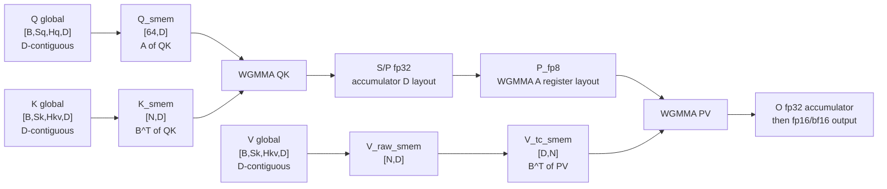

# Hopper WS FP8 GQA Attention 实现计划

日期：2026-05-09

本文记录 Hopper warp-specialized persistent FP8 GQA prefill kernel 的设计。目标不是先把 OP 层接口做复杂，而是先让 FP8 kernel 满足 Hopper WGMMA / TileLang lowering contract，并跑通正确性、layout、scale、pipeline 和性能验证；FA3 作为参考实现和 benchmark 参照，而不是正确性的唯一标准。

## 1. 本阶段输入输出契约

首版 kernel 假设调用方已经完成 incoherent processing 和 block-wise FP8 quantization。也就是说，attention kernel 消费的是已经量化好的 Q/K/V FP8 tensor 以及对应 scale，而不是在 kernel 内做 Hadamard/随机正交变换和 quantize。

建议首版约束：

| 项 | 取值 |
| --- | --- |
| GPU | Hopper, H200 first |
| kernel family | 现有 WS persistent GQA prefill 的 FP8 分支 |
| head_dim | 先固定 `D = 128` |
| tile | 与现有 WS 对齐：`block_m = 128`, `half_m = 64`, `block_n = 128` |
| input dtype | `q/k/v: float8_e4m3fn` |
| QK / PV accumulator | FP32 |
| output dtype | 先输出 fp16/bf16，不先做 FP8 output |
| scale granularity | FA3-style block scale，按现有 WS tile 的 sequence block 对齐 |

scale 先按 sequence block 管理：

```text
q_scale: [B, Hq, ceil(q_len / 128)]
k_scale: [B, Hkv, ceil(kv_len / 128)]
v_scale: [B, Hkv, ceil(kv_len / 128)]
```

用于和 FA3 直接做 benchmark 对比时要注意一个接口差异：当前 nightly docker 里的 `flash_attn_interface.flash_attn_func` FP8 descale 参数要求是 `[B, Hkv]`，连 Q descale 也是按 GQA group/KV head 给，而不是 `[B, Hq, block]`。因此 benchmark 里采用 FA3-compatible quantization：Q 的 scale 按 `(B, Hkv)` 统计，再展开成 TileOps kernel 需要的 `[B, Hq, num_blocks]`；K/V 的 `[B, Hkv]` 同样展开成 `[B, Hkv, num_blocks]`。kernel 本身仍保留 block-128 scale 入口，便于后续继续试 block-wise scale。

这里不引入公开的 `p_scale`。P 是 softmax 结果，范围天然在 `[0, 1]`，先按 FA3 路径在寄存器里直接 downcast 到 FP8 给第二个 WGMMA 使用。

## 2. FP8 GQA attention 计算过程

对一个 persistent work tile，逻辑计算仍然是：

```text
S = Q @ K^T
P = softmax(S * sm_scale + mask)
O = P @ V
```

FP8 版本实际执行顺序如下：

1. Producer warpgroup 通过 TMA 预取 `K[n:n+128, :]` 到 double-buffered shared memory。
2. Producer warpgroup 预取 `V[n:n+128, :]`，并在 producer 侧转置/重排成 FP8 WGMMA 第二个 GEMM 需要的 shared-memory layout。两个 consumer warpgroup 共用这份转置后的 V。
3. Consumer warpgroup 分别处理 `Q[m:m+64, :]` 和 `Q[m+64:m+128, :]`。
4. 第一个 WGMMA 做 `Q_fp8 @ K_fp8^T`，得到 FP32 `S_raw[64, 128]` accumulator fragment。
5. 对 `S_raw` 乘入 block scale 和 attention scale：

```text
S = S_raw * q_scale[q_block] * k_scale[k_block] * sm_scale
```

6. 做 mask 和 online softmax，P 仍然先存在 FP32 accumulator/register fragment 里。
7. 将 P 从 FP32 accumulator fragment downcast 成 FP8，同时转换成第二个 WGMMA 的 matrix A register fragment layout。
8. 第二个 WGMMA 做 `P_fp8 @ V_fp8`，得到 FP32 `O_delta[64, 128]`。
9. 在 online softmax 语义下，先按新旧 row max/sum 对历史 `acc_o` 做 rescale，再把当前 `O_delta * v_scale[v_block]` 累加进去。
10. 所有 K/V block 结束后，用最终 softmax denominator 归一化 `acc_o`，再写出 fp16/bf16 output。

用数据流画出来是：

```text
global Q_fp8 [B, Sq, Hq, D] --TMA--> Q_smem [64, D]
global K_fp8 [B, Sk, Hkv, D] --TMA--> K_smem [128, D]

Q_smem x K_smem^T
        |
        v
S_raw fp32 fragment, accumulator D layout
        |
        | * q_scale * k_scale * sm_scale, mask, online softmax
        v
P fp32 fragment, accumulator D layout
        |
        | downcast + register fragment layout transform
        v
P_fp8 fragment, WGMMA A layout

global V_fp8 [B, Sk, Hkv, D] --TMA--> V_raw_smem [128, D]
                                    --producer transpose/repack-->
                                      V_tc_smem, WGMMA B-compatible layout

P_fp8 x V_tc_smem
        |
        v
O_delta fp32 fragment
        |
        | * v_scale, online softmax rescale/add
        v
O fp32 accumulator -> output fp16/bf16
```

## 3. 各阶段矩阵 layout

逻辑 layout 先保持和现有 GQA 一致：

```text
Q: [B, Sq, Hq,  D], D contiguous
K: [B, Sk, Hkv, D], D contiguous
V: [B, Sk, Hkv, D], D contiguous
```

在一个 tile 内：

```text
Q_tile: [64, 128]       # M x D
K_tile: [128, 128]      # N x D, GEMM 中作为 B^T
V_tile: [128, 128]      # N x D, GEMM 中作为 B
S/P:    [64, 128]       # M x N
O:      [64, 128]       # M x D
```

第一段 QK 的 reduction K dimension 是 `D = head_dim`，而 Q/K 的全局 layout 本来就是 D contiguous，所以它和 FP8 WGMMA 的 k-major 要求相对容易对齐。第二段 PV 的 reduction K dimension 是 `N = block_n`，但 V 的全局 layout 是 D contiguous；从 `P @ V` 的视角看，V 的 reduction 维是 sequence 维，原始 V 不满足 FP8 WGMMA 期待的 majorness。因此 V 是 shared-memory 重排的重点，P 是 register-fragment 重排的重点。

## 4. 各矩阵重排方案

这一节只讨论 tile 内的数据怎么从“模型侧逻辑 layout”变成“WGMMA 可消费 layout”。要特别分清三件事：

- 逻辑 transpose：数学上把矩阵当成转置参与 GEMM。
- shared-memory repack：producer 把全局内存中的 tile 写成 WGMMA descriptor 友好的物理布局。
- register-fragment transform：consumer 在寄存器里改变 fragment ownership 和 local register 顺序。

一个容易踩坑的点：NVIDIA PTX 的 FP8 `wgmma.mma_async` 语法没有 FP16/BF16 那种 `imm-trans-a` / `imm-trans-b` operand。下面提到的 `transpose_B=True` 是 TileLang API 层的表达；在 Hopper FP8 WGMMA lowering 里，它必须被理解成选择 B operand 的 K-major shared-memory layout，并在 TileLang 的 GEMM shape 推导中表达数学上的 `B^T`。它不是硬件在 FP8 WGMMA 指令里额外执行一个 transpose flag。

已用 nightly TileLang smoke 确认：`float8_e4m3fn` SS WGMMA 在 `transpose_A=False, transpose_B=True` 下可以编译和运行；同样 shape 下 `transpose_B=False` 会被 TileLang 的 Hopper WGMMA 约束检查拒绝。

整体重排路径如下：



### 4.1 重排总表

| 矩阵 | 输入位置和逻辑形状 | WGMMA 角色 | 需要的重排 | 首版方案 |
| --- | --- | --- | --- | --- |
| Q | global `[64, D]` | QK 的 A operand | 共享内存 swizzle/k-major descriptor | TMA 到 `q_smem[64, D]`，不做逻辑转置 |
| K | global `[N, D]` | QK 的 B operand，数学上取 `K^T` | 共享内存 swizzle/k-major descriptor | TMA 到 `k_smem[N, D]`；TileLang 侧用 `transpose_B=True` 选择 B K-major |
| V | global `[N, D]` | PV 的 B operand | 必须把 reduction 维 `N` 变成物理连续/descriptor 友好 | producer 写 `v_tc_smem[D, N] = V_raw[N, D]^T`；TileLang 侧用 `transpose_B=True` 选择 B K-major |
| S/P | register `[64, N]` | QK 输出 D fragment，PV 输入 A fragment | FP32 accumulator D layout -> FP8 A register layout | softmax 后 downcast，并做 fragment transform 到 `p_tc` |
| O | register `[64, D]` | PV 输出 D fragment | 输出前 dtype cast/store | FP32 累加，最后写 fp16/bf16 global output |

### 4.2 Q/K：保留 D-contiguous，靠 descriptor 表达 QK

QK 的数学形式是：

```text
S[M, N] = Q[M, D] @ K[N, D]^T
```

Q 和 K 在 global memory 里都是 D contiguous，正好让第一个 GEMM 的 reduction 维 `D` 连续：

```text
Q_tile [M=64, D=128]              K_tile [N=128, D=128]

       D ->                              D ->
M  +----------------+              N  +----------------+
|  | q0,d0 ... d127 |              |  | k0,d0 ... d127 |
v  | q1,d0 ... d127 |              v  | k1,d0 ... d127 |
   | ...            |                 | ...            |
   +----------------+                 +----------------+

WGMMA sees:

A = Q_tile [M, D]
B = K_tile^T [D, N]    # via transpose_B=True
C = S [M, N]
```

所以 Q/K 不需要像 V 那样做 producer-side transpose。实现上仍然要让 shared memory 符合 WGMMA descriptor 的 swizzle/对齐要求，但这是 descriptor/SMEM layout 问题，不是数学矩阵转置问题。

首版计划：

```text
q_smem[64, 128]  <- TMA/copy Q_tile, WGMMA A-compatible smem layout
k_smem[128,128] <- TMA K_tile,      WGMMA B-compatible smem layout

T.wgmma_gemm(q_smem, k_smem, acc_s, transpose_B=True)
```

这里的合法性来自 TileLang lowering，而不是来自 PTX FP8 指令支持 transpose flag。TileLang 当前 WGMMA layout 推导里：

```text
a_is_k_major = not transpose_A
b_is_k_major = transpose_B
```

所以 `transpose_A=False, transpose_B=True` 正好给 FP8 WGMMA 提供 A K-major、B K-major 的 SS/TN 形式。反过来，如果对 FP8 QK 写成 `transpose_B=False`，TileLang 会把 B 当成 MN-major，并且当前 TileLang 会直接拒绝这个 FP8 WGMMA lowering。

换句话说，TileLang lowering 会负责 B operand 的 WGMMA shared-memory swizzle/descriptor 选择；它不会额外生成一个“把任意 B 矩阵逻辑转置”的 runtime pass。对 K 来说，global tile 本来就是 `[N, D]` 且 D contiguous，`transpose_B=True` 只需要把这块 shared memory 解释成 B K-major。对 V 来说，PV 的 reduction 维是 `N`，所以仍然需要 producer 显式写出 `V_tc_smem[D, N]`，然后再让 TileLang lowering 给这个 `V_tc_smem` 选择 B K-major swizzle。

### 4.3 V：producer-side transpose/repack

PV 的数学形式是：

```text
O[M, D] = P[M, N] @ V[N, D]
```

这里第二个 GEMM 的 reduction 维是 `N = block_n`。但原始 V 是 D contiguous：

```text
V_raw_smem [N, D], copied from global:

        D (= head_dim) contiguous ->
N   +-------------------------+
|   | V[n0, d0] ... V[n0,d127]|
v   | V[n1, d0] ... V[n1,d127]|
    | ...                     |
    | V[n127,d0]... V[n127,d127]
    +-------------------------+

For PV, WGMMA B reduction dimension is N.
Reading along N in V_raw_smem is strided by D, not contiguous.
```

因此 producer 不应该把 raw V 直接交给 FP8 WGMMA。首版方案是在 producer 侧写出转置后的 TC-ready buffer：

```text
V_tc_smem [D, N]:

        N/block_n contiguous ->
D   +-------------------------+
|   | V[n0,d0] V[n1,d0] ... V[n127,d0] |
v   | V[n0,d1] V[n1,d1] ... V[n127,d1] |
    | ...                              |
    | V[n0,d127] ...       V[n127,d127]|
    +-------------------------+

Then PV uses V_tc_smem^T as B:

A = P[M, N]
B = V_tc_smem^T[N, D]   # via transpose_B=True
C = O[M, D]
```

对应到 pipeline：

```text
producer:
  global V[n, d] -> V_raw_smem[n, d] -> V_tc_smem[d, n]

consumer 1 and consumer 2:
  both read the same V_tc_smem buffer for their own P@V
```

这里的 `V_tc_smem[D, N]` 是逻辑图。实际物理存储还要叠加 TileLang/Hopper WGMMA 的 shared-memory swizzle。首选表达是显式 `[D, N] + transpose_B=True`，因为这会让 TileLang shape 推导得到 `B^T[N, D]`，同时让 B operand 走 K-major descriptor。还需要单独 probe 的不是 `transpose_B=True` 是否适用于 FP8，而是 producer 显式转置写入 `V_tc_smem[D, N]` 时，写入索引是否与 TileLang 自动推导的 shared-memory swizzle 一致。

2026-05-11 试验记录 1：最初尝试了显式 K32 subview，也就是让 consumer 直接调用：

```python
T.wgmma_gemm(
    p_fp8,
    v_tc_smem[:, pv_k * 32:(pv_k + 1) * 32],
    acc_delta,
    transpose_B=True,
)
```

这个路径目前在 nightly TileLang 的 `LayoutInference` 阶段失败，报 `InternalError: bad optional access`。因此这个 probe 只能说明：TileLang 当前不能稳定 lower `FP8 WGMMA + B operand shared subview`，不能说明完整 PV GEMM 不可行。

2026-05-11 试验记录 2：对齐 FA3 后，改成完整 PV GEMM 表达：

```python
p_fp8_full = T.alloc_fragment([64, 128], "float8_e4m3fn")
T.copy(p_shared, p_fp8_full)
T.wgmma_gemm(
    p_fp8_full,
    v_tc_smem,
    acc_delta,
    transpose_B=True,
)
```

这个路径可以编译并通过 correctness。生成 CUDA 中没有 Python 层的 `pv_k` loop，而是由 TileLang WGMMA lowering 在一个完整 PV GEMM 内部生成 4 条 K32 WGMMA：

```cpp
fp8_e4_t p_fp8_1[64];
tl::initialize_wgmma_descriptor<1, 1, 64>(desc_b, v_tc_smem_base);
for (int ki = 0; ki < 4; ++ki) {
  tl::wgmma_rs<..., 64, 128, 32, ...>(
      p_fp8_1 + ki * 16,
      desc_b + ((ki * 32) >> 4),
      acc_delta,
      1);
}
```

这和 FA3/CUTE 的 lowering 思路一致：mainloop 表达完整 `m64n128k128` PV tile，底层 tiled MMA 按 FP8 `k32` atom 自动展开。正确性 quick check：`S=128, H=2, Hkv=1, D=128` 下 cosine 约 `0.99807`，最大误差约 `0.0068`。

不过 quick timing 显示，当前 shared-P full-fragment probe 在 `llama8b-1k` 上反而慢于默认 K32 staging 路径，粗测约：

```text
default K32 staging: 0.131 ms, 131 TFLOPS
full PV GEMM:        0.190 ms,  90 TFLOPS
```

主要嫌疑是 `p_fp8_full[64,128]` 增加了寄存器占用和 full-fragment fence/copy 成本。因此 full PV GEMM 解决的是 lowering/表达问题，不等于单独解决性能问题；最终仍需要和 FA3-style P register transform 一起设计。

默认可运行路径仍然保留 consumer 侧的 K32 `v_tc_shared` staging：

```text
producer:
  V_raw_smem[N,D] -> V_tc_smem[D,N]

consumer:
  V_tc_smem[:, k:k+32] -> v_tc_shared[D,32] -> FP8 WGMMA
```

后续如果要去掉这次 `v_tc_shared` copy，有两个更合理的方向，而不是写一个包住整段 PV 的大 helper：

1. 采用完整 PV GEMM 表达，让 TileLang lowering 自动展开 K32；同时继续优化 `p_shared -> p_fp8_full` 的寄存器压力。
2. 如果仍要按 K32 手动分片，再修 TileLang lowering 的 FP8 B subview 支持，或者写很薄的 descriptor/raw-pointer intrinsic。

### 4.4 S/P：accumulator fragment 到 FP8 A fragment

QK 之后的 S 是 FP32 accumulator fragment，它的寄存器 ownership 是 WGMMA accumulator D layout。softmax 在这个 fragment 上完成后，P 仍然处在 accumulator D layout 里：

```text
QK output / softmax input:

P_fp32 logical [M=64, N=128]
physical register layout: accumulator D fragment

row/col logical matrix:

        N ->
M   +---------------------+
|   | p00 p01 ... p0,127  |
v   | p10 p11 ... p1,127  |
    | ...                 |
    +---------------------+

but each thread owns elements according to D accumulator layout.
```

第二个 WGMMA 要把 P 当成 matrix A。对 FP8 `m64nNk32`，A operand register fragment 以 K32 为单位组织。`P[64,128]` 要拆成四个 K32 slice：

```text
P[64,128]

        0..31      32..63     64..95     96..127
      +---------+ +---------+ +---------+ +---------+
M=64  | slice 0 | | slice 1 | | slice 2 | | slice 3 |
      +---------+ +---------+ +---------+ +---------+

Each slice is a WGMMA A fragment for m64nNk32.
```

对每个 `P_sub[64,32]`，目标 A fragment ownership 按 PTX Figure 152 可写成：

```text
logical P_sub[row, col], row in [0, 63], col in [0, 31]

warp_group = row // 16        # 0..3
row16      = row % 16
row8       = row16 % 8        # 0..7
row_hi     = row16 // 8       # 0 or 1

col16      = col % 16
col_blk4   = col16 // 4       # 0..3
col_hi     = col // 16        # 0 or 1
elem       = col % 4          # packed FP8 lane inside .b32

thread = warp_group * 32 + row8 * 4 + col_blk4
local  = col_hi * 8 + row_hi * 4 + elem
```

实现上不要复用同一个 fragment 名义上“换 layout”。首版应显式区分：

```text
acc_s: FP32, [64, 128], QK accumulator D layout
p_tc:  FP8,  [64, 128], PV WGMMA A operand layout
```

转换过程是：

```text
acc_s fp32, D accumulator layout
        |
        | softmax result, optional clamp/saturation according to FP8 cast
        v
pack/downcast to FP8
        |
        | register-fragment transform
        | likely: local permutation + shfl_sync across lanes
        v
p_tc fp8, WGMMA A layout
```

先尝试用 `T.Fragment` 描述 `p_tc` 的 Figure 152 layout，再用 `T.copy(acc_s, p_tc)` 或显式 assignment 观察 TileLang 是否生成需要的 shuffle。如果不能生成，就写 extern helper，用 `prmt/byte_perm + shfl_sync` 做这段 register movement。

### 4.5 O：保留 FP32 累加，最后再出 shared/global

PV 的输出 `O_delta` 和最终 `acc_o` 都是 FP32 accumulator fragment。这里不需要为了 FP8 Tensor Core 再做输入侧重排；重点是 online softmax 的 rescale 顺序：

```text
old acc_o fp32
      |
      | rescale by online softmax factor
      v
rescaled acc_o + O_delta * v_scale[n_block]
      |
      v
final acc_o / denominator
      |
      v
output fp16/bf16 [B, Sq, Hq, D]
```

写回路径可以沿用 FP16 WS 的思路：`acc_o` 先 copy 到 shared memory，再由对应线程写 global output。首版不做 FP8 output，所以 O 的重排不是性能/正确性风险最高的部分。

## 5. 相对 FP16 WS 版本的技术困难

现有 FP16 WS kernel 的核心路径是：

```text
Q/K/V fp16
QK WGMMA -> acc_s fp32
softmax acc_s
T.copy(acc_s, acc_s_cast fp16)
PV WGMMA -> acc_o fp32
```

FP16 版本没有暴露出严重的 P register layout 问题，是因为 FP32 accumulator layout 和 FP16 matrix A register operand layout 在这个路径上可以直接衔接，至少不需要跨线程 register movement。Colfax 对 FA FP8 的分析也明确指出：FP16 情况可以不做 register movement，而 FP8 情况需要 downcast 后再做额外 register movement。

FP8 版本新增的困难主要有五类：

| 困难 | 原因 | 计划 |
| --- | --- | --- |
| P register layout transform | QK 产物是 accumulator D layout，PV 需要 FP8 A operand layout | 用 `T.Fragment` 描述 `p_tc`，先试 `T.copy/assignment` 是否生成正确跨线程 shuffle；不行就写 extern helper |
| V shared-memory majorness | PV 的 reduction 维是 sequence/block_n，而 V 全局是 D contiguous | Producer 侧把 V tile 转置/重排成 WGMMA B-compatible smem layout，供两个 consumer 共用 |
| block scale 插入位置 | scale 不再是单个 tensor 常量，Q/K/V 都有 block scale | QK 后 softmax 前乘 `q_scale*k_scale*sm_scale`；PV 后、累加到 `acc_o` 前乘 `v_scale` |
| online softmax 顺序 | 历史 `acc_o` 必须按新 row max/sum rescale | 复用现有 `rescale_*` 思路，但保证 `O_delta*v_scale` 和 `acc_o` rescale 的顺序正确 |
| TileLang lowering 能力边界 | FP8 WGMMA、fragment annotation、register shuffle 是否完整支持需要实测 | 用 nightly docker 写最小 probe，逐项确认 lowering、CUDA、SASS 和 correctness |

## 6. TileLang 实现方案

首版不改公开 OP 大面，只在 kernel 层增加实验性 FP8 WS persistent kernel。代码上可以从 `tileops/kernels/attention/gqa_fwd_ws.py` 分出 FP8 版本，避免把 FP16 稳定路径搅乱。

当前实现先落了两个 correctness baseline：

```text
tileops/kernels/attention/gqa_fwd_fp8.py
GQAFwdFP8WgmmaKernel
GQAFwdFP8WsPersistentKernel
```

`GQAFwdFP8WgmmaKernel` 是 128-thread single-warpgroup WGMMA baseline。它不是 WS，但可以使用 WGMMA：WGMMA 的硬件执行单位是一个 warpgroup，也就是 128 个线程；WS persistent 是更高层的 producer/consumer 调度方式，不是使用 WGMMA 的前提。

`GQAFwdFP8WsPersistentKernel` 已经移植到现有 FP16 WS 的基本 skeleton：`T.Persistent` work distribution、384 threads、1 个 producer warpgroup、2 个 consumer warpgroup、K/V TMA double buffer、两个 consumer 分别处理 `half_m=64`。

V transpose/repack 已经前移到 producer 侧。producer 先用 TMA 把 V tile 搬到 `v_smem_[0/1][N,D]`，等待 TMA 完成后写出 `v_tc_smem_[0/1][D,N] = v_smem_[0/1]^T`，再用 `v_full` 通知两个 consumer。consumer 侧默认路径目前仍把 `v_tc_smem[:, k:k+32]` 拷到 K32 的 `v_tc_shared` 临时 buffer；但新的 `use_full_pv_gemm` probe 证明，TileLang 可以接受完整 `p_fp8_full[64,128] @ v_tc_smem[128,128]^T` 表达，并在 CUDA lowering 中自动生成 4 条 `m64n128k32` FP8 WGMMA。真正有问题的是显式 shared subview 的 K32 写法，而不是完整 PV GEMM。

QK/PV overlap 也做了一版实验性移植，思路和 FP16 WS 一致：第一个 K/V block 只做 `QK -> softmax -> P materialize`，后续每轮发起当前 block 的 QK，同时发起上一轮 P/V 的 PV，然后用 anchor wait 把 softmax 放在 QK 完成之后、PV 完成之前。这个路径已经通过 `S=256` correctness，说明 delayed-PV 与 online softmax rescale 的数学顺序是可行的。

不过 FP8 overlap 不能完全机械照抄 FP16：

- FP16 PV 通常是一个 WGMMA；FP8 完整 PV GEMM lowering 会在内部生成 4 条 K32 WGMMA，所以 `wait_group` 深度必须按 outstanding WGMMA 数重新调。
- delayed PV 要保存上一轮完整 `P[64,128]`。shared-P 路径可以自然保存；当前 register-P helper 只生成一个 K32 A fragment，不适合作为完整 delayed-PV 主线。
- QK 后 P 的 downcast/layout transform、`p_shared -> p_fp8`、`v_tc_smem -> v_tc_shared` 这些额外 movement 可能吞掉 overlap 收益。

这些 baseline 先不接默认 dispatch。它们已经覆盖：

- `q/k/v: torch.float8_e4m3fn`
- `q_scale/k_scale/v_scale` block scale，block 大小先按 128 对齐
- QK 使用 FP8 `T.wgmma_gemm(..., transpose_B=True)`，FP32 accumulator
- softmax 前乘入 `q_scale * k_scale`
- P 通过 shared-memory round-trip 从 FP32 accumulator materialize 成 FP8 shared tile；也保留 `use_register_p=True` 的 extern-helper 实验分支
- PV 使用 FP8 RS `T.wgmma_gemm(..., transpose_B=True)`；默认路径显式按 K32 slice 累加，`use_full_pv_gemm` probe 则让 lowering 自动展开 K32
- PV contribution 乘入 `v_scale`
- output 为 fp16/bf16

当前仍未完成的 WS 性能形态：

- QK/PV overlap 已经做出 correctness 版本，但 quick benchmark 比 producer-V-transpose 串行版略慢；需要继续调 wait depth、WGMMA issue grouping 和 P/V materialization 路径。
- V transpose/repack 已前移到 producer，但还不是 FA3 的 `LDSM.T + STSM + byte_perm` 路线；当前是 producer 侧 shared-memory transpose baseline。
- TileLang 目前不能直接把 `v_tc_smem[:, k:k+32]` 作为 FP8 WGMMA B operand，但完整 `v_tc_smem` B operand 可以 lower；下一步应避免 Python 层 shared subview 分片。
- `acc_s -> p_fp8` 的直接 register transform 仍然会触发布局冲突；single-warpgroup baseline 保留 register helper，WS overlap 主线暂时固定 shared-P，因为 delayed PV 需要保存完整上一轮 P。

这些 baseline 的意义是先固定 FP8 attention 的数值合同、scale 顺序和 WS skeleton 接入方式，并确认 shared-memory round-trip 可以作为 P layout transform 的阶段性路线。下一步不是重新设计 pipeline，而是在 FP16 WS pipeline 的框架内，逐项替换 FP8 引入的 P/V movement。

实现步骤建议：

1. 写 FP8 WGMMA smoke kernel，确认 `T.wgmma_gemm` 对 `float8_e4m3fn` shared-memory operands、FP32 accumulator、`m64nNk32` lowering 可以正常编译运行。
2. 写 V producer-side transpose/repack probe：输入 `V_raw[N, D]`，producer 写 `V_tc_smem[D, N] = V_raw^T`，consumer 在 TileLang API 层以 `transpose_B=True` 选择 B K-major，用 WGMMA 读，和 PyTorch dequant reference 对齐。
3. 写 P fragment layout probe：`acc_s` 使用 QK accumulator layout，`p_tc` 使用 PTX Figure 152 的 A operand layout；先试 `T.annotate_layout({p_tc: T.Fragment(...)})` 加 `T.copy(acc_s, p_tc)`。
4. 如果 TileLang 不自动生成正确 register movement，就在 `_anchor_helper.h` 或新的 helper 里补 `prmt/byte_perm + shfl_sync` 风格的 register transform。
5. 把 scale 加进 kernel：`q_scale/k_scale` 在 softmax 前乘入 S，`v_scale` 在 PV 后乘入 O contribution。
6. 接入 non-causal FP8 WS kernel correctness test：先固定 dense `seq_len % 128 == 0`、`D=128`、H200。
7. 再接 causal path：复用现有 WS causal 的 tile pairing / loop range / mask，确认边界 block scale 和 bottom-right causal 一致。
8. 最后看性能：register count、producer transpose 成本、双 consumer 共享 V 的收益、TMA/barrier 是否仍然平衡。

TileLang 侧最关键的实现形态大概是：

```python
acc_s = T.alloc_fragment([half_m, block_n], "float")
p_tc = T.alloc_fragment([half_m, block_n], "float8_e4m3fn")
acc_o = T.alloc_fragment([half_m, dim], "float")

T.annotate_layout({
    p_tc: make_wgmma_m64nNk32_a_fragment_layout(half_m, block_n),
})

T.wgmma_gemm(q_smem, k_smem, acc_s, transpose_B=True, clear_accum=True)
T.wait_wgmma(0)

# scale + mask + online softmax happen on acc_s
# then transform/downcast acc_s -> p_tc
T.copy(acc_s, p_tc)  # 需要 probe；可能不够

T.wgmma_gemm(p_tc, v_tc_smem, acc_o, transpose_B=True, policy=T.GemmWarpPolicy.FullRow)
```

这里 `T.annotate_layout` 只是把 fragment layout 作为约束交给 TileLang lowering。它是否会为两个不同 fragment layout 之间的 copy 自动生成跨线程 shuffle，是本阶段必须用 probe 回答的问题。

## 7. 仍需确认的技术点

现在没有明显的算法级 blocker，剩下的是验证型问题：

| 问题 | 风险 | 验证方式 |
| --- | --- | --- |
| TileLang FP8 `T.wgmma_gemm` 是否接受 `transpose_B=True` 的 SS TN 路径 | 已确认：`transpose_B=True` 编译/运行通过；`transpose_B=False` 被拒绝 | 保留 smoke 作为回归用例 |
| `T.Fragment` + `T.copy` 是否能完成 P 的 accumulator layout 到 FP8 A layout 转换 | 如果不能，需要手写 register transform | fragment layout probe + CUDA/SASS 检查 |
| V transpose 后的 shared-memory layout 是否正好匹配 TileLang WGMMA B operand lowering | 错误结果或性能差 | 只测 `P@V` 的小 kernel |
| P downcast 到 FP8 的 rounding/saturation 行为是否和 FA3 误差预期一致 | correctness tolerance 变宽 | 和 dequant PyTorch reference、FA3 tolerance 对比 |
| block scale metadata 是否要支持 ragged/causal 最后一块 | 边界块 scale 读取错误 | 先 `seq_len % 128 == 0`，再加 ragged sentinel |
| producer 侧 V transpose 的开销是否能被 WS pipeline 吃掉 | 性能不达标 | ncu 看 producer/consumer overlap、barrier stall、Tensor Core utilization |

## 8. FA3 Hopper FP8 路径对照

FA3 的 Hopper WS mainloop 给了一个很好的目标形态。当前本地查看的是 flash-attention `ab66326` 的 `hopper/mainloop_fwd_sm90_tma_gmma_ws.hpp` 和 `hopper/utils.h`。

### 8.1 QK：SS GMMA，Q/K 都走 K-major shared layout

FA3 对 Q/K 的 shared memory layout 都使用 `GMMA::Major::K` 的 selector。也就是说，QK 阶段和我们的判断一致：Q、K 的模型侧 global layout 都是 D-contiguous，不需要 producer 做数学转置；需要的是让 shared-memory descriptor/swizzle 满足 FP8 GMMA 的 K-major operand 要求。

```text
Q global [M, D] -> Q_smem, GMMA Major::K
K global [N, D] -> K_smem, GMMA Major::K

S = Q @ K^T
```

映射到 TileLang，就是第一段仍然写成：

```python
T.wgmma_gemm(q_smem, k_smem, acc_s, transpose_B=True)
```

这里 `transpose_B=True` 对应的是 TileLang API 层选择 B operand K-major + 表达数学上的 `K^T`，不是 PTX FP8 指令里有一个 transpose immediate。

### 8.2 V：FP8 row-major V 要在 producer 侧转置

FA3 对 V 有一个专门判断：

```text
Transpose_V = Is_FP8 && !V_colmajor
```

普通 attention 输入的 V 是 row-major/D-contiguous，所以 FP8 路径会触发 V transpose。源码注释也直接说明：FP8 且 V row-major 时，用 `LDSM.T` 和 `STSM` 转置 V；FP16/BF16 不做这件事。

FA3 的 producer-side 路径可以概括成：

```text
global V [N, D]
    -> sVt / V_raw_smem
    -> ldmatrix.trans into registers
    -> byte_perm adjust packing
    -> stmatrix/store-matrix into sV / V_tc_smem

consumer reads V_tc_smem for PV GMMA
```

这和我们计划把 V transpose/repack 放进 producer、让两个 consumer 共享转置后 V 的方向一致。TileLang 里当前 baseline 还在 consumer tile 内写 `v_tc_shared[d, n] = V[n, d]`，WS 版本应该把这段移到 producer 的 double-buffer pipeline 里。

### 8.3 P：FA3 不用 shared round-trip，而是寄存器内变换

这是 FA3 和当前 TileLang baseline 最大的差异。

FA3 在 FP8 下强制 `MmaPV_is_RS`，也就是 PV 必须是 register/shared GMMA：P 作为 A operand 在寄存器，V 作为 B operand 在 shared。softmax 后，FA3 的 P 仍然在 QK accumulator fragment 里。它的处理顺序是：

```text
S/P fp32 accumulator D layout
    -> if FP8 and V row-major: permute_Cregs_fp8(P)
    -> convert_layout_acc_Aregs<TiledMmaPV>(layout)
    -> convert fp32 P to FP8 P
    -> if FP8 and V col-major: permute_Aregs_fp8(P)
    -> PV GMMA, P as register A operand
```

也就是说，FA3 没有把 P 写到 shared 再读回 A fragment；它用寄存器内的 layout reinterpret + permutation 完成 `D accumulator layout -> FP8 A operand layout`。对应 helper 在 `utils.h` 里：

```text
convert_layout_acc_Aregs: SM90 FP8 accumulator layout -> A-register layout
permute_Cregs_fp8:        FP8 row-major V 路径下，先调整 C accumulator registers
permute_Aregs_fp8:        FP8 col-major V 路径下，downcast 后调整 A registers
```

这些 helper 内部用的是 `__byte_perm` 和 warp 内 `__shfl_sync`，不是 shared-memory round-trip。

当前 TileLang baseline 采用的是：

```text
P fp32 accumulator
    -> T.copy(P, p_shared_fp8)
    -> T.copy(p_shared_fp8[:, k:k+32], p_fp8_A_fragment)
    -> PV GMMA
```

这个路径已经通过 correctness test，优点是 TileLang lowering 更容易接受，也天然绕开了 fragment-to-fragment layout conflict；缺点是比 FA3 多一次 shared write/read，性能目标上应该把它看成阶段性方案。后续如果 TileLang 能通过 `T.Fragment` 或 extern helper 表达 FA3 那套 `permute_Cregs_fp8 + convert_layout_acc_Aregs`，就应该替换掉 shared round-trip。

### 8.4 O：V transpose 会引入 output permutation

FA3 为了让 V transpose 更快，允许转置后的 V 列维做 permutation 来减少 bank conflict。因此 FP8 row-major V 路径在 PV 之后还有：

```text
permute_output_fp8(O)
```

我们当前 TileLang baseline 是朴素 `v_tc_shared[d, n]` 写法，还没有引入 FA3 的 V column permutation，所以暂时不需要 output unpermute。若后续为了性能复刻 FA3 的 `LDSM.T + STSM` layout，必须同时检查 O fragment 的列顺序，必要时补 output permutation。

### 8.5 对 TileOps 实现的结论

短期正确性路线：

```text
QK: FP8 SS WGMMA, transpose_B=True
P:  shared-memory round-trip, FP32 softmax -> FP8 shared -> FP8 A fragment
V:  producer-side transpose/repack to V_tc_smem[D, N]
PV: FP8 RS WGMMA, transpose_B=True
```

中期性能路线对齐 FA3：

```text
QK: 同上
P:  寄存器内 permute/layout-convert/downcast，去掉 shared round-trip
V:  producer 用 ldmatrix.trans + stmatrix 风格 copy 完成 transpose/repack
O:  如果 V transpose 引入列 permutation，则补 output unpermute
```

## 9. PTX / extern helper 实现方案

TileLang 可以通过 `T.call_extern` 调用 CUDA device helper。TileOps 现有 WS kernel 已经用 `_anchor_helper.h` + `compile_flags=["-include", helper]` 注入 helper，因此 FP8 register/layout helper 也可以沿用这个机制。

计划新增一个 attention 专用 helper，例如：

```text
tileops/kernels/attention/_fp8_gqa_helper.h
```

JIT 编译时：

```python
compile_flags=[
    "-O3",
    "-DENABLE_BF16",
    "-include", _ANCHOR_HELPER_PATH,
    "-include", _FP8_GQA_HELPER_PATH,
]
```

### 9.1 P register transform helper

目标是替换当前 baseline 的 shared-memory round-trip：

```text
当前:
  acc_s fp32 fragment
    -> p_shared fp8
    -> p_fp8 A fragment

目标:
  acc_s fp32 fragment
    -> register permutation/layout conversion
    -> p_fp8 A fragment
```

TileLang probe 已确认 `T.address_of(fragment[0, 0])` 可以传给 extern helper，但这个写法不适合 WGMMA accumulator fragment。社区反馈的正确模式是传 fragment buffer 的 raw `.data` Var，而不是 `T.address_of(...)`：

```cpp
namespace tl {

template <int BLOCK_M, int BLOCK_N>
__device__ __forceinline__ void fp8_softmax_acc_to_pv_a_frag(
    float* acc_s,
    uint8_t* p_frag,
    int slice_k32);

}  // namespace tl
```

TileLang 侧调用形态：

```python
T.call_extern(
    "handle",
    "tl::fp8_acc_to_pv_a_frag_64x128",
    acc_s.data,   # raw tir.Var, not BufferLoad
    p_fp8.data,   # raw tir.Var, not BufferLoad
    pv_k,
)
```

原因是 `T.address_of(acc_s[0, 0])` 内部会创建 `BufferLoad`，layout inference 会把它当成普通 fragment access，从而给 `acc_s` 引入 flat replicated layout，和 QK WGMMA accumulator D layout 冲突。`acc_s.data` 是 raw `tir.Var`，不会被 BufferUseDefCollector 当作 fragment load/store，因此不会污染 layout 约束。

已经从 TileLang 生成的 shared round-trip CUDA 里反解出了当前 `64x128 -> K32` 的映射公式，并落了一个 helper 草稿：

```text
tileops/kernels/attention/_fp8_gqa_helper.h
tl::fp8_acc_to_pv_a_frag_64x128
```

这个 helper 内部使用 `__shfl_sync` 和 packed FP8 conversion，目标是等价替换当前 baseline 的 `acc_s -> p_shared -> p_fp8` 地址映射。使用 `.data` 后，helper 已能接进 kernel 并通过 TileLang layout inference / NVCC 编译运行。

这里踩到的关键 CUDA 语义是：不能直接写 `__shfl_sync(mask, acc_s[src_base], src_lane)`，因为 source lane 传出去的是 source lane 自己计算出的 `src_base`，不是 destination lane 想要读取的 index。当前正确性版 helper 使用常量-index 循环：

```text
for k in 0..63:
  v = shfl(acc_s[k], src_lane)
  if desired_idx == k: use v
```

第一版常量-index helper 很重，但它证明了 `.data + extern helper` 路线可行，并且已替换主 kernel 的 P shared-memory round-trip。随后把常量-index 循环压缩成了按 lane 映射的版本：每个 FP8 pair 做 4 次 `shfl`，每个 K32 slice 共 32 次 `shfl`，相比第一版 `8 * 2 * 64 = 1024` 次 `shfl` 明显收敛。`test_gqa_fp8` 在 nightly docker 中通过。

当前 helper 还不是 FA3 最终形态。FA3 会进一步把寄存器重排和 FP8 pack 组织成更少的 `shfl + byte_perm`，并避免当前每个 pair 都单独做两组 source-index shuffle。

helper 内部参考 FA3 的三步：

```text
1. 对 QK accumulator registers 做 FP8 row-major V 路径需要的 C-reg permutation
2. 把 SM90 FP8 accumulator layout reinterpret 成 PV A-register layout
3. 用 cvt.rn.satfinite.e4m3x2.f32 / packed conversion 把 fp32 P downcast 成 FP8
```

寄存器移动使用：

```text
prmt.b32 / __byte_perm
shfl.sync.idx.b32 / __shfl_sync
```

FP8 pack 使用 PTX 的 packed conversion，例如：

```text
cvt.rn.satfinite.e4m3x2.f32
```

这个 helper 是性能目标路线。它依赖 TileLang fragment local array 的实际元素顺序和 FA3/CUTE fragment layout 对齐，因此必须用小 kernel 单独验证 mapping，而不能直接假设源码公式完全可搬。

### 9.2 V transpose/repack helper

V transpose 更适合从一开始就用 helper 表达，因为它的输入/输出都是 shared memory pointer，ABI 比 fragment pointer 更稳定：

```cpp
namespace tl {

template <int D, int N>
__device__ __forceinline__ void fp8_transpose_v_smem(
    uint8_t* v_raw_smem,
    uint8_t* v_tc_smem,
    int stage);

}  // namespace tl
```

目标路径对齐 FA3：

```text
v_raw_smem [N, D]
    -> ldmatrix.trans / LDSM.T
    -> byte_perm
    -> stmatrix / STSM
    -> v_tc_smem [D, N] plus WGMMA-friendly swizzle/permutation
```

如果为了减少 bank conflict 引入 FA3 那种 V column permutation，则还必须配套实现 output permutation helper：

```cpp
template <int BLOCK_M, int D>
__device__ __forceinline__ void fp8_permute_output_regs(float* acc_o);
```

### 9.3 验证顺序

先不要直接把 PTX helper 塞进完整 WS kernel。验证顺序应当是：

1. `acc_s -> p_fp8` 单独 probe：输入一块已知 softmax P，helper 生成 A fragment，接 PV WGMMA，与 reference 对齐。
2. `v_raw_smem -> v_tc_smem` 单独 probe：固定 P，验证 PV WGMMA 读到的 V 顺序正确。
3. 把 P helper 替换 baseline 里的 shared round-trip，保持非 WS kernel，确认 correctness 和生成代码。
4. 再搬进 WS persistent skeleton，并检查寄存器数、shared memory、barrier 和 Tensor Core utilization。

当前执行结果：

```text
- FP8 fragment pointer ABI: 可编译。
- T.address_of(acc_s[0,0]): 会触发 WGMMA accumulator layout 与 flat replicated layout 冲突。
- acc_s.data / p_fp8.data: 可绕过 layout inference 冲突，extern helper 能编译运行。
- 第一版 naive helper: 因为 shfl 的 source-lane value 语义不对，完整 attention cosine 约 0.9967，未过阈值。
- 当前 helper: 已从常量-index shuffle 优化到 32 次 `shfl` / K32 slice，主 kernel 不再需要 P shared-memory round-trip，nightly correctness 通过。
- 后续优化目标: 用 FA3-style `byte_perm + shfl` 继续减少 register movement。
```

### 9.4 当前 benchmark 结果

已加 benchmark：

```text
benchmarks/ops/attention/bench_gqa_fp8.py
```

运行方式示例：

```bash
docker run --rm --gpus '"device=1"' \
  -v /home/ga/TileOPs:/workspace -w /workspace \
  tileops-runner:nightly-tl019-post-fa3 \
  python3 benchmarks/ops/attention/bench_gqa_fp8.py \
    --quick --cases llama8b-1k,llama8b-4k \
    --impls tileops_wgmma_shared_p,tileops_ws_shared_p,fa3
```

benchmark 现在对齐现有 GQA benchmark 的 Llama-style profile：

```text
llama8b-1k:    B1 S1024 H32  Hkv8 D128
llama8b-4k:    B1 S4096 H32  Hkv8 D128
llama8b-8k:    B1 S8192 H32  Hkv8 D128
llama8b-32k:   B1 S32768 H32 Hkv8 D128
llama8b-128k:  B1 S131072 H32 Hkv8 D128
llama70b-4k:   B1 S4096 H64  Hkv8 D128
llama405b-4k:  B1 S4096 H128 Hkv8 D128
```

当前 FP8 baseline 仍然是 non-causal dense prefill，所以 FA3 对照也使用 `causal=False`。输出 dtype 用 bf16，以匹配 FA3 FP8 forward 的默认输出。

GPU1 / H200 上的 quick 结果：

| case | implementation | latency ms | TFLOPS |
| --- | --- | ---: | ---: |
| llama8b-1k | TileOps WGMMA shared P | 0.640267 | 26.83 |
| llama8b-1k | TileOps WS shared P, producer V transpose, serial PV | 0.198412 | 86.59 |
| llama8b-1k | TileOps WS shared P, producer V transpose, overlap experiment | 0.210035 | 81.80 |
| llama8b-1k | FA3 FP8 | 0.027680 | 620.66 |
| llama8b-4k | TileOps WGMMA shared P | 10.466525 | 26.26 |
| llama8b-4k | TileOps WS shared P, producer V transpose, serial PV | 3.741878 | 73.46 |
| llama8b-4k | TileOps WS shared P, producer V transpose, overlap experiment | 3.897626 | 70.52 |
| llama8b-4k | FA3 FP8 | 0.506602 | 542.59 |
| llama70b-4k | TileOps WGMMA shared P | 20.779076 | 26.46 |
| llama70b-4k | FA3 FP8 | 1.119438 | 491.10 |

结论：

1. single-warpgroup register helper 虽然去掉了 shared round-trip，但小测仍慢于 TileLang 生成的 shared store/load 路线；WS 主线暂时固定 shared-P。
2. conservative WS 移植已经正确运行；单纯换成 persistent/TMA skeleton 时并不会自动接近 FA3，但把 V transpose 前移到 producer 后，1K/4K 从约 25 TFLOPS 提升到约 70-88 TFLOPS。
3. FP16-style delayed PV overlap 已通过 correctness，但当前 quick benchmark 比 serial PV 略慢。初步判断是 FP8 PV 拆成 4 个 K32 WGMMA，以及 `p_shared -> p_fp8`、`v_tc_smem -> v_tc_shared` movement 把 overlap 收益吃掉了。
4. 和 FA3 的差距仍然很大。在 Llama 1K/4K 形状上，TileOps WS producer-transpose baseline 约 70-88 TFLOPS，而 FA3 在同一 FA3-compatible descale 合同下约 540-620 TFLOPS。
5. 下一轮优化优先级：保留 FP16 WS pipeline 作为主结构，但针对 FP8 的三个差异点优化：P materialization、V K32 slice feeding、4 个 PV WGMMA 的 issue/wait grouping。

### 9.5 明日计划

2026-05-11 早上的推进：

- 已把 `GQAFwdFP8WsPersistentKernel` 默认路径回退到当前最快的 producer-V-transpose + serial-PV 版本。smoke test 通过，quick benchmark 回到 `llama8b-1k: 0.198564 ms / 86.52 TFLOPS`、`llama8b-4k: 3.747776 ms / 73.34 TFLOPS`。
- 生成 CUDA dump 显示 `P -> p_shared -> p_fp8` 不是 `stmatrix/ldmatrix` 路线，而是普通 packed shared store/load。`acc_s -> p_shared` 是 fp32 转 fp8 后按 `fp8_e4_2_t` 写 shared；`p_shared -> p_fp8` 是按 `fp8_e4_4_t` 从 shared 读回 fragment。
- `v_tc_smem -> v_tc_shared` 也是普通 shared movement：每个 K32 slice 通过 `fp8_e4_16_t` 级别 load/store 搬到 WGMMA 可接受的 `[D,32]` 临时 shared buffer。
- probe 过 `v_tc_smem[pv_k, :, :]` 这种 chunked 3D shared buffer，TileLang layout inference 仍然不能直接把它当 FP8 WGMMA B operand：不 annotate 时是 `no available layout found`，加 swizzled annotation 后是 layout conflict。因此短期要么保留 K32 copy，要么改 TileLang lowering/写更底层 helper。

后续继续时建议按下面顺序推进：

1. 先单独检查 overlap 实验的 SASS / profiler timeline，确认 QK 与 4 个 PV K32 WGMMA 是否真的重叠；如果没有，优先调 `wait_group` 深度和 WGMMA issue 顺序，而不是改算法。
2. 重新看 P materialization：shared-P 是 delayed-PV 最稳路径，但当前 `T.copy(acc_s, p_shared)` / `T.copy(p_shared slice, p_fp8)` 不是 `stmatrix/ldmatrix` 类路径。要么推进 FA3-style register transform，要么在 TileLang lowering 里补 layout-aware intrinsic。
3. 继续处理 `v_tc_smem -> v_tc_shared`：直接 shared slice 目前被 layout inference 卡住，可能需要 TileLang lowering 支持、extern helper，或改成更接近 FA3 的 `LDSM.T + STSM + byte_perm` producer-side repack。
4. producer-side V transpose 目前是朴素 shared transpose；后续目标是对齐 FA3 的 `LDSM.T + STSM + byte_perm`，必要时配套 output permutation。

### 9.6 2026-05-11 继续推进记录

本轮先把 WS default K32 路径接上了 register-P helper：

```text
acc_s[64,128] -> tl::fp8_acc_to_pv_a_frag_64x128(acc_s.data, p_fp8.data, pv_k)
```

也就是说，`use_register_p=True, use_full_pv_gemm=False` 时不再分配 `p_shared_[1/2]`，consumer 在每个 `pv_k` slice 前直接由 `acc_s` 生成 `p_fp8[64,32]`。`tests/ops/attention/test_gqa_fp8.py` 已增加 `ws_register_p` case，nightly docker / GPU1 上 5 个 FP8 case 全部通过。

但是 quick benchmark 说明这个 helper 还不是性能路线：

| case | implementation | latency ms | TFLOPS |
| --- | --- | ---: | ---: |
| llama8b-1k | TileOps WS shared P | 0.198324 | 86.63 |
| llama8b-1k | TileOps WS register P | 0.208272 | 82.49 |

SASS/resource 对比：

| implementation | regs | shared | QGMMA | SHFL | PRMT | F2FP | BAR |
| --- | ---: | ---: | ---: | ---: | ---: | ---: | ---: |
| WS shared P | 168 | 2048 B | 16 | 24 | 138 | 128 | 26 |
| WS register P | 168 | 2048 B | 16 | 280 | 234 | 128 | 26 |

结论是 register-P helper 没有降低 ptxas register count，也没有减少 WGMMA/barrier 数量；反而引入大量 `SHFL/PRMT`。这和 FA3 的真正路径不同：FA3 是把 `tSrS.data()` 通过 `convert_layout_acc_Aregs<TiledMmaPV>` 原地重解释，再 `convert_type_out` 和 `permute_Aregs_fp8`，不是每个 K32 slice 都用一个外部 helper 重建完整 A fragment。因此这个分支保留为 correctness/probing 工具，默认仍用 shared-P。

V transpose 也重新对了 FA3 和 TileOps 的 SASS：

- FA3 源码明确使用 `SM75_U16x8_LDSM_T -> __byte_perm(0x6420/0x7531) -> SM90_U32x4_STSM_N`，注释写明 FP8 row-major V 需要这条路线。
- TileOps 当前 producer-side `v_tc_smem[d,n] = v_smem[n,d]` 的 SASS 统计是 `LDSM=0`，说明它只是普通 shared load/store transpose，没有走 FA3 的 warp-level vectorized transpose。

所以下一阶段优先级应调整为：

1. 不把当前 register-P helper 作为性能主线；真正要做的是 TileLang 内支持 FA3-style `acc_s.data()` 原地 layout reinterpret/downcast/permute，或者写更贴近 FA3 的 fragment helper。
2. 先攻 V transpose：把 producer 里的朴素 shared transpose 替换成 `LDSM.T + PRMT + STSM` 形态，并确认输出列 permutation 是否需要补偿。
3. 再回到 full-PV / K32 feeding：full-PV 的 PTX fence 更少且 register count 不变，但当前性能慢，可能和 P materialization/V layout 仍未对齐有关。

### 9.7 后续计划草案

当前技术判断：

- WS skeleton、TMA K/V loading、double-buffer barrier、scale 顺序和 FP8 数值合同已经能正确跑通。
- 当前最快的 TileOps FP8 WS baseline 是 shared-P + producer-side V transpose + serial PV；register-P helper 和 full-PV GEMM 都已经验证过 correctness，但还没有表现出性能收益。
- 性能 gap 不再优先怀疑 ptxas register count。TileOps shared-P、register-P、FA3 hdim128 e4m3 都是 `168 regs/thread`。真正可疑的是 movement 路径：V transpose 没有走 FA3 的 `LDSM.T + PRMT + STSM`，P materialization 也没有走 FA3 的原地 register-layout transform。

短期主线：先做 V transpose micro-probe。

目标是把下面这段 producer-side 朴素转置：

```text
v_smem[N, D] -> v_tc_smem[D, N]
```

替换成 FA3-style 路径：

```text
sVt shared
  -> LDSM.T / ldmatrix.trans load to registers
  -> byte permute: 0x6420 / 0x7531
  -> STSM / stmatrix store to sV shared
```

建议先不要直接塞回完整 GQA kernel，而是做一个小 kernel/probe：

1. 输入 `V[N,D]`，TMA 或普通 copy 到 `v_smem[N,D]`。
2. 用 helper 生成 `v_tc_smem[D,N]`。
3. 单独验证 shared memory 结果和朴素 transpose 等价，或者直接接一个小的 `P@V` WGMMA 校验输出。
4. 编译到 SASS，验收标准是能看到 `LDSM`/`STSM`，并且普通 shared load/store 明显减少。

短期验收标准：

| item | target |
| --- | --- |
| correctness | `P@V` 小 kernel 与朴素 transpose 路径一致 |
| SASS | 出现 `LDSM.T` / `STSM` 形态，`LDSM=0` 不再成立 |
| integration | 替换 WS producer transpose 后，smoke test 通过 |
| performance | llama8b-1k 不低于当前 shared-P baseline，理想情况下明显超过 86 TFLOPS |

中期主线：重新设计 P materialization。

当前 `register-P helper` 证明“绕开 shared-P”本身不是充分条件。它每个 K32 slice 做大量 shuffle，SASS 上 `SHFL 24 -> 280`、`PRMT 138 -> 234`，所以比 shared-P 慢。更接近 FA3 的方向应该是：

```text
acc_s.data
  -> convert_layout_acc_Aregs<TiledMmaPV> style reinterpret
  -> convert_type_out FP32/BF16/FP16 -> FP8
  -> permute_Aregs_fp8
  -> PV RS operand A
```

这件事的难点不是 CUDA PTX 本身，而是 TileLang 里如何安全表达 fragment register layout 的 reinterpret，且不触发 layout inference 把 fragment 当成 floating buffer。现阶段已经确认 `.data + compile-time offset` 比 `T.address_of(acc_s[...])` 更安全。

暂缓项：full-PV 与 K32 feeding。

full-PV GEMM 目前有两个有价值的结论：

- TileLang 可以 lower 完整 `p_fp8[64,128] @ v_tc_smem[128,128]^T`，并自动生成 4 条 `m64n128k32` WGMMA。
- PTX 层 full-PV 的 `wgmma.fence/commit/wait` 更少，register count 不变。

但它当前仍慢于 K32 staging，因此先不把它作为性能主线。等 V transpose 和 P materialization 更接近 FA3 后，再重新评估 full-PV 是否优于 K32 serial PV。

建议下一次讨论的技术决策：

1. V transpose helper 是写纯 PTX inline asm，还是优先尝试 TileLang/CUTE-style intrinsic 暴露？
2. helper 是否允许引入 FA3 的 V column permutation？如果允许，就必须同步设计 O output unpermute。
3. P materialization 是先做 TileLang lowering 支持，还是继续用外部 helper 逼近 FA3 的 `permute_Aregs_fp8`？

参考资料：

- NVIDIA PTX ISA, `wgmma.mma_async.m64nNk32` register fragments: <https://docs.nvidia.com/cuda/parallel-thread-execution/index.html#matrix-fragments-for-wgmma-mma-async-m64nnk32>
- Colfax Research, FP8 FlashAttention register layout and V majorness discussion: <https://research.colfax-intl.com/adding-fp8-to-flashattention/>
- FlashAttention Hopper WS mainloop, FP8 QK/PV/V transpose implementation: <https://github.com/Dao-AILab/flash-attention/blob/main/hopper/mainloop_fwd_sm90_tma_gmma_ws.hpp>
- FlashAttention Hopper utilities, FP8 register permutation helpers: <https://github.com/Dao-AILab/flash-attention/blob/main/hopper/utils.h>

### 9.8 V transpose helper 与后端 WGMMA lowering 对照

更清晰的组织方式应该从 WGMMA 的 contract 开始，而不是从我们看到的性能现象开始。

#### 9.8.1 WGMMA 需要哪种 swizzle？

Hopper WGMMA 不只是要求 shared memory 里有一块逻辑矩阵；它要求 shared memory 的物理排布和传给 `wgmma.mma_async` 的 `GmmaDescriptor` 完全一致。descriptor 里至少编码了：

```text
start_address
layout_type       // SWIZZLE_NONE / 32B / 64B / 128B
leading offset
stride offset
```

TileLang generated CUDA 中能直接看到这个 contract。当前 FP8 PV 有两种 lowering：

```cpp
// K32 staging path: B tile 是每次 PV 用的 [K=32, N=128] slice
tl::initialize_wgmma_descriptor<3, 1, 16>(desc_b, v_tc_shared);
```

这里 `layout_type=3`，按 TileLang `GmmaDescriptor` 注释是 `SWIZZLE_32B`。

```cpp
// full-PV path: B tile 是完整 v_tc_smem[128,128]，内部发 4 个 K=32 WGMMA
tl::initialize_wgmma_descriptor<1, 1, 64>(desc_b, v_tc_smem);
```

这里 `layout_type=1`，即 `SWIZZLE_128B`。

所以“WGMMA 需要哪种 swizzle”的答案不是一个抽象结论，而是由具体 lowering 决定：

| path | WGMMA B operand | descriptor | target swizzle |
| --- | --- | --- | --- |
| K32 staging | `v_tc_shared[D,32]` | `<3,1,16>` | `SWIZZLE_32B` |
| full-PV | `v_tc_smem[D,128]` | `<1,1,64>` | `SWIZZLE_128B` |

这也是现在最重要的技术边界：不能把 `v_tc_smem[D,128]` 写成 `SWIZZLE_128B`，再用普通 TileLang logical copy 切成 `v_tc_shared[D,32]` 给 `SWIZZLE_32B` descriptor。那会把 swizzled physical bytes 当作普通逻辑矩阵读走，结果必然错。

#### 9.8.2 为了使用这种 swizzle，各个矩阵应该怎么操作？

FP8 GQA prefill 的核心矩阵路径是：

```text
Q_fp8[M,D] @ K_fp8[N,D]^T -> S_acc[M,N]
softmax(S_acc) -> P
P_fp8[M,N] @ V_fp8[N,D] -> O_acc[M,D]
```

对 QK：

- Q/K 都来自 global FP8。
- TileLang 通过 `T.tma_copy` 和 `T.wgmma_gemm(..., transpose_B=True)` 生成 shared descriptor 和 WGMMA 指令。
- 这一路目前 correctness 没问题，不是主要矛盾。

对 P：

- QK 产物 `S_acc` 在寄存器中，softmax 后仍然是寄存器 fragment。
- FP8 PV 在 Hopper 上应该用 RS WGMMA：P 是 A operand，在 registers；V 是 B operand，在 shared descriptor。
- 因此高性能路径不应该把 P 当普通矩阵反复 store/load，而应该把 softmax 后的 accumulator fragment 转成 PV-A 所需的 register layout，再 cast/pack 成 FP8。

对 V：

- global V 的自然逻辑形状是 `[N,D]`，D/head_dim 连续。
- PV 的 WGMMA B operand 逻辑上服务于 `P[M,K] @ V[K,D]`，所以 shared 中必须提供 WGMMA descriptor 能解释的 B tile。
- 如果选择 full-PV，就应该把 V 准备成 `v_tc_smem[D,128]` 对应的 `SWIZZLE_128B` physical layout。
- 如果选择 K32 staging，就应该把每个 `D x 32` slice 准备成 `SWIZZLE_32B` physical layout，或者让 TileLang 的普通 copy 负责从普通 layout 搬到 `v_tc_shared[D,32]` 的 descriptor layout。

也就是说，V 的操作不是“做一个 transpose”这么简单，而是：

```text
global V[N,D]
  -> producer-side shared source tile
  -> warp-level transpose / byte permute
  -> WGMMA-B descriptor 期待的 shared physical swizzle
```

#### 9.8.3 TileLang 中如何实现？

TileLang 中有三层要分开看：

1. 高层 DSL：

```python
T.tma_copy(v[..., :, :], v_smem)
T.wgmma_gemm(p_fp8, v_tc_smem, acc_delta, ...)
```

这一层表达逻辑矩阵操作，但看不出最终 descriptor 是 32B 还是 128B swizzle。

2. Generated CUDA：

```cpp
tl::initialize_wgmma_descriptor<...>(desc_b, ptr);
tl::wgmma_rs<...>(p_regs, desc_b, acc_regs, ...);
```

这里是确认 WGMMA contract 的关键。当前已经确认：

- K32 staging PV 使用 `<3,1,16>`，即 `SWIZZLE_32B`。
- full-PV 使用 `<1,1,64>`，即 `SWIZZLE_128B`。
- PV 的 PTX/SASS 是 RS 形式，P/A 在 registers，V/B 在 shared descriptor。

3. 外部 helper：

shared buffer 传给 `T.call_extern` 时应使用：

```python
v_smem.access_ptr("r")
v_tc_smem.access_ptr("w")
```

fragment buffer 如果要绕过 layout inference，应优先使用：

```python
acc_s.data
p_fp8.data
```

而不是 `T.address_of(acc_s[0,0])`。

因此 TileLang 里的实现策略应该是：

```text
先固定目标 lowering:
  full-PV  -> helper 输出 SWIZZLE_128B v_tc_smem
  K32      -> helper 输出 SWIZZLE_32B v_tc_shared slice

再写 helper:
  LDSM.T -> PRMT -> STSM

最后用 generated CUDA/PTX 检查:
  descriptor layout_type 是否和 helper 输出一致
  PV 是否仍然是 RS WGMMA
```

#### 9.8.4 FA3 是不是这样做的？

FA3 的逻辑和 WGMMA contract 的方向一致，但这里要注意标准关系：

```text
correctness standard = Hopper WGMMA descriptor/register-fragment contract
implementation reference = FA3
performance reference = FA3 benchmark
```

也就是说，TileLang 实现不需要逐行复刻 FA3；只要最终传给 WGMMA 的 register fragment 和 shared descriptor 所描述的 physical layout 一致，它就是正确的。FA3 的价值是告诉我们一条已经验证过且性能很好的 movement 路径。

FA3 在 Hopper WS mainloop 里明确规定：

```cpp
static constexpr bool Transpose_V = Is_FP8 && !V_colmajor;
static_assert(!(!MmaPV_is_RS && Is_FP8), "MmaPV must be RS if FP8");
```

也就是说：

- FP8 PV 必须走 RS：P 在 registers，V 在 shared。
- 如果 V 不是 col-major，就需要 producer-side transpose/repack。

FA3 对 V 定义两套 shared layout：

```text
sVt      // TMA load / source layout
sV       // WGMMA-B / MMA layout
```

然后用：

```text
SM75_U16x8_LDSM_T
  -> __byte_perm(0x6420 / 0x7531)
  -> SM90_U32x4_STSM_N
```

把 `sVt` 转成 `sV`。这正是我们现在尝试移植的 V movement 路径。

FA3 对 P 也不是普通 shared round-trip。它从 QK accumulator fragment 出发：

```text
tSrS.data()
  -> convert_layout_acc_Aregs<TiledMmaPV>
  -> convert_type_out to FP8
  -> permute_Aregs_fp8
  -> PV RS A operand
```

所以 FA3 的整体原则可以概括为：

```text
P: register accumulator layout -> FP8 RS-A register layout
V: global/source shared layout -> WGMMA-B shared swizzled layout
PV: RS WGMMA
```

TileLang 版本也应该按这个原则实现。现在我们做错/没做完的地方不是“是否需要 swizzle”，而是还没有把 helper 输出的 physical layout 与 TileLang generated descriptor 精确对齐。

#### 9.8.5 TileLang 当前和 FA3 的不同点如何解释？

下面这些不同点本身不一定是错误；判断标准是它是否满足当前 WGMMA/lowering contract，以及性能代价是否可接受。

| item | FA3 | 当前 TileLang | 是否违反 contract | 影响 |
| --- | --- | --- | --- | --- |
| PV WGMMA form | FP8 PV 强制 RS，P in registers，V in shared | generated PTX/SASS 也是 RS | 不违反 | 这一点已经对齐 contract |
| V source/shared-load layout | CUTE TMA tensor `sVt`，显式设置 gmem view、smem destination layout 和 TMA copy atom | 当前 `T.tma_copy` 按 TileLang source slice 与 destination buffer 推导 tensor map/layout；也可以通过改变 V view、shared buffer layout 或 lower-level TMA helper 来设置 | 不一定违反 | 关键是明确设置出的 source shared physical layout，再让 transpose helper 按这个 layout 读取 |
| V target layout | `sV` 是 FA3 `TiledMmaPV` 的 WGMMA-B layout | K32 path 是 `SWIZZLE_32B`，full-PV path 是 `SWIZZLE_128B` | 当前 helper 可能违反 | helper 必须按具体 descriptor 写 physical layout |
| V movement | `LDSM.T + PRMT + STSM` | baseline 是普通 shared transpose；实验 helper 已能生成 `LDSM/PRMT/STSM` | baseline 不违反，helper 尚未证明 | baseline 正确但慢；helper 快但 layout 未验证正确 |
| P materialization | accumulator regs 原地 reinterpret/cast/permute 成 FP8 RS-A | baseline shared-P round-trip；register-P helper 是 K32 slice 重建 | 不违反 | shared-P 正确但慢；register-P helper 性能差，不是最终路径 |
| V column permutation / O unpermute | FA3 可引入 permutation 并在 O 侧补偿 | 当前 baseline 没引入 permutation | 不违反 | 如果后续复刻 FA3 permutation，必须同步补 O layout |
| Scale granularity | FA3 benchmark 接口多用 per-head descale | TileLang kernel 入口保留 block-128 scale，也可在 benchmark 里展开 FA3-style scale | 不违反 | 比 benchmark 时要说明 scale contract 是否一致 |

因此现在的技术判断应改成：

```text
不是“TileLang 和 FA3 不一样，所以错”；
而是“TileLang helper 写出的 physical layout 和 TileLang generated WGMMA descriptor 不一致，所以错”。
```

补充：V 的 source layout 是可以设置/控制的，但要分清三层：

1. global memory view / TMA tensor map：决定 TMA 从 global 以什么 shape/stride 看 V。FA3 把 V 建模成 `(D, N, H, B)` view，本质上是用 stride 选择把原始 row-major V 解释成转置坐标空间。
2. shared destination layout：决定 TMA 落到 shared 后的 source tile physical layout，也就是后续 `LDSM.T` 读取的 `sVt`。
3. WGMMA-B target layout：决定 `STSM` 写出的 `sV` 必须匹配哪个 `GmmaDescriptor`，例如 TileLang full-PV 的 `SWIZZLE_128B` 或 K32 path 的 `SWIZZLE_32B`。

TMA 不是任意 runtime transpose；它是“按 tensor map 坐标读取，再按 shared layout 落点写入”。所以如果 TileLang 高层 `T.tma_copy(v[n, d], v_smem[n, d])` 不能表达 FA3 那个 `(d, n)` view + `SmemLayoutVt`，就需要：

- 改 V 的 TileLang source view / destination shared buffer layout；
- 或使用 lower-level TMA helper 明确构造 tensor map；
- 或接受当前 TileLang `T.tma_copy` 产生的 source shared layout，然后把 V transpose helper 的 source layout 改成这个 layout。

TileLang 里要区分两种“swizzle”：

- `T.use_swizzle(...)` 是 threadblock/rasterization swizzle，影响 CTA tile 调度顺序，不是 shared-memory bank swizzle。
- WGMMA/TMA 需要的 shared-memory swizzle 应通过 buffer layout 表达，例如：

```python
T.annotate_layout({
    v_tc_smem: tilelang.layout.make_full_bank_swizzled_layout(v_tc_smem),
})
```

或根据目标 descriptor 选择 `make_quarter_bank_swizzled_layout` / `make_half_bank_swizzled_layout` / `make_full_bank_swizzled_layout`。当前 nightly 的 WGMMA lowering 也正是按连续维度自动推导这三种 layout：32B / 64B / 128B。

2026-05-11 的 PV-only probe 进一步确认了这个判断。固定 `P_fp8[64,128]` 和 `V_fp8[128,128]`：

```text
baseline: TileLang logical v_tc_smem[d,n] = v_smem[n,d] -> full-PV WGMMA
helper:   fp8_transpose_v_128x128_ldsm_stsm(v_smem, v_tc_smem) -> same full-PV WGMMA
```

二者使用完全相同的后端 descriptor：

```cpp
tl::initialize_wgmma_descriptor<1, 1, 64>(desc_b, v_tc_smem);
tl::wgmma_rs<..., 64, 128, 32, false, false, 1, 1>(p_frag, desc_b, acc, ...);
```

结果：

| path | max abs vs torch | cosine vs torch |
| --- | ---: | ---: |
| TileLang baseline | 0.00119 | 1.0 |
| CUTE helper | 3.79 | 0.027 |
| TileLang full-bank helper | 0.00119 | 1.0 |

这说明 full-PV WGMMA descriptor contract 本身是对的；helper 的 `STSM` 目标 layout 不是 TileLang baseline 所满足的 `<1,1,64>` physical layout。

对 generated CUDA 展开式可以看到 TileLang full-bank baseline 写 `v_tc_smem[d,n]` 的物理地址公式：

```text
physical(d, n) =
  d * 128
  + xor_bit_2(n, d[2]) * 64
  + xor_bit_1(n, d[1]) * 32
  + xor_bit_0(n, d[0]) * 16
  + n[0:4]
```

等价于 TileLang `make_full_bank_swizzled_layout` 的 128B swizzle 公式，而不是当前 CUTE helper 目标 layout 的可直接替代品。

据此新增了一个 TileLang-native contract helper：

```cpp
tl::fp8_transpose_v_128x128_tl_full_swizzle(v_smem, v_tc_smem)
```

它显式写入 TileLang full-bank 物理地址：

```text
dst(d, n) = d * 128 + (((n >> 4) ^ (d & 7)) << 4) + (n & 15)
src(d, n) = n * 128 + d
```

PV-only probe 中该 helper 与 TileLang baseline 输出完全一致：

```text
tl_full max abs vs baseline = 0
tl_full cosine vs baseline = 1.0
```

完整 GQA smoke case 也通过：

```text
use_full_pv_gemm=True, use_tl_full_v_transpose=True
max abs ~= 0.0068
cosine  ~= 0.9981
```

llama8b-1k quick benchmark：

| path | latency ms | TFLOPS |
| --- | ---: | ---: |
| WS K32 shared-P baseline | 0.185 | 92.8 |
| WS full-PV baseline | 0.309 | 55.5 |
| WS full-PV + TileLang full-bank helper | 0.310 | 55.5 |

所以 TileLang-native full-PV contract 路线已经正确，但当前 helper 只是 scalar contract implementation，不是性能实现。后续要优化这一条路线，应把同一个 full-bank address contract 改写成 vectorized/shared-matrix movement，而不是改数学 layout。

因此这里还有一个与 FA3 的关键差异：FA3 的 FP8 row-major V 路径还配套做了 P/C/O register permutation：

```cpp
if constexpr (Is_FP8 && !V_colmajor) { flash::permute_Cregs_fp8(tSrS); }
...
if constexpr (Is_FP8 && !V_colmajor) { flash::permute_output_fp8(tOrO); }
```

也就是说，FA3 的 `sV` layout 不一定等于“未置换 P/O 的 TileLang baseline contract”。它满足的是 FA3 自己的 combined contract：

```text
V shared permutation
+ P/A register permutation
+ O/C register/output permutation
= mathematically correct P @ V
```

当前 TileLang baseline 没有引入这组 permutation，因此如果只单独移植 FA3 的 V transpose helper，会破坏 contract。后续有两个选择：

1. TileLang-native 路线：让 helper 目标 layout 精确等于 TileLang `make_full_bank_swizzled_layout` / descriptor `<1,1,64>` 的 physical layout，不引入额外 P/O permutation。这个 correctness 已经打通，下一步是做 vectorized implementation 和 K32 `<3,1,16>` variant。
2. FA3-combined 路线：同时移植 V layout、P register permutation 和 O output permutation，使三者作为整体满足 contract。这里的 correctness 标准仍然是最终 `P @ V` 结果，而不是单独某一个 helper 是否与 TileLang baseline shared bytes 相同。

额外检查：将 helper 输出和 baseline 输出做 column-wise best matching，平均最佳列 cosine 约 `0.40`，row-wise 约 `0.21`。因此当前错误不是一个简单的 O 列 permutation 可以解释的；至少在 TileLang 当前 P/O layout 下，helper 的 target shared layout 与 descriptor contract 不匹配。

下一步 micro-probe 的目标也应该按 contract 描述：

1. 读取 generated CUDA，固定目标 descriptor，例如 `initialize_wgmma_descriptor<1,1,64>`。
2. 构造能被这个 descriptor 正确解释的 shared physical layout。
3. 用 WGMMA 结果验证 layout contract。
4. 再和 FA3 的 movement 路径比较，解释如果不同，为什么仍满足或不满足 contract。

本轮先把 FA3-style V transpose atom 做成了 CUTE helper：

```text
LDSM.T -> PRMT(0x6420 / 0x7531) -> STSM
```

独立 `_probe_fp8_v_transpose_cute.cu` 已确认能编译成目标 SASS，能看到 `LDSM.16.MT88.4`、`PRMT`、`STSM.16.M88.4`。

接入 TileLang kernel 时，shared buffer 不能用 `.data` 传给 `T.call_extern`，否则 codegen 会出现 undefined shared var。改成：

```python
v_smem.access_ptr("r")
v_tc_smem.access_ptr("w")
```

后可以通过 TileLang lowering 和 CUDA 编译，kernel 也能运行。但 correctness 明显不对，说明问题已经从“extern 指针怎么传”推进到“helper 写出的 shared 物理 layout 是否等于后续 WGMMA descriptor 读取的 layout”。

对 generated CUDA/PTX 后有一个关键结论：后续 PV WGMMA 的 descriptor 在 K32 路径和 full-PV 路径中不同。

当前 K32 staging 路径：

```cpp
// v_tc_smem[D,128] -> v_tc_shared[D,32] 后再做 PV
tl::initialize_wgmma_descriptor<3, 1, 16>(desc_b, v_tc_shared);
tl::wgmma_rs<..., 64, 128, 32, false, false, 1, 1>(p_fp8, desc_b, acc_delta, 1);
```

这里 `layout_type=3`，按 TileLang `GmmaDescriptor` 注释是 `SWIZZLE_32B`。所以如果 helper 直接把 `v_tc_smem[D,128]` 写成 FA3 128x128 WGMMA layout，再通过普通 TileLang logical load 拷到 `v_tc_shared[D,32]`，这个 swizzle 信息会被当普通矩阵数据读走，必然不对。

full-PV 路径：

```cpp
tl::initialize_wgmma_descriptor<1, 1, 64>(desc_b, v_tc_smem);
for ki in 0..3:
    tl::wgmma_rs<..., 64, 128, 32, false, false, 1, 1>(
        p_fp8 + ki * 16,
        desc_b + ((ki * 32) >> 4),
        acc_delta,
        1,
    );
```

这里 `layout_type=1`，即 `SWIZZLE_128B`。这才是 FA3 128x128 V transpose helper 应该优先对齐的后端 descriptor。PTX 中对应的 PV WGMMA 是 RS 形式：

```text
wgmma.mma_async.sync.aligned.m64n128k32.f32.e4m3.e4m3
  {D regs}, {A regs}, B_desc, p, 1, 1
```

SASS 中对应：

```text
QGMMA.64x128x32.F32.E4M3.E4M3 R..., R..., gdesc[UR...], R...
```

所以后端 WGMMA 指令类型没有偏：PV 确实是 A in registers、B in shared descriptor 的 RS WGMMA。当前错在 helper 的源/目标 CUTE layout 与 TileLang 实际 `T.tma_copy(v_desc, v_smem)`、`initialize_wgmma_descriptor<1,1,64>(v_tc_smem)` 之间还没有物理对齐。

下一步应该做一个最小 PV-only probe：

1. 固定一个小 `P_fp8[64,128]` 和 `V_fp8[128,128]`。
2. 路径 A：沿用当前朴素 transpose + full-PV WGMMA，作为 TileLang descriptor baseline。
3. 路径 B：用 `fp8_transpose_v_128x128_ldsm_stsm` 写 `v_tc_smem`，直接接 full-PV WGMMA。
4. 如果 B 不等于 A，dump helper 写入后的 shared 物理地址映射，反推 TileLang `<1,1,64>` descriptor 期待的 layout，而不是继续盲调 `SmemLayoutVt`。

技术决策点：

- `LDSM.T + PRMT + STSM` helper 的目标应该先服务 full-PV (`SWIZZLE_128B`)；不要同时试图服务当前 K32 staging (`SWIZZLE_32B`)。
- 如果坚持 K32 staging，helper 目标必须改成每个 `[D,32]` slice 的 `SWIZZLE_32B` layout，或者取消 `v_tc_smem -> v_tc_shared` 这次普通 logical copy。
- 现在不应再怀疑“FP8 PV 是否必须 RS”。TileLang PTX/SASS 已确认 PV 是 RS：P/A 在寄存器，V/B 是 shared descriptor。

### 9.9 Primitive-level probes

接下来不要再直接在整条 attention pipeline 里猜性能/正确性问题，而是把每个 primitive 的作用拆开验证。每个 probe 都回答三件事：

1. 输入逻辑矩阵是什么；
2. primitive 写出的寄存器或 shared-memory 物理 layout 是什么；
3. 后续 WGMMA / store 以哪种 contract 解释这份数据。

#### 9.9.1 V movement primitive

已经增加 `_probe_fp8_v_movement_primitives.py`，输入同一个 `V[N,D]` byte pattern，比较四条路径写出的 `v_tc_smem[D,N]` raw bytes：

```text
baseline:
  for d,n:
    v_tc_smem[d,n] = v_smem[n,d]

tl_full:
  fp8_transpose_v_128x128_tl_full_swizzle

cute_no_prmt:
  LDSM.T -> STSM

cute:
  LDSM.T -> PRMT(0x6420 / 0x7531) -> STSM
```

GPU1 / nightly docker 结果：

```text
tl_full:      equal_to_baseline=True  mismatched_bytes=0
cute_no_prmt: equal_to_baseline=False mismatched_bytes=15872
cute:         equal_to_baseline=False mismatched_bytes=14336
```

解释：

- `tl_full` 的 scalar helper 精确等价于 TileLang full-PV baseline，说明 `<1,1,64>` / `SWIZZLE_128B` 的 TileLang-native physical contract 已经写对。
- `cute_no_prmt` 与 baseline 大量不一致，说明单纯 `LDSM.T -> STSM` 的 register/shared atom 排布不是 TileLang baseline contract。
- 加上 `PRMT` 后 mismatch 从 `15872` 降到 `14336`，说明 `PRMT` 确实在修正 CUTE movement 内部的 FP8 byte packing；但 CUTE helper 的整体目标 layout 仍不是当前 TileLang P/O layout 下的 full-bank baseline。

所以 V movement 现在有两个清晰方向：

1. TileLang-native 路线：保留已经验证正确的 physical formula，后续把 scalar loop 改成 vectorized movement。
2. FA3-combined 路线：继续使用 CUTE `LDSM.T + PRMT + STSM`，但必须同时移植 P/C register permutation 和 O output permutation。不能单独拿这个 helper 去接当前 TileLang baseline。

#### 9.9.2 P register primitive

下一组 probe 应该只验证 `S_acc registers -> P_fp8 RS-A registers`，暂时不混入 V transpose。建议构造：

```text
QK/softmax 或 synthetic S_acc
  -> shared-P baseline
  -> PV WGMMA

same S_acc
  -> register-P helper
  -> same PV WGMMA
```

验收标准不是 helper 的局部 byte layout 和 FA3 一样，而是同一个 `V` descriptor 下，PV 输出和 shared-P baseline 一致。这个 probe 需要继续拆两层：

- cast/pack：确认 `FP32/FP16 P * p_scale -> e4m3` 的 saturate/rounding 行为；
- register mapping：确认每个 `S_acc` accumulator register 被放到 PV RS-A operand 期望的位置。

当前旧的 `fp8_acc_to_pv_a_frag_64x128` 已能跑通 correctness，但 SASS 里 `SHFL/PRMT` 明显偏多，所以它只是功能 baseline，不是最终性能实现。

已增加 `_probe_fp8_p_register_primitives.py`，构造最小链路：

```text
Q_fp8[64,128] @ K_fp8[128,128]^T
  -> acc_s[64,128]   # 真实 QK WGMMA accumulator fragment

path A:
  acc_s -> p_shared -> p_frag[:,32] -> PV WGMMA

path B:
  acc_s.data -> fp8_acc_to_pv_a_frag_64x128 -> p_frag[:,32] -> same PV WGMMA
```

GPU1 / nightly docker 结果：

```text
shared   max abs vs torch = 0.0117, cosine = 0.999996
register max abs vs torch = 0.0117, cosine = 0.999996
register max abs vs shared = 0
register cosine vs shared = 1.0
```

这说明当前 register-P helper 在“作为 PV RS-A operand 被 WGMMA 消费”这个 contract 下是正确的。它不是性能最终态，但 mapping/cast 功能没有问题。

又增加 `_probe_fp8_p_materialization_primitives.py`，去掉 PV WGMMA，只把 `p_frag` 直接 `T.copy` 出来观察。结果：

```text
pv_k=0 register_eq_shared=False, register_mismatch_shared=1988
pv_k=1 register_eq_shared=False, register_mismatch_shared=1981
pv_k=2 register_eq_shared=False, register_mismatch_shared=1982
pv_k=3 register_eq_shared=False, register_mismatch_shared=1995
```

但前一个 PV probe 已经证明二者进入 WGMMA 后输出完全一致。因此这里得到一个重要判断：

```text
P fragment 的普通 T.copy/store 观察结果
不等价于
P fragment 作为 WGMMA RS-A operand 时的解释方式。
```

也就是说，P register primitive 的验收标准必须是“接同一个 WGMMA 后输出一致”，不能用普通 copy dump 出来的 logical matrix 作为唯一标准。generated CUDA 也能看到这一点：

```cpp
// shared path: acc_s -> fp8 shared -> p_frag
__nv_cvt_float2_to_fp8x2(...)
*(fp8_e4_16_t*)(p_frag + 0) = *(fp8_e4_16_t*)(swizzled_p_shared + ...);

// register path: helper 直接写 p_frag
tl::fp8_acc_to_pv_a_frag_64x128(acc_s, p_frag, pv_k);

// 两者后面都作为同一个 RS-A operand
tl::wgmma_rs(..., reinterpret_cast<const uint32_t*>(p_frag + 0), ...);
```

当前性能瓶颈因此更具体地落在：

1. `fp8_acc_to_pv_a_frag_64x128` 为了重建 WGMMA-A fragment 做了跨 lane `__shfl_sync`；
2. 每个 K32 slice 都重新做一遍 mapping/pack；
3. 还没有采用 FA3 那种基于已知 accumulator layout 的 register reinterpret + 局部 permutation。

下一步优化 register-P，不应该改变 correctness contract，而是把 helper 的实现从“功能性 gather”改成“layout-aware register transform”。

#### 9.9.3 P helper 应该怎么改

这里有两条路线，性质不同。

**路线 A：继续满足当前 TileLang-native V/O contract。**

这条路线的目标是不改变后面的 `v_tc_shared/v_tc_smem` descriptor，也不引入 O permutation，只把：

```text
acc_s -> p_shared -> p_frag
```

代数化成：

```text
acc_s.data -> p_frag.data
```

当前 `fp8_acc_to_pv_a_frag_64x128` 已经是这个方向的功能 baseline。它本质上在模拟 generated CUDA 里的两步：

```cpp
// 1. store accumulator fragment to swizzled p_shared
__nv_cvt_float2_to_fp8x2(acc_s[i], ...)
store p_shared[swizzled_addr(thread, i)]

// 2. load p_shared slice into PV RS-A fragment
p_frag[...] = load p_shared[swizzled_addr(thread, pv_k, ...)]
```

把这两个地址公式合成后，会得到：

```text
p_frag[target_lane, local_byte]
  = fp8(acc_s[source_lane, source_register])
```

也就是说，当前 contract 下 `p_frag` 的某些元素确实来自同 warp 的别的 lane，所以跨 lane exchange 不是偶然的。

一个看起来诱人的小优化是把：

```cpp
shfl acc_s[src_base0]
shfl acc_s[src_base0 + 1]
shfl acc_s[src_base0 + 4]
shfl acc_s[src_base0 + 5]
target lane 再根据 lane_d1 二选一
```

改成：

```cpp
src_base = src_base0 + (lane_d1 ? 4 : 0)
shfl acc_s[src_base]
shfl acc_s[src_base + 1]
```

这个尝试已经验证过是不正确的。原因是 `__shfl_sync` 的 input operand 在 source lane 上求值，而 `lane_d1` 是 target lane 的选择条件。source lane 和 target lane 的 `lane_d1` 不一定相同，所以不能简单把 target 的选择提前塞进 source operand。

在当前 contract 下可试的局部优化只有两类：

1. source lane 先把两个候选 pair 各自 cast/pack 成 FP8x2，再 shuffle packed `uint32_t`，把 4 次 float shuffle 变成 2 次 packed shuffle；代价是可能增加 FP8 convert 指令，需要实测。
2. 为特定 `pv_k` / lane group 写专门化 mapping，避免通用表达式和不必要的临时变量；这能小幅减少 integer/PRMT 压力，但不会从根上消掉跨 lane exchange。

所以路线 A 是低风险 correctness route，但性能上可能有天花板。

**路线 B：切到 FA3-style combined contract。**

FA3 row-major V 的核心不是“把当前 P helper 写得更聪明”，而是换一组互相配套的 layout contract：

```text
P/S side:
  permute_Cregs_fp8(tSrS)
  convert_layout_acc_Aregs<TiledMmaPV>(tSrS.layout())
  convert_type_out(..., tOrP)

V side:
  LDSM.T -> PRMT -> STSM

O side:
  permute_output_fp8(tOrO)
```

注意 row-major V 路径下，FA3 是先对 FP32 accumulator 做 `permute_Cregs_fp8`，然后 reinterpret 成 PV-A layout，再 cast 到 FP8；它没有在这一支使用 `permute_Aregs_fp8`。`permute_Cregs_fp8` 和 `permute_output_fp8` 都主要是本线程内 register-pair swap，不是当前这种大量跨 lane gather。

因此真正接近 FA3 性能的改法应该是：

```text
1. 实现 acc_s 的 FA3-style C-register permutation helper
   acc_s.data -> acc_s.data

2. 实现 reinterpret/cast helper
   acc_s.data -> p_fp8.data
   这里按 convert_layout_acc_Aregs 后的 A-register layout 写 p_fp8，
   尽量只做本 lane register read + FP8 pack。

3. V 改用已经写好的 CUTE movement
   fp8_transpose_v_128x128_ldsm_stsm

4. PV WGMMA 后，对 acc_delta/acc_o 做 output permutation
   acc_delta.data -> acc_delta.data

5. 用 combined PV-only probe 验证：
   P permute/cast + CUTE V movement + O permutation
   的最终输出等于 torch / TileLang baseline。
```

这条路线的 correctness 标准仍然不是“某个中间 fragment dump 和 baseline 一样”，而是：

```text
same P, same V
combined route PV output == mathematical P @ V
```

技术判断：路线 B 才是应该主推的性能路线；路线 A 可以保留作回归和对照 benchmark。

2026-05-11 进一步试了第一版 combined helper：

```cpp
tl::fp8_permute_cregs_64x128(acc_s.data)
tl::fp8_acc_to_pv_a_frag_64x128_fa3(acc_s.data, p_frag.data)
tl::fp8_transpose_v_128x128_ldsm_stsm(v_smem, v_tc_smem)
tl::fp8_permute_output_64x128(acc.data)
```

第一版 `permute_Cregs` 和 `permute_output` 按 FA3 `utils.h` 的 shape 直接翻译：

```text
permute_Cregs:
  swap float2 acc_s[8*i + 2 : 8*i + 4]
       with acc_s[8*i + 4 : 8*i + 6]

permute_output:
  swap acc[8*i + 2*j + 1]
       with acc[8*i + 2*j + 4]
```

同时加了一个 full-PV A-register oracle：

```cpp
tl::fp8_acc_to_pv_a_frag_64x128_full_gather(acc_s, p_frag)
```

它只是把已经验证正确的 K32 gather helper 调 4 次：

```text
pv_k = 0 -> p_frag[0:16]
pv_k = 1 -> p_frag[16:32]
pv_k = 2 -> p_frag[32:48]
pv_k = 3 -> p_frag[48:64]
```

variant probe 结果：

```text
gather_tl_v     cos vs baseline = 1.0000
combined        cos vs baseline = 0.2455
fa3_p_tl_v      cos vs baseline = 0.2533
fa3_p_tl_v_no_c cos vs baseline = 0.1248
gather_cute     cos vs baseline = 0.0147
gather_cute_o   cos vs baseline = 0.0510
```

解释：

1. `full_gather + TileLang V` 完全等价 baseline，说明 full-PV `p_frag[64]` 的 TileLang/WGMMA A-register oracle 已经有了。
2. 简单顺序 pack 的 `fp8_acc_to_pv_a_frag_64x128_fa3` 不等价于 TileLang full-PV A-register layout；即使 V 仍用 TileLang baseline，也只有约 `0.25` cosine。
3. `gather + CUTE V + output permute` 也不对，说明当前 `fp8_transpose_v_128x128_ldsm_stsm` + 简单 `permute_output` 并没有构成 FA3 的完整 combined contract。问题不是单独 P，也不是单独 O；CUTE V source/target layout、PV tiled MMA layout、P/O fragment layout 必须作为整体重新对齐。

因此下一步不能只继续“照抄三个 FA3 helper 名字”。更可靠的推进方式是：

1. 保留 `full_gather` 作为 full-PV A-register correctness oracle。
2. 先让 `fa3-style P helper + TileLang V` 对齐 `full_gather + TileLang V`，也就是只解决 P raw order。
3. 再让 `full_gather + CUTE V + O permute` 对齐 baseline，单独解决 V/O combined contract。
4. 最后再合并 `fa3-style P + CUTE V + O permute`。

这也说明：FA3 的 `convert_layout_acc_Aregs<TiledMmaPV>` 不能被简化成“按 `acc_s[0..63]` 顺序 pack 到 `p_frag[0..63]`”。它依赖具体 `TiledMmaPV` 的 A-register layout。TileLang 这边要么直接从 generated CUDA 的 `T.copy(p_shared, p_frag)` load formula 反推出 raw order，要么在 CUTE helper 中构造与 TileLang `wgmma_rs` 完全一致的 A fragment layout。

继续枚举 `full_gather` 的真实 mapping 后可以看到：

```text
p_frag[target_lane, out_byte]
  <- fp8(acc_s[source_lane, source_register])
```

其中 source lane 永远落在同一个 4-lane quad 内，但只有 `25%` 的 byte 来自本 lane：

```text
same-lane bytes = 512 / 2048 = 25%

quad remap:
  target lane % 4 = 0 -> source lane % 4 = 0 or 1
  target lane % 4 = 1 -> source lane % 4 = 2 or 3
  target lane % 4 = 2 -> source lane % 4 = 0 or 1
  target lane % 4 = 3 -> source lane % 4 = 2 or 3
```

所以在当前 TileLang-native V/O contract 下，跨 lane exchange 是 contract 本身要求的；不是 helper 写得不够聪明导致的偶然开销。

据此增加了一个保守优化 helper：

```cpp
tl::fp8_acc_to_pv_a_frag_64x128_quad
tl::fp8_acc_to_pv_a_frag_64x128_full_quad
```

它不改变 mapping，只把原来的 full-warp absolute source lane：

```cpp
src_lane = (lane & 28) + ((lane & 1) << 1) + (pair & 1)
__shfl_sync(mask, value, src_lane, 32)
```

改成 quad-local：

```cpp
src_rank = ((lane & 1) << 1) + (pair & 1)
__shfl_sync(mask, value, src_rank, 4)
```

probe 结果：

```text
gather_tl_v cos vs baseline = 1.0000
quad_tl_v   cos vs baseline = 1.0000
```

这说明 quad-local helper 是等价替换。它能减少一些 integer lane 计算并更准确表达 contract 范围，但 shuffle 数量仍然不变。因此它是 A 线的小优化，不是最终性能解。要接近 FA3，仍然需要 B 线：让 P/V/O 三者共同采用 FA3-style combined contract，而不是维持当前 TileLang-native V/O contract。

#### 9.9.4 B 线第一次推进：CUTE P helper

B 线先尝试把 FA3 的 P layout 逻辑搬进 helper，而不是继续手写 raw index。新增：

```cpp
tl::fp8_acc_to_pv_a_frag_64x128_cute(acc_s, p_frag)
```

helper 内部构造 FA3 同形状的 CUTE tiled MMA：

```cpp
using TileShapeQK = Shape<_64, _128, _128>;
using TileShapePV = Shape<_64, _128, _128>;

TiledMmaQK = make_tiled_mma(GMMA::ss_op_selector<... TileShapeQK ...>, AtomLayout<_1,_1,_1>);
TiledMmaPV = make_tiled_mma(GMMA::rs_op_selector<... TileShapePV, Major::K, Major::K ...>, AtomLayout<_1,_1,_1>);
```

然后按 FA3 的思路做：

```text
partition_fragment_C(TiledMmaQK, [64,128])
  -> permute_Cregs_fp8
  -> convert_layout_acc_Aregs<TiledMmaPV>
  -> cast/pack to FP8 p_frag
```

这个 helper 已经可以通过 TileLang/NVCC 编译并运行。variant 结果：

```text
cute_p_tl_v   cos vs baseline = 0.2533
cute_p_cute   cos vs baseline = 0.1263
cute_p_cute_o cos vs baseline = 0.2455
```

其中 `cute_p_tl_v` 和之前手写 `fa3_p_tl_v` 完全一致：

```text
fa3_p_tl_v cos vs baseline = 0.2533
```

结论：

1. 第一版手写 `permute_Cregs + sequential pack` 没有漏掉一个简单的 CUTE layout swap；它和 CUTE `convert_layout_acc_Aregs` 在当前 raw pointer 用法下等价。
2. 仅把 P helper 改成 CUTE/FA3 风格仍不能接上 TileLang 当前 `wgmma_rs` A operand contract。

更深一层的原因是：FA3 的 `tSrS.data()`、`tOrP`、`tOrV`、`tOrO` 是同一个 CUTE `TiledMmaPV` contract 下的一组 tensor view；而 TileLang 当前路径里：

```text
QK accumulator raw layout: TileLang generated WGMMA fragment
PV A raw layout:          TileLang generated wgmma_rs A fragment
PV B descriptor:          TileLang initialize_wgmma_descriptor<...>
PV O raw layout:          TileLang generated accumulator fragment
```

它们不能通过单独替换某个 helper 自动等价于 FA3 的 CUTE contract。`cute_p_tl_v` 失败说明 P/A raw order 不一致；`gather_cute` 失败说明 CUTE V movement 写出的 shared layout 也不是 TileLang descriptor 当前解释的 layout。

因此 B 线的真正实现边界要上移一层：

```text
不是只替换 P/V/O 三个 helper，
而是要让 PV 这一整个 unit 共享同一个 contract。
```

后续有两个可行方向：

1. **TileLang-lowering 方向**：在 TileLang lowering/descriptor 层支持 FA3/CUTE 的 `TiledMmaPV` A/B/O layout，使 `T.wgmma_gemm` 生成的 descriptor 和 fragment layout 与 CUTE helper 完全一致。
2. **extern PV unit 方向**：把 `P cast + V movement + PV WGMMA + O permutation` 做成一个 CUTE/inline-PTX extern unit，内部自己初始化/使用 matching descriptor 和 fragment layout；TileLang 只负责在 unit 前后提供 raw `acc_s.data`、shared V pointer 和输出 accumulator/store 接口。

当前 probe 证明了“单独 helper 替换”不是正确抽象边界。B 线下一步如果继续实现，应该优先做一个 PV-only extern unit probe，而不是再调 `permute_Cregs` 的 index。

#### 9.9.5 显式 `T.layout` / swizzle annotation 实验

根据社区信息，又单独做了 `_probe_fp8_layout_annotation.py`，测试 high-level `T.wgmma_gemm` 下显式标注 `v_tc_smem` layout 是否能让 CUTE V helper 和 TileLang descriptor 对齐。

测试组合：

```text
v path:
  baseline: v_tc_smem[d,n] = v_smem[n,d]
  cute:     fp8_transpose_v_128x128_ldsm_stsm
  tl_full:  fp8_transpose_v_128x128_tl_full_swizzle

layout:
  none
  make_full_bank_swizzled_layout(v_tc_smem)
  make_wgmma_swizzled_layout(v_tc_smem)
```

结果：

```text
baseline:none  cos_base = 1.0000
baseline:full  cos_base = 1.0000
baseline:wgmma cos_base = 1.0000

tl_full:none   cos_base = 1.0000
tl_full:full   cos_base = 1.0000
tl_full:wgmma  cos_base = 1.0000

cute:none      cos_base = 0.0331
cute:full      cos_base = 0.0331
cute:wgmma     cos_base = 0.0331
```

generated CUDA 中 `full` 和 `wgmma` 完全一致，后续 PV descriptor 仍是：

```cpp
tl::initialize_wgmma_descriptor<1, 1, 64>(desc_b, v_tc_smem);
tl::wgmma_rs<..., 64, 128, 32, ...>(
    p_frag + ki * 16,
    desc_b + ((ki * 32) >> 4),
    acc,
    ...
);
```

解释：

1. 对 high-level `T.wgmma_gemm` 来说，TileLang 已经自动把 `[128,128]` FP8 B shared buffer 推导成 `<1,1,64>` / `SWIZZLE_128B`。显式 `make_full_bank_swizzled_layout` 或 `make_wgmma_swizzled_layout` 不会改变当前 lowering。
2. 显式 layout annotation 能保证 TileLang 自己的 DSL store/load 和 WGMMA descriptor 一致；这就是 `baseline` 和 `tl_full` 都正确的原因。
3. CUTE helper 仍然错，说明问题不是“TileLang 没有标注 swizzle”，而是 CUTE helper 写出的 physical bytes 不等于 TileLang `<1,1,64>` descriptor 当前解释的 physical contract。

所以社区建议对 atom-level emitter 是必要的：如果手写 `WGMMATensorCoreIntrinEmitter`，确实要同时 `_assign_*_shared_layout(...)` 和 `T.annotate_layout(...)`。但在我们当前 high-level `T.wgmma_gemm` 路径里，descriptor 选择已经正确，显式 annotation 不能解决 CUTE helper 与 TileLang contract 不匹配的问题。

这个结果进一步支持上一节的判断：B 线不能靠局部标注 layout 修好，必须让 PV unit 的 P/A、V/B descriptor、O/C layout 共享同一套 contract。

#### 9.9.6 Atom-level descriptor 与 FA3 `sVt` source layout 实验

为了确认问题是否来自 high-level `T.wgmma_gemm` 自动 descriptor 推导，又新增 `_probe_fp8_atom_pv_descriptor.py`。这个 probe 保持同样的 PV 输入：

```text
P_fp8 [64,128]
V_fp8 [128,128]
O_fp32 [64,128]
```

但把 PV WGMMA 分成两种执行方式：

```text
high-level:
  T.wgmma_gemm(p_frag, v_tc_smem, acc, transpose_B=True)

atom-level:
  TensorCoreIntrinEmitter(...)
  _assign_b_shared_layout(make_full_bank_swizzled_layout(v_tc_smem))
  T.annotate_layout({v_tc_smem: layout, p_frag: mma_load_layout, acc: mma_store_layout})
  emi.wgmma_rs(p_frag[...], v_tc_smem[...], acc[...])
```

结果：

```text
baseline:high  cos_base = 1.0000
baseline:atom  cos_base = 1.0000
tl_full:high   cos_base = 1.0000
tl_full:atom   cos_base = 1.0000
cute:high      cos_base = 0.0404
cute:atom      cos_base = 0.0404
```

generated CUDA 里 atom-level 路径显式生成：

```cpp
tl::initialize_wgmma_descriptor<1, 1, 64>(desc_b, B_ptr);
tl::wgmma_rs<..., 64, 128, 32, false, false, 1, 1>(
    p_frag + ki * 16, desc_b + ((ki * 32) >> 4), acc, ...);
```

这说明：手动 descriptor 和 high-level descriptor 在当前 TileLang contract 下完全等价。CUTE V helper 失败不是因为 high-level 自动推导错了，也不是因为没有手动 `_assign_b_shared_layout`。

接着对 FA3 source 侧又做了一个更严格的实验。FA3 row-major FP8 V 的 producer 不是把普通 `[N,D]` shared tile 直接喂给 `LDSM.T`，而是先落到：

```cpp
SmemLayoutVt =
  tile_to_shape(
    ss_smem_selector<TmaMajorV = GMMA::Major::MN, Element, D, N>{},
    Shape<D, N, stages>,
    Step<_2, _1, _3>{})
```

因此 probe 里新增：

```text
plain v_smem [N,D]
  -> fp8_pack_v_128x128_fa3_vt
  -> FA3-style sVt source layout
  -> LDSM.T + PRMT + STSM
  -> sV target layout
  -> PV WGMMA
```

结果仍然和旧 CUTE helper 一样：

```text
fa3_src_cute:high  cos_base = 0.0404
fa3_src_cute:atom  cos_base = 0.0404
```

所以当前错误的主因也不是 `LDSM.T` source shared tile 是否按 FA3 `SmemLayoutVt` 准备。更准确的结论是：

```text
FA3 sV target layout + FA3 P/O register permutation
是同一个 CUTE TiledMmaPV contract 的一部分。

TileLang 当前 PV consumer 虽然也是合法的 SWIZZLE_128B RS WGMMA，
但它的 P raw fragment order、B descriptor解释、O accumulator/store layout
组成的是另一套 contract。
```

因此 B 线的正确实现边界应继续上移：不要再只替换 V helper 或只手动 descriptor；下一步应实现一个最小 PV-only CUTE extern unit，让 CUTE 自己完成：

```text
CUTE P/A fragment view
CUTE sV shared descriptor/view
CUTE PV WGMMA
CUTE O fragment view / output permutation
```

然后再把这个 extern PV unit 接回 TileLang WS pipeline。这个实验也确认 A 线仍然安全：新增 helper 后 `tests/ops/attention/test_gqa_fp8.py` 仍然是 `6 passed`。

#### 9.9.7 PV-only CUTE extern unit 第一版

继续新增 `_probe_fp8_cute_pv_unit.py` 和 helper：

```cpp
tl::fp8_pv_cute_unit_64x128x128(
    p_smem, v_smem, v_vt_smem, v_tc_smem, direct_v, o_smem)
```

这个 helper 第一次把 PV consumer 也搬进 CUTE：

```text
P shared
  -> thr_mma.partition_A(sP)
  -> thr_mma.make_fragment_A(...)
  -> cute::copy(...) 到 tOrP

V shared
  -> either FA3 sVt + LDSM.T + PRMT + STSM
  -> or direct write to CUTE SmemLayoutVtMma
  -> tOrV = thr_mma.partition_fragment_B(sV)

tOrO = partition_fragment_C(tiled_mma_pv, Shape<64,128>)
  -> cute::gemm(tiled_mma_pv, tOrP, tOrV, tOrO)
  -> permute_output_fp8
  -> convert_layout_acc_rowcol + coordinate store
```

当前状态：

```text
tl_high             cos_ref = 1.0000
cute_unit           cos_ref = 0.0082
cute_unit_direct_v  cos_ref = 0.0119
```

`cute_unit_direct_v` 绕过了 `LDSM.T + PRMT + STSM`，直接把 `V(n,d)` 写入 CUTE `SmemLayoutVtMma` 的 `sV(d,n)`，但仍然错误。这进一步说明当前主要问题已经不在 V movement primitive，而在 CUTE PV unit 内部的 **P/A operand view、GMMA orientation、或 O fragment interpretation**。

额外观察：`cute_unit_direct_v` 的输出 norm/mean 和 baseline 几乎一致，但 cosine 很低；row/col best match 也只有约 `0.20/0.31`，不是简单行列 permutation。因此下一步应优先做更小的 CUTE GEMM sanity probe：

```text
1. 用 CUTE RS WGMMA 做一个纯 GEMM P[64,128] @ V[128,128]。
2. 先不引入 FA3 V transpose，也不引入 output permutation。
3. 枚举/确认 TiledMmaPV 的 A/B major 与 P/V logical view：
   - A 是否应按 [M,K] 还是 [K,M] view 填入 tOrP
   - B 的 SmemLayoutVtMma 是否应作为 [D,N] 还是 [N,D] 传给 partition_fragment_B
   - O store 是否应使用 partition_C(identity) 还是 epilogue rowcol view
4. 只有这个 pure CUTE PV GEMM 对齐 torch 后，再重新加回 FA3 V movement。
```

本轮之后再次跑 `tests/ops/attention/test_gqa_fp8.py`，仍然是：

```text
6 passed, 14 warnings
```

#### 9.9.8 PV-only CUTE extern unit contract 闭环

继续把 probe 拆小以后，结论更新如下。

首先单独验证三个 view：

```text
o_store   : CUTE O fragment -> row/col direct global store，mismatches = 0
v_view    : direct write V(n,d) -> CUTE SmemLayoutVtMma sV(d,n)，mismatches = 0
p_view    : P shared -> CUTE A fragment -> logical dump，mismatches = 0
```

这说明 pure CUTE PV GEMM 的 A/B/O 基础 view 没问题。`direct_v + no_o` 路径也已经对齐：

```text
tl_high                    cos_ref = 1.0000, max_base = 0
cute_unit_direct_v_no_o    cos_ref = 1.0000, max_base = 0
```

也就是说，如果直接把 `V(n,d)` 写成 CUTE `sV(d,n)`，并且不做 FA3 output permutation，PV WGMMA contract 本身是正确的。

接着验证 FA3-style V movement：

```text
V(n,d)
  -> FA3 SmemLayoutVt source
  -> LDSM.T + PRMT(0x6420 / 0x7531) + STSM
  -> CUTE SmemLayoutVtMma target
  -> read as sV(d,n)
```

这个读回不等于普通 `V.T`：

```text
v_fa3_view mismatches = 14336 / 16384
```

axis pattern 显示它引入了明确的列/子行 permutation。例如 16 列内 `n` 维读回类似：

```text
0, 1, 8, 9, 2, 3, 10, 11, 4, 5, 12, 13, 6, 7, 14, 15
```

`d` 维读回则呈现偶数子行优先。这不是 descriptor 错误，而是 FA3 row-major FP8 V 路径的预期之一：V movement、P/C-register permutation、O output permutation 必须作为一个组合 contract 使用。

因此新增 `fa3_p` 分支：

```text
P logical/shared
  -> fill QK C accumulator layout
  -> permute_Cregs_fp8
  -> convert_layout_acc_Aregs<TiledMmaPV>
  -> cast/pack to FP8 PV-A registers

V logical/shared
  -> FA3 sVt
  -> LDSM.T + PRMT + STSM

O
  -> permute_output_fp8
  -> 16-col group store mapping:
     [0,1,4,5,8,9,12,13,2,3,6,7,10,11,14,15]
```

最终 PV-only CUTE extern unit 闭环：

```text
cute_unit_fa3_p  cos_ref = 1.0000, max_base = 0
```

这给 B 线一个更清楚的技术边界：

1. 单独替换 V helper 是不成立的；FA3 V layout 必须和 FA3 P/O permutation 一起接入。
2. 如果走 TileLang-native 路线，应该保持 `direct_v_no_o` 这种 contract：V target 直接等价于 `sV(d,n)=V(n,d)`，不引入额外 O permutation。
3. 如果走 FA3-combined 路线，应该把 PV consumer 做成一个更完整的 extern unit，内部拥有 P layout transform、V movement、PV WGMMA 和 O store/unpermute。
4. 目前 PV-only correctness 已证明；下一步难点是把 `P logical/shared` 替换成真实 pipeline 中的 `softmax accumulator registers`，并把这个 extern PV unit 接回 WS persistent consumer。

本轮新增 helper 后再次跑：

```text
tests/ops/attention/test_gqa_fp8.py
6 passed, 14 warnings
```

#### 9.9.9 `acc_s.data` 入口验证

下一步把 PV-only unit 的 P 入口从 probe 用的 `p_smem` 换成真实 QK accumulator registers。新增 helper：

```cpp
tl::fp8_pv_cute_unit_from_acc_64x128x128(
    acc_s.data,
    v_smem,
    v_vt_smem,
    v_tc_smem,
    flags,
    out)
```

其中 `acc_s.data` 不能换成 `T.address_of(acc_s[0,0])`；前者是 raw Var，不会触发布局推导里的 fragment BufferLoad 问题。

新增 `_probe_fp8_cute_pv_from_acc.py`，kernel 内部先做真实 QK WGMMA：

```text
Q shared @ K shared^T -> acc_s FP32 fragment
```

然后比较两条 PV 路径：

```text
baseline:
  acc_s -> T.copy to FP8 p_shared -> TileLang full PV WGMMA

fa3_from_acc:
  acc_s.data
    -> permute_Cregs_fp8
    -> convert_layout_acc_Aregs<TiledMmaPV>
    -> FP8 PV-A
    -> FA3 V movement
    -> CUTE PV WGMMA
    -> O permutation + column store mapping
```

结果：

```text
baseline         cos_ref = 0.9999993, max_ref = 0.0058
direct_from_acc  cos_base = 0.1228
fa3_from_acc     cos_base = 1.0000, max_base = 0
```

`direct_from_acc` 故意不做 FA3 P/O 配套，因此失败是预期的；`fa3_from_acc` 与 baseline 完全一致，说明真实 TileLang QK WGMMA 的 `acc_s.data` layout 可以被 CUTE side 正确解释。这一步把最关键的桥打通了：

```text
TileLang QK accumulator registers
  -> CUTE/FA3 PV unit
```

接回 WS persistent 前还有一个工程注意点：当前 PV-only helper 里用了 `__syncthreads()`，在 128-thread probe CTA 中合法；但 WS persistent CTA 是 384 threads，consumer warpgroup 单独调用这个 helper 会死锁。因此正式接入时必须选一种同步方案：

1. **producer-side V movement**：仍由 producer 128 threads 完成 `sVt -> sV`，用现有 `v_full/v_empty` barrier 交给两个 consumers；consumer helper 只做 `acc_s.data -> P regs -> PV WGMMA -> O permutation`，内部不需要 CTA-wide sync。
2. **warpgroup-safe extern unit**：把 helper 内的 CTA-wide `__syncthreads()` 改成适用于单个 128-thread consumer group 的同步方式，或者完全避免 shared write/read 后的 CTA sync。

由于我们本来就希望 V transpose 放在 producer 中、两个 consumer 共享转置后的 V，优先路线应该是第 1 条。

为此又新增了一个更适合 WS 接入的 consumer helper：

```cpp
tl::fp8_pv_cute_unit_from_acc_pretransposed_64x128x128(
    acc_s.data,
    v_tc_smem,
    flags,
    out)
```

这个版本假设 `v_tc_smem` 已经是 FA3/CUTE target layout，不在 helper 内做 V movement，也不调用 `__syncthreads()`。probe 中先单独准备 V：

```text
v_smem
  -> fp8_pack_v_128x128_fa3_vt
  -> fp8_transpose_v_128x128_fa3_src_ldsm_stsm
  -> v_tc_smem
```

再调用 pretransposed helper，结果同样闭环：

```text
fa3_pretrans_from_acc  cos_base = 1.0000, max_base = 0
```

这就是后续 WS 正式接入应使用的形态：

```text
producer:
  TMA V -> sVt/v_tc_smem via FA3 LDSM.T + PRMT + STSM
  barrier_arrive(v_full)

consumer:
  barrier_wait(v_full)
  acc_s.data -> fp8_pv_cute_unit_from_acc_pretransposed_64x128x128
```

本轮新增 from-acc helper 后再次跑：

```text
tests/ops/attention/test_gqa_fp8.py
6 passed, 14 warnings
```

#### 9.9.10 第一版 WS 接入

在 `GQAFwdFP8WsPersistentKernel` 中新增实验开关：

```python
config={"use_fa3_pv_extern": True}
```

这条路径当前和旧的 `use_full_pv_gemm/use_tl_full_v_transpose/use_ldsm_v_transpose/use_register_p` 互斥。接线方式如下：

```text
producer warpgroup:
  TMA V -> v_smem
  fp8_pack_v_128x128_fa3_vt(v_smem, v_vt_smem)
  producer-only barrier
  fp8_transpose_v_128x128_fa3_src_ldsm_stsm(v_vt_smem, v_tc_smem)
  barrier_arrive(v_full)

consumer warpgroup:
  QK WGMMA -> acc_s
  online_softmax(acc_s)
  barrier_wait(v_full)
  fp8_pv_cute_unit_from_acc_pretransposed_64x128x128(
      acc_s.data, v_tc_smem, flags=4, o_shared)
  T.copy(o_shared, acc_delta)
  rescale(acc_o)
  acc_o += acc_delta * v_scale
```

这里保留了一个临时 shared round-trip：

```text
CUTE PV O registers -> row-major float o_shared -> TileLang acc_delta fragment
```

原因是 probe 已确认 `CUTE tOrO` 的 raw fragment layout 不能直接写入 TileLang `acc_delta.data`：

```text
fa3_pretrans_to_acc  cos_base ~= -0.009
```

但 row-major store 再 `T.copy` 回 fragment 是正确的，因此第一版先用它验证 WS 整体接线。这个 round-trip 是当前实现的主要临时性能成本，后续要继续消掉。

当前验证：

```text
tests/ops/attention/test_gqa_fp8.py
7 passed, 14 warnings

manual seq_len=256:
  use_fa3_pv_extern=True
  cos = 0.9980493
  max_abs = 0.00475
  finite = True
```

实现中还有一个编译 warning：

```text
src and dst must have the same dtype for tma store
o_shared float32 -> output float16 fallback to normal copy
```

这是因为第一版实验路径把 `o_shared` 临时改成了 `float32`，同时复用它做最终 output staging。正确性没问题，但性能上不理想。随后已拆成：

1. `acc_delta_shared`：float32 row-major，只服务 extern PV -> acc_delta
2. `o_shared`：保持 out dtype，用于最终 store

实际实现中，`use_fa3_pv_extern=True` 路径进一步避免分配最终 `o_shared`，直接：

```text
acc_o fragment -> output global
```

因此 shared footprint 没有增加到超过 Hopper dynamic shared memory 上限，同时 dtype fallback warning 消失。更新后：

```text
tests/ops/attention/test_gqa_fp8.py
7 passed, 14 warnings
```

更好的最终目标仍然是继续解决 CUTE O fragment -> TileLang acc_delta fragment 的 raw layout 对齐，彻底去掉 `acc_delta_shared` round-trip。

下一步优化优先级：

1. 消掉 `CUTE O -> o_shared -> acc_delta` 中转。
2. 避免 producer 侧 `v_smem -> v_vt_smem` 的额外 pack shared pass，尽量让 TMA 直接落到 FA3 `sVt` layout。
3. 做 `use_fa3_pv_extern` vs 现有 WS full-PV/TL-full-V/FA3 的 benchmark 和 SASS diff。

#### 9.9.11 swizzle postmortem：之前为什么一直错

现在可以把这轮 swizzle 问题重新表述得更准确一些：

```text
错的不是某一个 WGMMA descriptor swizzle bit，
而是我们把两套不同的 PV contract 混在了一起。
```

Hopper FP8 WGMMA 的 shared operand 确实要求特定 swizzle。对 TileLang high-level `T.wgmma_gemm` 来说，`[128,128]` FP8 B operand 已经能自动推到正确的 WGMMA shared layout：

```text
FP8 [D, N] = [128, 128]
  -> SWIZZLE_128B
  -> descriptor template 类似 <1, 1, 64>
```

因此我们后来做的这些实验都说明同一件事：

```text
TileLang high-level descriptor == 手动 atom-level descriptor
make_full_bank_swizzled_layout / make_wgmma_swizzled_layout 不能修 CUTE helper
```

原因是 descriptor 只定义“WGMMA 如何解释 shared memory”。它不保证“某个 helper 写进去的物理 bytes 就符合这个解释”。之前失败的路径大多是：

```text
FA3-style V movement 写出的 physical shared bytes
  + TileLang-native P fragment
  + TileLang-native O accumulator/store
```

这三者不是同一个 contract。

可以把目前确认过的两套 contract 写成下面两张表。

**A. TileLang-native contract**

这套路径的目标是让 TileLang 当前 `T.wgmma_gemm` 看到普通逻辑矩阵：

```text
P logical: [M, K] = [64, 128]
V logical: [K, N] = [128, 128]
O logical: [M, N] = [64, 128]
```

对应约束是：

```text
V target shared:
  物理 bytes 必须满足 TileLang descriptor 解释后等价于 V(n, d)

P:
  可以 shared-P，也可以 register-P helper，
  但必须匹配 TileLang WGMMA RS-A fragment contract

O:
  不做 FA3 output permutation
```

我们用 `direct_v_no_o` 验证过这套 contract 是对的：

```text
direct write V(n,d) -> CUTE sV(d,n)
不做 permute_output_fp8
PV 输出 = baseline
```

`fp8_transpose_v_128x128_tl_full_swizzle` 属于这条路线。它的目标不是复刻 FA3 的 bank-conflict-optimized permutation，而是写出 TileLang `SWIZZLE_128B` descriptor 当前能直接解释的 physical layout。

**B. FA3-combined contract**

FA3 row-major FP8 V 路径是另一套组合 contract。它不是让 `sV(d,n)` 简单读回 `V(n,d)`，而是故意引入一组 V-side permutation 来配合 register-side permutation：

```text
V:
  sVt source layout
    -> LDSM.T
    -> PRMT / __byte_perm(0x6420, 0x7531)
    -> STSM
    -> sV target layout

P:
  QK C accumulator layout
    -> permute_Cregs_fp8
    -> convert_layout_acc_Aregs<TiledMmaPV>
    -> cast/pack FP32 -> FP8 PV-A

O:
  PV C accumulator
    -> permute_output_fp8
    -> output column unpermute/store mapping
```

这套 contract 的 V source/target layout 是：

```cpp
// source: FA3 sVt, TMA-major MN
SmemLayoutVt =
  tile_to_shape(
    ss_smem_selector<GMMA::Major::MN, Element, D, N>{},
    Shape<D, N, stages>,
    Step<_2, _1, _3>{});

// target: PV WGMMA B operand, MMA-major K
SmemLayoutVtMma =
  tile_to_shape(
    ss_smem_selector<GMMA::Major::K, Element, D, N>{},
    Shape<D, N, stages>,
    Step<_1, _2, _3>{});
```

在我们的 helper 里对应为：

```text
fp8_pack_v_128x128_fa3_vt
  v_smem [N,D] -> FA3 sVt [D,N]

fp8_transpose_v_128x128_fa3_src_ldsm_stsm
  sVt -> LDSM.T + PRMT + STSM -> sV / v_tc_smem
```

这个 movement 单独读回时不是 `V.T`：

```text
v_fa3_view mismatches = 14336 / 16384
```

axis pattern 里能看到 16 列内的重排：

```text
n readback:
  0, 1, 8, 9, 2, 3, 10, 11, 4, 5, 12, 13, 6, 7, 14, 15

d readback:
  偶数子行优先
```

这正是之前直觉上最容易误判的地方：如果拿“单独读回是否等于 `V.T`”作为 FA3 V helper 的正确性标准，会得到错误结论。FA3 的正确性标准不是单独 V view，而是：

```text
FA3 V movement
+ FA3 P/C-register permutation
+ FA3 O/output permutation
=> 最终 P @ V 正确
```

最终我们用 `cute_unit_fa3_p` 证明了这套 combined contract：

```text
cute_unit_fa3_p  cos_ref = 1.0000, max_base = 0
```

#### 9.9.12 swizzle 应该怎么调

后续调 swizzle 时先选 contract，再调具体 layout。不要先问“某个 tensor 的 swizzle 对不对”，而要问：

```text
P producer / V shared descriptor / O consumer
是不是同一个 PV contract？
```

**路线 A：TileLang-native swizzle**

适合保留 `T.wgmma_gemm` 做 PV consumer。

1. 让 TileLang 推导或显式标注 WGMMA shared layout：

```python
T.annotate_layout({
    v_tc_smem: tilelang.layout.make_wgmma_swizzled_layout(v_tc_smem),
})
```

对 high-level `T.wgmma_gemm`，通常不用手动注册 emitter layout；TileLang 已经会选到 FP8 full-bank swizzle。只有 atom-level emitter 需要同时做：

```python
emi._assign_b_shared_layout(layout)
T.annotate_layout({v_tc_smem: layout})
```

2. V producer 必须写出 TileLang descriptor 期望的 physical bytes。

当前可用的验证路径是：

```text
fp8_transpose_v_128x128_tl_full_swizzle
  -> TileLang full-PV WGMMA
  -> no output permutation
```

3. P helper 必须匹配 TileLang RS-A fragment contract。

当前 `fp8_acc_to_pv_a_frag_64x128` / shared-P baseline 都属于这条路线。它的缺点是可能需要跨 lane gather 或 shared round-trip，但 correctness contract 清楚。

4. O 不做 `permute_output_fp8`。

如果在这条路线里加 FA3 output permutation，结果会变成列 permutation，`direct_v` probe 已经验证过这一点。

**路线 B：FA3-combined swizzle**

适合追求 FA3 的 movement/register path。它必须整体接入：

```text
producer:
  V [N,D]
    -> FA3 sVt layout
    -> LDSM.T + PRMT + STSM
    -> FA3 sV / v_tc_smem

consumer:
  acc_s.data
    -> permute_Cregs_fp8
    -> convert_layout_acc_Aregs<TiledMmaPV>
    -> FP8 P registers
    -> CUTE PV WGMMA with same TiledMmaPV
    -> permute_output_fp8
    -> output column mapping
```

当前 WS 接入使用：

```python
config={"use_fa3_pv_extern": True}
```

helper 是：

```cpp
fp8_pv_cute_unit_from_acc_pretransposed_64x128x128(
    acc_s.data,
    v_tc_smem,
    flags = 4,
    o_shared)
```

其中 `flags = 4` 表示启用 FA3 P/C-register path，并启用 output permutation。当前 row-major store 里还需要 16-col group mapping：

```cpp
base = col & ~15;
within = col & 15;
pair = within >> 1;
low = within & 1;
mapped_pair = ((pair & 3) << 1) | (pair >> 2);
store_col = base + (mapped_pair << 1) + low;
```

也就是 16 列内：

```text
0, 1, 4, 5, 8, 9, 12, 13, 2, 3, 6, 7, 10, 11, 14, 15
```

如果去掉这一步，`best_col_cos = 1.0` 但整体输出列顺序不对。

**调试 checklist**

每次改 swizzle，按下面顺序验：

1. `v_view`：direct write 到 target layout 后，CUTE/TileLang B view 是否符合预期。
2. `v_fa3_view`：FA3 movement 的 readback 不要求等于 `V.T`，只记录 permutation pattern。
3. `cute_unit_direct_v_no_o`：验证 pure CUTE PV view 是否正确。
4. `cute_unit_fa3_p`：验证 FA3 combined P/V/O contract 是否正确。
5. `fa3_from_acc`：验证真实 `acc_s.data` 能否进入 CUTE/FA3 PV unit。
6. `fa3_pretrans_from_acc`：验证 producer-side pretransposed V + consumer PV unit 是否正确。
7. WS smoke：`use_fa3_pv_extern=True`，至少测 `seq_len=128` 和 `seq_len=256`。

目前已通过的关键验收：

```text
cute_unit_direct_v_no_o     cos_ref = 1.0000
cute_unit_fa3_p             cos_ref = 1.0000
fa3_from_acc                cos_base = 1.0000
fa3_pretrans_from_acc       cos_base = 1.0000
WS use_fa3_pv_extern smoke  7 passed
manual seq_len=256          cos = 0.9980493
```

**仍未完成的 swizzle/layout 工作**

1. `CUTE tOrO -> TileLang acc_delta.data` raw fragment layout 还没对齐：

```text
fa3_pretrans_to_acc  cos_base ~= -0.009
```

所以第一版 WS 接入仍然通过：

```text
CUTE O registers -> row-major float32 shared -> T.copy -> acc_delta
```

2. producer 侧还多一次：

```text
v_smem -> v_vt_smem
```

后续应该让 TMA 直接落到 FA3 `sVt` layout，去掉这次 pack。

3. `o_shared` 当前在实验路径里被临时改成 float32，导致最终 output store fallback warning。后续应拆出独立 `acc_delta_shared`，让最终 `o_shared` 保持 output dtype。

#### 9.9.13 后续两条优化路线

第一版 `use_fa3_pv_extern=True` 已经把 FA3-combined contract 接回 WS persistent，并通过 correctness smoke。接下来主要有两条优化线，分别砍掉不同位置的 movement。

**路线 1：消掉 `acc_delta_shared` round-trip**

当前 consumer 侧是：

```text
CUTE PV WGMMA
  -> CUTE tOrO registers
  -> row-major float32 acc_delta_shared
  -> T.copy(acc_delta_shared, acc_delta)
  -> acc_o += acc_delta * v_scale
```

目标是：

```text
CUTE PV WGMMA
  -> directly write TileLang acc_delta fragment
  -> acc_o += acc_delta * v_scale
```

已知问题是：CUTE `tOrO` accumulator raw register layout 和 TileLang `acc_delta.data` 的 raw fragment layout 不一致。直接 raw 写入已经验证失败：

```text
fa3_pretrans_to_acc  cos_base ~= -0.009
```

所以这条线要做的是推导/实现映射：

```text
CUTE tOrO logical(row, col)
  -> CUTE raw register index
  -> TileLang acc_delta raw register index
```

然后在 helper 内做 register-level reorder，避免写回 shared。收益是减少一次 shared store/load 和一次 `T.copy`，但风险是更依赖 TileLang fragment raw layout，调试会更细。

**路线 2：让 TMA 直接落到 FA3 `sVt` layout**

当前 producer 侧是：

```text
TMA V -> v_smem [N, D]
v_smem -> fp8_pack_v_128x128_fa3_vt -> v_vt_smem / FA3 sVt
v_vt_smem -> LDSM.T + PRMT + STSM -> v_tc_smem
```

目标是：

```text
TMA V -> directly into FA3 sVt layout
sVt -> LDSM.T + PRMT + STSM -> v_tc_smem
```

也就是让 TMA destination physical layout 等于 FA3 row-major FP8 V path 的 source layout：

```cpp
SmemLayoutVt =
  tile_to_shape(
    ss_smem_selector<GMMA::Major::MN, Element, D, N>{},
    Shape<D, N, stages>,
    Step<_2, _1, _3>{});
```

这条线要验证的是：TileLang/TMA 是否能把 global `V[n,d]` 直接写到 CUTE `sVt(d,n)` 对应的 physical address。验收可以沿用已经建立的 probe：

```text
TMA direct sVt
  -> fp8_transpose_v_128x128_fa3_src_ldsm_stsm
  -> fa3_pretrans_from_acc
  -> cos_base = 1.0
```

收益是删掉一次完整 128x128 FP8 shared-to-shared repack，更接近 FA3 producer pipeline；风险相对更低，因为 contract 边界清晰，目标 layout 已经明确。

**优先级**

明天优先做路线 2。原因：

1. 目标 contract 更清楚：TMA destination physical layout 必须等于 FA3 `sVt`。
2. 可以用现有 `v_fa3_view` / `fa3_pretrans_from_acc` probe 直接判断是否正确。
3. 不需要先解 CUTE O fragment raw layout 和 TileLang fragment raw layout 的对应关系。

路线 1 保留为第二阶段优化。它的收益也明确，但更容易被 TileLang lowering/fragment layout 细节影响。

#### 9.9.14 路线 2 进展：TMA direct to FA3 sVt

已经加 probe `_probe_fp8_tma_to_fa3_svt.py`，验证同一个 `V[128,128]` byte pattern 下：

```text
pack baseline:
  T.copy V -> v_smem[N,D]
  fp8_pack_v_128x128_fa3_vt(v_smem, v_vt_smem)
  fp8_transpose_v_128x128_fa3_src_ldsm_stsm(v_vt_smem, v_tc_smem)

direct TMA:
  T.annotate_layout(v_vt_smem = make_full_bank_swizzled_layout(v_vt_smem))
  T.tma_copy(V, v_vt_smem)
  fp8_transpose_v_128x128_fa3_src_ldsm_stsm(v_vt_smem, v_tc_smem)
```

night test docker + physical GPU1 测到：

```text
direct_tma:none     equal_to_pack = False, mismatched_bytes = 14336
direct_tma:full     equal_to_pack = True,  mismatched_bytes = 0
direct_tma:wgmma    equal_to_pack = True,  mismatched_bytes = 0
direct_tma:half     equal_to_pack = False, mismatched_bytes = 12288
direct_tma:quarter  equal_to_pack = False, mismatched_bytes = 14336
```

结论：`v_vt_smem` 需要 128B full-bank swizzle；TileLang 的 `make_full_bank_swizzled_layout` 可以表达 FA3 `SmemLayoutVt` 的 TMA destination contract。

已在 `GQAFwdFP8WsPersistentKernel` 增加实验开关：

```python
config={
    "use_fa3_pv_extern": True,
    "use_fa3_v_tma_direct": True,
}
```

开启后 producer 侧路径变成：

```text
TMA V -> v_vt_smem / FA3 sVt
v_vt_smem -> LDSM.T + PRMT + STSM -> v_tc_smem
```

也就是去掉了：

```text
TMA V -> v_smem[N,D]
v_smem -> fp8_pack_v_128x128_fa3_vt -> v_vt_smem
```

night test docker + physical GPU1 correctness：

```text
pytest tests/ops/attention/test_gqa_fp8.py -k ws_fa3_pv_extern_tma_direct -q
1 passed, 7 deselected
```

quick benchmark，night test docker + physical GPU1，`n_warmup=3, n_repeat=10, n_trials=2`：

```text
case        old fa3_pack     new fa3_tma_direct
llama8b-1k  0.590560 ms      0.232966 ms
llama8b-4k  9.614569 ms      4.250368 ms
```

对应吞吐：

```text
llama8b-1k  29.09 TFLOP/s -> 73.74 TFLOP/s
llama8b-4k  28.59 TFLOP/s -> 64.67 TFLOP/s
```

注意：宿主机 env_tilelang_20260119 下新 persistent case 曾触发 `Cannot convert type float32x64 to CUDA type` 的 codegen 报错；night test docker 环境可以正常编译并通过测试。后续测试/benchmark 先以 night docker 为准。

#### 9.9.15 路线 1 诊断：CUTE O raw 不能局部直写 TileLang acc_delta

继续用 night test docker + physical GPU1：

```text
container GPU UUID = GPU-bea8d0b6-e3c4-082c-e524-50f7791c9a1e
```

新增 probe `_probe_fp8_acc_delta_fragment_layout.py`，把三种 layout 放到同一个 row-major shared 坐标系里比：

```text
tilelang_raw:
  T.alloc_fragment((64,128), float32)
  raw register 写 tid * 64 + raw_idx
  T.copy(fragment, shared)

tilelang_wgmma_store_raw:
  同上，但先 annotate:
    acc: pv_emi.make_mma_store_layout(acc)

cute_raw / cute_raw_permuted:
  CUTE TiledMmaPV partition_fragment_C
  raw register 写 tid * 64 + raw_idx
  convert_layout_acc_rowcol 后写 shared
  cute_raw_permuted 额外执行 permute_output_fp8(tOrO)
```

结果：

```text
cute_raw vs tilelang_raw
  same_code_count   2 / 8192
  same_owner_count 64 / 8192
  same_raw_count  256 / 8192

cute_raw vs tilelang_wgmma_store_raw
  same_code_count   32 / 8192
  same_owner_count 128 / 8192
  same_raw_count   256 / 8192

cute_raw_permuted vs tilelang_raw
  same_code_count    1 / 8192
  same_owner_count  64 / 8192
  same_raw_count   128 / 8192

cute_raw_permuted vs tilelang_wgmma_store_raw
  same_code_count   16 / 8192
  same_owner_count 128 / 8192
  same_raw_count   128 / 8192
```

结论：

1. `fp8_pv_cute_unit_from_acc_pretransposed_to_acc_64x128x128` 里那种直接 `tOut(i)=tOrO(i)` 不只是 raw index 顺序错；owner thread 也大面积不一致。
2. 即使给 TileLang `acc_delta` 加 `pv_emi.make_mma_store_layout(acc_delta)`，也没有变成 CUTE `tOrO` 的 raw layout。
3. `permute_output_fp8(tOrO)` 是正确路径里会做的步骤，但它只改变 raw 内部排列，不能解决 owner thread mismatch。
4. 所以“在 helper 内做一个 per-thread register reorder，然后直接写 TileLang acc_delta.data”这条小优化不成立；若继续硬做，需要跨线程/跨 warpgroup 交换，复杂度和代价都会接近甚至超过当前 shared round-trip。

同时复跑 `_probe_fp8_atom_pv_descriptor.py`：

```text
baseline:high      cos_ref 1.0
baseline:atom      cos_ref 1.0
tl_full:high       cos_ref 1.0
tl_full:atom       cos_ref 1.0
cute:high          cos_ref 0.04037
cute:atom          cos_ref 0.04037
fa3_src_cute:high  cos_ref 0.04037
fa3_src_cute:atom  cos_ref 0.04037
```

这说明 TileLang atom PV 本身可以直接产出 TileLang `acc_delta` fragment，但它要求 V shared contract 是 TileLang full-swizzle PV contract；当前 FA3/CUTE `v_tc_smem` contract 不能直接交给 TileLang atom PV。

后续路线调整：

```text
路线 1A（暂缓）:
  CUTE PV WGMMA -> CUTE tOrO -> direct TileLang acc_delta.data
  状态：需要跨线程 layout exchange，不再作为优先小优化。

路线 1B（可继续评估）:
  P register/materialize -> TileLang atom PV -> TileLang acc_delta
  前提：producer 侧改成 TileLang full-swizzle V contract，或另做 TMA direct to TileLang full PV layout。
  好处：consumer 侧天然没有 acc_delta_shared round-trip。
  风险：会离 FA3 sVt path 远一点，需要重新 benchmark producer+consumer 总账。
```

#### 9.9.16 路线 1B 总账 benchmark：暂时不值得切过去

night test docker + physical GPU1，`n_warmup=3, n_repeat=10, n_trials=2`，对比 FA3 baseline、现有 TileOps WS、TileLang full-PV、FA3 extern PV：

```text
case        impl                       latency_ms  TFLOP/s  cos_fa3
llama8b-1k  fa3                        0.027971    614.20   1.000000
llama8b-1k  ws_shared_p                0.196410     87.47   0.999627
llama8b-1k  ws_full_pv                 0.309202     55.56   0.999627
llama8b-1k  ws_full_pv_tl_full         0.309633     55.48   0.999627
llama8b-1k  ws_fa3_extern_pack         0.589451     29.15   0.999627
llama8b-1k  ws_fa3_extern_tma_direct   0.286042     60.06   0.999627

llama8b-4k  fa3                        0.506745    542.44   1.000000
llama8b-4k  ws_shared_p                3.161197     86.95   0.999565
llama8b-4k  ws_full_pv                 4.758714     57.76   0.999565
llama8b-4k  ws_full_pv_tl_full         4.461344     61.61   0.999565
llama8b-4k  ws_fa3_extern_pack         7.477719     36.76   0.999565
llama8b-4k  ws_fa3_extern_tma_direct   3.260703     84.30   0.999565
```

结论：

1. 路线 2 的 TMA-direct 对 FA3 extern path 有明显收益，但 FA3 extern path 仍然不是当前 TileOps 分支最快路径。
2. 当前最快 TileOps 配置仍是默认 `ws_shared_p`，约 `87 TFLOP/s`，和 FA3 仍有约 `6x-7x` 差距。
3. `ws_full_pv_tl_full` 能避开 CUTE O raw layout 问题，但 producer+consumer 总账比默认 `ws_shared_p` 慢，暂时不值得作为主线。
4. 下一步应该把重点从单个 shared repack/round-trip 转向整个 WS pipeline 和 FA3 的 steady-state 差异：consumer/prod overlap、barrier cadence、register pressure、WGMMA issue density，以及是否还有不必要的 per-stage synchronization。

#### 9.9.17 注意：`use_ldsm_v_transpose` 很快但当前 contract 错

为了确认是否存在比默认路径更快的 TileLang-compatible V producer，又扫了一组旧开关：

```text
case        impl             latency_ms  TFLOP/s
llama8b-1k  shared_p         0.197997     86.77
llama8b-1k  register_p       0.207587     82.76
llama8b-1k  ldsm_v           0.071226    241.20
llama8b-1k  full_pv          0.309562     55.50
llama8b-1k  full_pv_ldsm_v   0.055977    306.91
llama8b-1k  full_pv_tl_full  0.309894     55.44

llama8b-4k  shared_p         3.820913     71.94
llama8b-4k  register_p       3.498951     78.56
llama8b-4k  ldsm_v           1.357442    202.50
llama8b-4k  full_pv          4.764441     57.69
llama8b-4k  full_pv_ldsm_v   1.117746    245.92
llama8b-4k  full_pv_tl_full  4.163448     66.02
```

但 correctness 对 FA3 失败：

```text
full_pv_ldsm_v llama8b-1k  cos_fa3 = 0.09655, max_abs = 0.03740
full_pv_ldsm_v llama8b-4k  cos_fa3 = 0.12647, max_abs = 0.02032
```

所以这些 `ldsm_v` 数字只能说明 LDSM/STSM 形式的 V movement 本身潜在很快，不能作为有效优化结果。当前问题是它写出的 `v_tc_smem` physical layout 不满足 TileLang PV WGMMA contract；`_probe_fp8_atom_pv_descriptor.py` 里也已经看到 `cute/fa3_src_cute` 交给 TileLang atom PV 会得到 `cos_ref ~= 0.04037`。

后续如果要追这条线，正确目标不是直接打开 `use_ldsm_v_transpose`，而是做一个新的 V transpose helper：

```text
TMA V[N,D] -> shared
LDSM/STSM/PRMT fast path
-> TileLang full-swizzle PV B operand physical layout
```

验收必须先过：

```text
TileLang PV atom/high-level WGMMA cos_ref = 1.0
full kernel cos_fa3 >= 0.997
```

在此之前，`use_ldsm_v_transpose` 只能作为 layout/profiling probe，不能进入 correctness path。

#### 9.9.18 LDSM/STSM -> TileLang full-swizzle：contract 打通，但总账不赢

按上一节的目标继续试了一版正确 helper：

```text
V row-major [N,D]
  -> fp8_pack_v_128x128_tl_ldsm_src
  -> fp8_transpose_v_128x128_ldsm_stsm
  -> TileLang full-swizzle PV B layout
```

关键 mapping：

```cpp
perm_n = (n & ~15)
       + (n_within & 1)
       + ((n_within & 2) << 2)
       + ((n_within & 4) >> 1)
       + ((n_within & 8) >> 1);
perm_d = (d & ~15) + ((d_within & 7) << 1) + (d_within >> 3);
```

probe 结果，night test docker + physical GPU1：

```text
_probe_fp8_v_movement_primitives.py
  tl_full:            equal_to_baseline=True, mismatched_bytes=0
  ldsm_tl_full:       equal_to_baseline=False, mismatched_bytes=14336
  pack_ldsm_tl_full:  equal_to_baseline=True, mismatched_bytes=0

_probe_fp8_pv_contract.py
  baseline             cos vs torch = 1.0
  tl_full              cos vs torch = 1.0
  ldsm_tl_full         cos vs torch ~= 0.027
  pack_ldsm_tl_full    cos vs torch = 1.0
```

接进 `GQAFwdFP8WsPersistentKernel` 时踩到一个重要同步坑：最初 combined helper 里有 `__syncthreads()`，但 WS 主 kernel 中 V producer 只有 128 个线程调用它，CTA 总线程数是 384，所以会 deadlock。修法是拆开：

```text
fp8_pack_v_128x128_tl_ldsm_src(...)
T.barrier_arrive(v_pack_full)
T.barrier_wait(v_pack_full, gi_vp % 2)
fp8_transpose_v_128x128_ldsm_stsm(...)
```

新增实验开关：

```python
config={
    "use_full_pv_gemm": True,
    "use_tl_pack_ldsm_v_transpose": True,
}
```

长序列 correctness，night test docker + physical GPU1：

```text
llama8b-1k  cos_fa3 = 0.999627, max_abs = 0.001133
llama8b-4k  cos_fa3 = 0.999565, max_abs = 0.000622
```

对应 quick benchmark，direct JIT callable，`n_warmup=3, n_repeat=10, n_trials=2`：

```text
llama8b-1k  0.427113 ms, 40.22 TFLOP/s
llama8b-4k  7.048956 ms, 39.00 TFLOP/s
```

结论：

1. LDSM/STSM 到 TileLang full-swizzle 的 contract 已经打通，正确性过了 1k/4k。
2. 但“先 shared-to-shared prepack，再 LDSM/STSM”总账不赢，比手写 `tl_full` 和默认 WS 都慢。
3. 真正可能有收益的下一步是让 TMA 直接落到 `fp8_pack_v_128x128_tl_ldsm_src` 所需的 source physical layout，这样删掉 prepack pass：

```text
TMA V -> prepacked source layout
prepacked source -> LDSM/STSM -> TileLang full-swizzle PV B
```

4. 新路径已加 smoke test：

```text
pytest tests/ops/attention/test_gqa_fp8.py -k tl_pack_ldsm -q
1 passed, 8 deselected
```

#### 9.9.19 系统拆账：为什么当前 FP8 路线性能还不赢

这次先不继续盲目接新 helper，而是把成本拆开看。测试环境仍然是 night test docker + physical GPU1 / H200。

孤立 V movement microbench：

```text
mode                latency_ms
baseline            0.014161
tl_full             0.013714
ldsm_tl_full        0.002766
pack_ldsm_tl_full   0.018395
cute                0.002772
```

单 block PV contract microbench：

```text
mode                latency_ms   cos_ref
baseline            0.015647     1.000000
tl_full             0.015664     1.000000
pack_ldsm_tl_full   0.019152     1.000000
```

这里的核心信号是：

1. 裸 `LDSM/STSM` 确实很快，约 `0.00277 ms`。
2. 但裸 `LDSM/STSM` 写出的 layout 不满足 TileLang full-PV contract；要正确就必须先做 `fp8_pack_v_128x128_tl_ldsm_src`。
3. 一旦加上 source prepack，V movement 变成 `0.0184 ms`，反而慢于手写 `tl_full` swizzle 的 `0.0137 ms`。
4. 所以当前 `pack_ldsm_tl_full` 不是“快速 LDSM/STSM 版本”，而是“额外一次 shared-to-shared prepack + 快速 LDSM/STSM”。前者吃掉了后者的收益。

完整 kernel 同脚本横向 benchmark：

```text
case        impl                   latency_ms   TFLOP/s   cos_fa3
llama8b-1k  ws_default             0.197824     86.84     0.999627
llama8b-1k  ws_full_pv_tl_full     0.309906     55.44     0.999627
llama8b-1k  ws_full_pv_pack_ldsm   0.403616     42.56     0.999627

llama8b-4k  ws_default             3.748688     73.33     0.999565
llama8b-4k  ws_full_pv_tl_full     5.345003     51.43     0.999565
llama8b-4k  ws_full_pv_pack_ldsm   6.298388     43.64     0.999565
```

这说明当前慢有两层：

1. `use_full_pv_gemm=True` 本身已经比默认 WS 慢。默认 WS 每次只处理 `pv_k=32` 的片段，`p_fp8` fragment 是 16 个 FP8；full-PV 路径一次 materialize 128 列，`p_fp8` fragment 变成 64 个 FP8，并在 descriptor 内部做 4 个 `ki`。
2. `pack_ldsm` 在 full-PV 基础上又增加了一个完整 128x128 FP8 shared prepack pass、一个 `v_pack_full` barrier、以及两个额外 16KB perm buffer。generated CUDA 里 Q buffer offset 从 `147456/155648` 推到 `180224/188416`，动态 shared footprint 增加约 32KB。

generated CUDA 对比的关键片段：

```text
default:
  for pv_k in 0..3:
    load 16 FP8 p_fp8
    copy V slice -> v_tc_smem
    descriptor <3,1,16>
    one wgmma_rs

full_pv_tl_full:
  load 64 FP8 p_fp8
  descriptor <1,1,64>
  for ki in 0..3:
    wgmma_rs

full_pv_pack_ldsm:
  TMA V -> v_raw
  fp8_pack_v_128x128_tl_ldsm_src -> v_perm
  v_pack_full barrier
  fp8_transpose_v_128x128_ldsm_stsm -> v_tc
  then same full-PV path
```

当前判断：

1. `pack_ldsm_tl_full` 已经证明了 contract 可以正确打通，但不是性能优化形态。
2. 要让 LDSM/STSM 真正变成收益，必须删掉 prepack，也就是让 TMA 直接落到 `fp8_pack_v_128x128_tl_ldsm_src` 所需的 source physical layout。
3. 但即使删掉 prepack，也还只是在优化 full-PV 路线；full-PV 本身比默认 WS 慢的问题仍然独立存在。

后续优先级建议改成两条并行判断：

```text
A. Producer/layout 路线：
   TMA V -> pack_ldsm source layout
   source layout -> LDSM/STSM -> TileLang full-swizzle PV B
   验收：V movement 接近 0.0028 ms，full kernel 至少回到/超过 tl_full。

B. Consumer/PV 路线：
   继续分析默认 WS 为何优于 full-PV。
   重点看 p_fp8 fragment 大小、PV descriptor 形态、shared slice copy 与 overlap。
   验收：full-PV 或新 PV contract 不再比 default 慢。
```

短期不建议继续堆 `pack_ldsm` 变体；下一步应该先证明能不能让 TMA 直接写入 prepacked source layout。如果不能，LDSM/STSM 这条路线在当前 TileLang contract 下基本没有总账收益。

#### 9.9.20 回收既有结论：FP8 swizzle / fragment contract，而不是 block size

这一节不是新方向，而是把 9.9.5 到 9.9.18 已经跑过的 swizzle 实验重新收束成当前行动口径。先按当前判断暂停讨论 block size。已有背景是 FP16 路线和 FA3 基本对齐，性能也接近；因此 FP8 特有的差异更可能来自 swizzle / fragment layout contract。

FA3 的 FP8 forward 关键点：

```text
Is_FP8 && !V_colmajor -> Transpose_V = true
MmaPV_is_RS = true

TMA V -> SmemLayoutVt
producer WG: LDSM.T + byte_perm + STSM
        -> SmemLayoutVtMma

QK accumulator tSrS
  -> permute_Cregs_fp8(tSrS)
  -> convert_layout_acc_Aregs<TiledMmaPV>
  -> FP8 P register fragment tOrP
  -> PV RS WGMMA

final O:
  -> permute_output_fp8(tOrO)
```

也就是说 FA3 也有 FP8 swizzle，但它的关键优势是 swizzle 后的每一步都仍在 CUTE/GMMA 自洽 layout 里：

1. V 的 TMA destination 就是 `SmemLayoutVt`，不是普通 row-major shared tile。
2. LDSM/STSM 直接把 `SmemLayoutVt` 转成 PV WGMMA 需要的 `SmemLayoutVtMma`。
3. P 的寄存器 permutation 直接针对 CUTE QK accumulator layout 和 CUTE PV A fragment layout。
4. O 的 permutation 直接针对 CUTE PV accumulator layout 和最终输出 layout。

我们当前 FP8 慢点更像是“跨 layout 系统”的成本：

```text
FA3/CUTE swizzle contract
  != TileLang full-swizzle shared descriptor
  != TileLang acc_delta fragment raw layout
```

因此出现了两类额外 movement：

1. Producer 侧：为了让 LDSM/STSM 产物喂给 TileLang full-PV，需要 `fp8_pack_v_128x128_tl_ldsm_src` 这次额外 shared prepack。
2. Consumer 侧：FA3/CUTE PV accumulator raw layout 无法直接解释成 TileLang `acc_delta.data`，目前只能走 `acc_delta_shared -> T.copy -> acc_delta` round-trip。

这个解释和现有实验吻合：

```text
bare LDSM/STSM      很快，但 TileLang contract 错
pack + LDSM/STSM    正确，但 prepack 吃掉收益
CUTE PV external    能走 FA3 contract，但 acc_delta_shared round-trip 还在
```

下一步应该专门做 swizzle-oriented 验证，不再把 block size 混进来：

```text
A. V swizzle:
   证明 TMA 能否直接写入 TileLang 所需的 ldsm source physical layout。
   如果不能，TileLang full-PV + LDSM/STSM 基本不可能赢。

B. P/O fragment:
   继续比较 FA3/CUTE PV accumulator raw layout 与 TileLang acc_delta raw layout。
   之前已看到 owner thread 不匹配，说明不是单线程寄存器 reorder 就能解决。

C. FA3 contract inside TileOps:
   如果继续用 CUTE PV external，就应优先消掉 acc_delta_shared round-trip；
   否则 FA3 swizzle 的收益会被 consumer 侧 shared copy 抵消。
```

#### 9.9.21 当前可提升点清单

baseline 先固定为当前最快正确版本：`ws_shared_p / ws_default`，即 shared-P + producer-side V transpose + serial K32 PV。下面只列可能改善总账的方向，不把 correctness 不过的 `ldsm_v` 当作优化结果。

| 优先级 | 位置 | 当前成本/症状 | 已知实验结论 | 可能收益 | 风险/难点 | 下一步实验 |
|---|---|---|---|---|---|---|
| P0 | V producer swizzle | 默认路径用普通 shared transpose / K32 slice contract，裸 LDSM/STSM 虽快但 layout 不对 | `ldsm_tl_full` 约 `0.0028 ms` 但错；`pack_ldsm_tl_full` 正确但 prepack 后约 `0.0184 ms`，慢于 `tl_full` | 如果 TMA 直接落到 `fp8_pack_v_128x128_tl_ldsm_src` 的 source layout，可删掉 prepack，让 LDSM/STSM 的速度真正进总账 | 需要表达一个非普通 row-major 的 TMA destination physical layout，并证明后续 TileLang PV descriptor 正确解释 | 做 `TMA V -> pack_ldsm source layout -> LDSM/STSM -> TileLang full-swizzle PV B` probe；验收 V movement 接近 `0.0028 ms` 且 full kernel correctness 过 1k/4k |
| P0 | PV/consumer contract | full-PV 路径本身比默认 K32 WS 慢；`p_fp8` fragment 从 16 扩到 64，descriptor 内部 4 个 `ki` | `ws_full_pv_tl_full` 正确但约 `55 TFLOP/s`，低于默认 `ws_shared_p` 约 `87 TFLOP/s` | 找到默认 K32 为何更快，可能保留 K32 issue density，同时去掉多余 V slice copy | 需要看 generated CUDA/SASS 的 WGMMA issue、register pressure、shared copy 和 barrier cadence | 对比 default vs full-PV 的 SASS/ptxas：`p_fp8` regs、WGMMA group、shared load/store、stall；先不要改 block size |
| P1 | CUTE PV extern output | FA3/CUTE PV 可以走自洽 swizzle，但 O 现在要 `CUTE tOrO -> acc_delta_shared -> T.copy -> acc_delta` | TMA-direct FA3 extern 正确且明显快于 extern pack，但仍不如默认 WS；直接 raw 写 `acc_delta.data` 失败，owner thread 不匹配 | 如果能消掉 `acc_delta_shared` round-trip，FA3 extern path 才有机会接近 FA3 movement 总账 | 不是简单 per-thread reorder；可能需要跨线程交换或把后续 `acc_o` accumulation 也放进 CUTE-side helper | 做更小的 O/accumulate extern unit：让 CUTE PV 结果直接完成 `acc_o += O_delta * v_scale`，绕开 TileLang `acc_delta` fragment |
| P1 | P materialization | 默认 shared-P 正确但有 shared round-trip；register-P helper 正确但 SHFL/PRMT 多，没变快 | register-P correctness 过，但 benchmark 不赢，且不像 FA3 的原地 fragment conversion | 若能复刻 FA3 `permute_Cregs_fp8 + convert_layout_acc_Aregs`，可减少 shared-P movement | TileLang accumulator raw layout 和 FA3/CUTE A fragment contract 要整体对齐，局部 helper 容易错 | 继续用 PV-only probe 验 P fragment；目标不是 K32 gather，而是 layout-aware register transform |
| P2 | V shared footprint / barriers | `pack_ldsm` 增加两个 16KB perm buffer、一个 `v_pack_full` barrier，dynamic shared 从已有布局继续膨胀 | full kernel `ws_full_pv_pack_ldsm` 正确但最慢 | 降低 occupancy/shared pressure，改善 producer/consumer overlap | 只有在相关路径可能变快时才值得做，否则是局部优化 | 若 P0 TMA-direct 可行，再回头压 shared buffer；否则暂不投入 |
| P2 | QK/PV overlap | delayed-PV correctness 已通过，但 quick benchmark 比 serial PV 略慢 | FP16-style overlap 不能直接带来 FP8 收益，可能被 P/V materialization 吃掉 | 如果 swizzle movement 降下来，overlap 可能重新有收益 | 当前 movement 太重时调 overlap 容易误判 | 等 P0/P1 至少一个 movement 成本下降后再重测 overlap |
| Guardrail | correctness/benchmark | 短序列可能掩盖 block/tile 问题 | 已改用 1k/4k correctness 口径；night docker + GPU1 是准环境 | 保证每个优化不是只在 microbench 里成立 | 编译缓存/不同环境会导致结果飘 | 每次优化都跑：primitive probe -> 1k/4k correctness -> same-script benchmark |

短期最值得先做的仍然是 P0 的 V producer swizzle：它有最清楚的收益来源，也有现成 microbench 证明裸 LDSM/STSM 的速度上限。第二条 P0 是解释默认 K32 WS 为何比 full-PV 更快；这决定我们最终应该优化 K32 contract，还是继续尝试 full-PV/FA3 contract。

#### 9.9.22 FA3 FP8 各部分策略速查

源码参照：`flash-attention/hopper/flash_fwd_launch_template.h`、`tile_size.h`、`mainloop_fwd_sm90_tma_gmma_ws.hpp`、`utils.h`。

| 部分 | FA3 FP8 策略 | 关键实现 | 对 TileOps 的启发 |
|---|---|---|---|
| 全局开关 | FP8 且 V row-major 时启用 V transpose；SM90 FP8 通常走 RS PV | `FP8_TransposeV = Is_FP8 && !V_colmajor`；`tile_size_fwd_sm90(..., element_size=1)` 返回 `MmaPV_is_RS=true`、`IntraWGOverlap=true` | 我们不能只换一个 V helper；V/P/O 都属于同一个 FP8 contract |
| tile / scheduler | H100/H200 SM90 用 warp-specialized persistent；FP8 hdim128 非 paged/local 时常用 `block_m=128, block_n=224` | `tile_size_fwd_sm90` 对 element_size=1 的分支；`kStages=2`；persistent scheduler | block 不是当前主疑点，但 FA3 的 blockN 比我们当前 128 大，后续只在 swizzle contract 稳定后再看 |
| Q/K load | Q、K 仍按各自 WGMMA shared layout 进 shared；K 是 QK B operand | `sQ=SmemLayoutQ`、`sK=SmemLayoutK`；TMA partition 到 `sQ/sK` | Q/K 不是 FP8 特有主要矛盾，重点仍是 V/P/O |
| V TMA source | V 的 TMA global view 被构造成 `(D, N, Hkv, B)`，落到 `SmemLayoutVt`，不是普通 `[N,D]` row-major shared tile | `shape_V = make_shape(headdim_v, seqlen_k, ...)`；`gVt_TMA` 是 `(K,N)`；TMA destination 是 `sVt` | 我们路线 2/TMA-direct 的本质就是表达这个 source shared physical layout |
| V producer transpose | producer WG 把 `sVt` 转成 PV WGMMA B 需要的 `SmemLayoutVtMma` | `LDSM.T -> __byte_perm(0x6420/0x7531) -> STSM`；还做 `Transpose_ILP=2` 来提高 ILP | 裸 LDSM/STSM 快是合理的；问题是必须同时满足后续 PV descriptor/layout |
| P materialization | softmax 后的 `tSrS` 不写 shared；直接在寄存器里变成 PV A operand | `permute_Cregs_fp8(tSrS)`；`convert_layout_acc_Aregs<TiledMmaPV>(tSrS.layout())`；`convert_type_out` | 我们 shared-P 是稳定 baseline，但不是 FA3 性能路线；register-P 需要 layout-aware transform，不是泛化 gather |
| PV GEMM | FP8 PV 是 RS：P 在 registers，V 在 shared，统一用 CUTE `TiledMmaPV` contract | `flash::gemm(tiled_mma_pv, tOrP, tOrV, tOrO)` | 如果用 CUTE PV extern，就应尽量把后续 O accumulation 也留在同一 contract 内 |
| O permutation | V row-major FP8 路径最后要修 O accumulator layout | `permute_output_fp8(tOrO)` | 只搬 V swizzle 不够，O 端也必须配套；这也是 raw 写 TileLang `acc_delta` 出错的根源之一 |
| online softmax / overlap | 每步发下一轮 QK，同时做上一轮 PV；`scores_scale` 控制 rescale 顺序 | `fwd_step` 中 QK GEMM、PV GEMM、softmax、`rescale_o` 交错；`IntraWGOverlap=true` | 我们 FP16 能对齐 FA3，FP8 差距主要不是数学顺序，而是 FP8 movement 太重 |
| scale | Q/K/V descale 融在 QK/PV/softmax finalize 口径里，V descale 在最终 softmax scale 里合并 | `v_descale` 参与 `softmax.finalize(v_descale)`，再 `rescale_o` | benchmark 比较时要固定 FA3-compatible scale contract，避免误把 scale 差异当性能/正确性差异 |

一句话总结：FA3 的 FP8 不是“一个更快的 V transpose”，而是 `sVt -> sV`、`tSrS -> tOrP`、`tOrO -> O` 三段都在 CUTE `TiledMmaPV` contract 里闭环。这里首先是 correctness contract 问题：任一段 layout 不匹配，结果就会错；性能问题来自我们为了维持 correctness 而在 TileLang contract 和 FA3/CUTE contract 之间加了 shared round-trip、prepack、layout bridge 等额外 movement。

#### 9.9.23 应该尝试移除哪些 bridge

先把原则写清楚：不能把 bridge 当普通性能 copy 直接删。每删一座桥，都必须先选定桥两端属于同一个 correctness contract，否则会回到之前 `ldsm_v` 很快但错误、`fa3_pretrans_to_acc` 余弦接近 0 的状态。

| 优先级 | bridge | 当前路径 | bridge 存在原因 | 移除方式 | 验收 |
|---|---|---|---|---|---|
| P0 | TileLang full-PV 的 LDSM source prepack | `TMA V -> row-major/raw shared -> fp8_pack_v_128x128_tl_ldsm_src -> LDSM/STSM -> TileLang full-swizzle PV B` | 裸 `LDSM/STSM` 的 source layout 不等于 TileLang full-PV B descriptor 需要的 source physical layout；不 prepack 就错 | 让 TMA destination 直接等于 `fp8_pack_v_128x128_tl_ldsm_src` 产物 layout，也就是 `TMA V -> tl_ldsm_src physical layout -> LDSM/STSM` | primitive: `pack_ldsm_tl_full` 等价；full kernel 1k/4k correctness；V movement 接近裸 `LDSM/STSM ~0.0028 ms`，不能退回 `0.018 ms` prepack |
| P0 | 默认 K32 WS 的 V slice staging | `producer v_tc_smem[D,N] -> consumer copy v_tc_smem[:, pv_k:pv_k+32] -> v_tc_shared[D,32] -> K32 PV WGMMA` | TileLang 现在不能稳定把 full `[D,N]` 的 K32 subview 当作 `SWIZZLE_32B` B operand；显式 slice copy 是 correctness bridge | 两个方向：A. 让 producer 直接写出 4 个 K32 `v_tc_shared`-style physical buffers；B. 写 lower-level K32 WGMMA descriptor/helper，直接从 full buffer 的 physical offset 读 | 对比 default 输出完全一致；generated CUDA/SASS 中消失或明显减少 K32 shared slice copy；默认 `ws_shared_p` latency 下降 |
| P0 | shared-P materialization | `QK acc_s -> p_shared FP8 -> p_fp8 fragment -> PV WGMMA` | QK accumulator layout 不能直接当 PV A fragment；shared round-trip 是最稳 correctness bridge | 做 TileLang-native layout-aware register transform：从 `acc_s.data` 直接生成当前 K32 PV 需要的 `p_fp8.data`，不要泛化 gather；mapping 应从 generated `T.copy(p_shared slice, p_fp8)` 或 fragment probe 反推 | `register_p` primitive 与 shared-P bit/cos 一致；SASS 不能比 shared-P 多大量 `SHFL/PRMT`；full kernel 比默认 shared-P 快 |
| P1 | FA3 extern 的 O/acc_delta bridge | `CUTE PV tOrO -> acc_delta_shared row-major fp32 -> T.copy -> TileLang acc_delta -> acc_o += acc_delta * v_scale` | CUTE PV O raw owner/thread layout 与 TileLang `acc_delta.data` 不同；直接 raw 写已经失败，且 owner thread mismatch | 不优先做 per-thread reorder。更可行是把 bridge 右侧也搬进 CUTE/helper：CUTE PV 后直接执行 `acc_o` 的 add/rescale，或直接产出最终 O staging，避免回到 TileLang `acc_delta` fragment | PV-only/external unit 中 `acc_o` 更新等价 baseline；full kernel correctness；`acc_delta_shared` 分配与 `T.copy(acc_delta_shared, acc_delta)` 消失 |
| P1 | FA3 sVt pack bridge | `TMA V -> v_smem[N,D] -> fp8_pack_v_128x128_fa3_vt -> v_vt_smem / FA3 sVt` | FA3 `LDSM.T` source 期待 `SmemLayoutVt`，不是普通 row-major shared | 已经证明可用：`TMA V -> make_full_bank_swizzled_layout(v_vt_smem) / FA3 sVt` | 保持 `fa3_pretrans_from_acc`/full kernel correctness；用于 FA3 extern path 时不要重新引入 pack |
| P1 | FA3 P bridge | `TileLang acc_s -> 手写 FA3/CUTE P view -> CUTE PV` | FA3 的 `permute_Cregs_fp8 + convert_layout_acc_Aregs<TiledMmaPV>` 是 CUTE contract，不能简单顺序 pack | 若走 FA3 contract，应让 P、V、O 全部留在 CUTE PV unit 内；不要只替换 P 或只替换 V | PV-only: `fa3_from_acc` / `fa3_pretrans_from_acc` 保持 `cos_base=1.0`；full path 不再需要 shared-P |
| P2 | final O staging | `acc_o -> o_shared -> global O` | 输出 coalescing / dtype conversion 需要 staging；不是 FP8 swizzle 根因 | 等前面 bridge 降下来后再看是否能 vectorize 或直接 store | 只作为末端微优化，不应先做 |

建议按两条 contract 路线并行判断：

```text
路线 A：TileLang-native / 当前最快 K32 WS
  目标：保留默认 K32 PV contract，移除 V slice staging 和 shared-P。
  优点：从当前最快正确版本出发。
  难点：需要反推出 TileLang K32 fragment/shared descriptor 的 raw contract。

路线 B：FA3/CUTE contract
  目标：V/P/O 都留在 CUTE TiledMmaPV contract 内，重点移除 O/acc_delta bridge。
  优点：和 FA3 correctness contract 最一致。
  难点：如果最后还要回 TileLang acc_delta，bridge 仍然在；所以要把 acc_o 更新也放进 helper 或改 TileLang lowering。

路线 C：TileLang full-PV + LDSM/STSM
  目标：TMA direct 到 tl_ldsm_src layout，删掉 prepack。
  优点：局部 contract 最清楚，microbench 上限明确。
  难点：full-PV 本身目前比默认 K32 慢；即使删 prepack，也未必最终赢。
```

短期最有信息量的顺序：

1. 先做路线 C 的 `TMA -> tl_ldsm_src`，因为它验证最快，能回答 LDSM/STSM 在 TileLang contract 下有没有总账机会。
2. 同时对路线 A 做 generated CUDA/SASS 拆账，确认默认 K32 的 V slice staging 和 shared-P 各占多少。
3. 如果 FA3 extern 继续作为主线，就不要再尝试简单 `tOrO -> acc_delta.data` raw reorder，而是做 CUTE-side `acc_o` update，直接移除 O/acc_delta bridge。

#### 9.9.24 移除 prepack 时如何保证 swizzle 正确

这里不能“直接删掉 `fp8_pack_v_128x128_tl_ldsm_src`”。要删的是 runtime shared-to-shared pass，但它表达的 physical permutation 必须由 TMA destination layout 接管。

当前正确但慢的路径是：

```text
global V[n,d]
  -> row-major/shared v_smem[n,d]
  -> fp8_pack_v_128x128_tl_ldsm_src
       v_perm_smem[perm_n(n), perm_d(d)] = v_smem[n,d]
  -> fp8_transpose_v_128x128_ldsm_stsm
  -> TileLang full-swizzle PV B layout
```

其中 prepack 的目标 layout 是明确的：

```cpp
n_within = n & 15
d_within = d & 15

perm_n = (n & ~15)
       + (n_within & 1)
       + ((n_within & 2) << 2)
       + ((n_within & 4) >> 1)
       + ((n_within & 8) >> 1)

perm_d = (d & ~15)
       + ((d_within & 7) << 1)
       + (d_within >> 3)
```

要移除 prepack，新的 contract 必须变成：

```text
global V[n,d]
  --TMA destination layout does the same physical placement-->
ldsm_src_smem[physical = perm_n(n) * 128 + perm_d(d)]
  -> fp8_transpose_v_128x128_ldsm_stsm
  -> TileLang full-swizzle PV B layout
```

也就是说，TMA 的 shared destination 逻辑坐标仍然是 `V[n,d]`，但 destination physical address 必须等于旧 prepack 写入的地址。这样 `fp8_transpose_v_128x128_ldsm_stsm` 看到的 source bytes 和旧路径完全一样，后续 swizzle correctness 才不会变。

实施步骤：

1. **定义 `tl_ldsm_src` layout**

   给 shared buffer 建一个 layout，满足：

   ```text
   logical coord (n,d) -> physical offset perm_n(n) * 128 + perm_d(d)
   ```

   如果 TileLang 高层 layout API 能表达这个 permutation，就用 `T.annotate_layout` / custom layout；如果不能，就需要 lower-level TMA/CUTE helper，直接用 CUTE tensor map + smem layout 表达 destination。

2. **先做 byte-level probe，不接 PV**

   用唯一 byte pattern 的 V：

   ```text
   old_src:
     TMA/copy V -> row-major v_smem
     fp8_pack_v_128x128_tl_ldsm_src(v_smem, v_perm_smem)

   new_src:
     TMA V -> ldsm_src_smem with custom destination layout

   check:
     physical bytes(new_src) == physical bytes(old_src)
   ```

   这一步必须 byte-exact。cosine 不够，因为这是 layout correctness。

3. **再做 movement-level probe**

   ```text
   old:
     pack_ldsm_tl_full = pack -> LDSM/STSM -> v_tc

   new:
     TMA-direct ldsm_src -> LDSM/STSM -> v_tc

   check:
     v_tc bytes equal
     and _probe_fp8_pv_contract.py cos_ref = 1.0
   ```

   这一步证明 TMA direct source 不是只“看起来像 prepack”，而是真的能被现有 `fp8_transpose_v_128x128_ldsm_stsm` 消费。

4. **最后接 full kernel**

   只有前两步都 byte/cos 正确后，才把 kernel 里的：

   ```text
   v_smem
   v_perm_smem
   fp8_pack_v_128x128_tl_ldsm_src
   v_pack_full barrier
   ```

   替换成：

   ```text
   v_ldsm_src_smem with tl_ldsm_src layout
   TMA V -> v_ldsm_src_smem
   fp8_transpose_v_128x128_ldsm_stsm(v_ldsm_src_smem, v_tc_smem)
   ```

验收顺序固定为：

```text
1. physical source bytes equal old prepack output
2. LDSM/STSM output bytes equal old pack_ldsm output
3. PV-only cos_ref = 1.0
4. full kernel 1k/4k cos_fa3 >= current ws_full_pv_pack_ldsm
5. benchmark 中 prepack latency/barrier/shared footprint 消失
```

如果第 1 步做不到，就不要继续接 full kernel；那说明我们没有真的把 prepack 的 swizzle 语义搬进 TMA destination layout。

#### 9.9.25 `tl_ldsm_src` 先尝试的 TileLang 原语

目标不是找一个“差不多 swizzled”的 layout，而是让 `T.tma_copy(V[n,d], dst[n,d])` 写出的 shared physical bytes 精确等于旧 `fp8_pack_v_128x128_tl_ldsm_src` 输出。

按从高层到低层的顺序尝试：

| 顺序 | TileLang 原语/方式 | 要验证什么 | 预期 |
|---|---|---|---|
| 1 | `T.alloc_shared([block_n, dim], fp8)` + `T.annotate_layout({dst: tilelang.layout.make_full_bank_swizzled_layout(dst)})` + `T.tma_copy(v[..., n:n+128, :, :], dst, barrier=...)` | full-bank swizzle 是否偶然等价 `tl_ldsm_src` 的 `perm_n/perm_d` | 大概率不等价，但要先做 byte probe，因为 FA3 sVt direct 曾用这个口径打通 |
| 2 | `T.alloc_shared([dim, block_n], fp8)` + `make_full_bank_swizzled_layout` + `T.tma_copy` | 改变 shared logical shape 后，TMA destination physical layout 是否能表达同一 permutation | 如果 shape/stride 刚好让 `perm_d/perm_n` 交换匹配，可能可行；否则 byte probe 会失败 |
| 3 | `tilelang.layout.make_swizzled_layout` / `make_wgmma_swizzled_layout` / quarter/half/full-bank variants | TileLang 内置 WGMMA swizzle family 是否有一个 layout 等于 `tl_ldsm_src` source permutation | 作为枚举 probe；通过标准只看 physical bytes，不看名字 |
| 4 | `T.tma_copy(..., dst, barrier=...)` + `disable_tma=False/True` 对照 | 确认 observed bytes 来自 TMA destination layout，而不是普通 vectorized copy fallback | 真正目标必须是 TMA 路径；`disable_tma=True` 只能做 debug |
| 5 | 如果高层 layout 不够：新增 tiny extern/CUTE TMA helper | 用 CUTE `make_tensor(make_smem_ptr(dst), CustomLayout{})` 或 tensor map 直接表达 `logical (n,d) -> physical perm_n*128+perm_d` | 这是 fallback；能保证 correctness，但集成复杂度更高 |

第 1 到第 3 步要写成同一个 byte probe：

```text
old:
  TMA/copy V -> row-major v_smem
  fp8_pack_v_128x128_tl_ldsm_src(v_smem, old_src)

candidate:
  T.tma_copy(V, dst_with_candidate_layout)

check:
  physical bytes(candidate) == physical bytes(old_src)
```

只有 byte-exact 的 candidate 才继续接：

```text
candidate -> fp8_transpose_v_128x128_ldsm_stsm -> TileLang full-PV
```

如果所有内置 layout 都失败，就不要继续调 `make_full_bank_swizzled_layout` 参数；直接降到 lower-level CUTE/TMA helper，因为目标 permutation 已经由 `perm_n/perm_d` 完全定义。

#### 9.9.26 `tl_ldsm_src` TileLang 原语实验结果

新增 probe：

```text
TileOPs/_probe_fp8_tma_to_tl_ldsm_src.py
```

同时给 helper 加了 raw shared dump：

```cpp
fp8_dump_128x128_raw(smem, out)
```

probe 分两层：

```text
stage=source:
  old: T.copy/TMA -> row-major v_smem -> fp8_pack_v_128x128_tl_ldsm_src -> raw dump
  new: T.tma_copy(V, candidate_layout_smem) -> raw dump

stage=movement:
  old: pack -> fp8_transpose_v_128x128_ldsm_stsm -> raw dump
  new: candidate_layout_smem -> fp8_transpose_v_128x128_ldsm_stsm -> raw dump
```

结果，night docker + GPU1：

| candidate layout | source bytes vs pack | movement bytes vs pack+LDSM | lowering |
|---|---:|---:|---|
| none | mismatch `14336` | mismatch `14336` | normal layout，错误 |
| `tilelang.layout.Layout([128,128], perm_n/perm_d)` | `0` mismatch | `0` mismatch | **fallback 到普通 loop store，不是 TMA** |
| `make_full_bank_swizzled_layout` / `make_wgmma_swizzled_layout` | mismatch `15680` | mismatch `15680` | 内置 128B swizzle，不等价 |
| `make_half_bank_swizzled_layout` | mismatch `15888` | mismatch `15888` | 不等价 |
| `make_quarter_bank_swizzled_layout` | mismatch `15920` | mismatch `15920` | 不等价 |
| `make_swizzled_layout(k_major=True)` | mismatch `15680` | mismatch `15680` | 不等价 |
| `make_swizzled_layout(k_major=False)` | mismatch `15990` source；movement 触发 CUTE swizzle pointer alignment assert | padded/custom-like layout，不可用 |

关键发现：

1. `tilelang.layout.Layout` 可以精确表达 `tl_ldsm_src` 的 correctness contract：

   ```text
   logical (n,d) -> physical perm_n(n) * 128 + perm_d(d)
   ```

   byte-level source 和 LDSM/STSM 后 movement 都与旧 prepack 路径完全一致。

2. 但 generated CUDA 显示它没有走 TMA：

   ```cpp
   for (int i = 0; i < 128; ++i) {
     src_smem[perm_expr(i, threadIdx.x)] = v[i * 128 + threadIdx.x];
   }
   ```

   TileLang 也打印 warning：

   ```text
   Came across unsupported swizzle layout for src: v, dst: src_smem, fallback to normal copy
   ```

3. 因此，高层 `T.tma_copy + custom Layout` 目前只能证明 swizzle 语义正确，不能作为性能版本替代 `fp8_pack_v_128x128_tl_ldsm_src`。

当前判断：

```text
TMA descriptor 能表达的是有限 swizzle/interleave family；
tl_ldsm_src 的 perm_n/perm_d 不是 TileLang 内置 TMA-supported swizzle。
```

下一步不能简单把 custom `Layout` 接进 full kernel，因为那只是把 prepack pass 换成另一个普通 loop copy。后续有两个方向：

1. **lower-level TMA 可表达性确认**：优先用 TileLang low-level TMA intrinsics 或外部 PTX，即 `T.create_tma_descriptor` / `T.tma_load` / inline `cp.async.bulk.tensor`，明确检查 TMA descriptor 是否能表达 `perm_n/perm_d`。CUTE 只作为 FA3 参考，不作为第一集成路线。
2. **改 LDSM/STSM helper 的 source contract**：让 TMA 落到一个硬件支持的 source layout，例如 full-bank swizzle，然后重新设计 `LDSM.T + PRMT + STSM` 的寄存器/存储 mapping，使输出仍然等于 TileLang full-PV B layout。也就是不要强求 TMA 复刻旧 prepack，而是把 permutation 移进 LDSM/STSM helper。

#### 9.9.27 CUTE、外部 PTX 与 TileLang 的取舍

这里需要纠正一下用词：FA3 是 CUTE/CUTLASS 实现，所以用 CUTE 描述它的 `SmemLayoutVt` 和 TMA copy atom 很自然；但 TileLang 不是把 CUTE 当一等 DSL 原语来接 TMA。TileOps 现在的 helper 可以通过 `-include _fp8_gqa_helper.h` 使用 CUTE 做 LDSM/STSM、fragment view、PV extern probe，但这不等于 TileLang 高层支持 CUTE TMA descriptor 作为正常 `T.tma_copy` 替代。

对 TileLang 集成来说，优先顺序应该是：

1. **TileLang low-level TMA intrinsics**

   ```text
   T.create_tma_descriptor(...)
   T.tma_load(...)
   ```

   手动枚举 descriptor 参数：global view `[N,D]` / `[D,N]`、global strides、boxDim、elementStrides、interleave、swizzle。目标是绕开 `T.tma_copy` 的 layout inference/fallback，但仍然使用 TileLang 生成 host descriptor 和 barrier glue。

2. **外部 PTX helper**

   用 inline PTX 发 `cp.async.bulk.tensor...`。这可以绕过 TileLang `T.tma_copy` lowering，但仍然需要一个合法 tensor map descriptor；descriptor 里的 swizzle 仍然是 CUDA TMA 支持的模式。它适合作为“lowering 是否保守”的 probe。

3. **CUTE TMA helper**

   只作为对照或最后 fallback。它和 FA3 写法最接近，但要把 tensor map descriptor、mbarrier、shared pointer alignment 和 TileLang kernel 参数接起来，集成成本比外部 PTX/TileLang intrinsic 更高。

所以当前问题应该这样问：

```text
是否存在一组 TMA descriptor 参数
  (global view/stride, boxDim, elementStride, interleave, swizzle)
让 TMA 落点 byte-exact 等于 tl_ldsm_src?
```

如果存在，就用 TileLang low-level TMA 或外部 PTX 接回；如果不存在，就不要继续在 TMA 上强求 `tl_ldsm_src`，转向“硬件支持 source layout + 新 LDSM/STSM helper”。

#### 9.9.28 外部 PTX TMA probe 结果

新增 probe：

```text
TileOPs/_probe_fp8_ptx_tma_to_tl_ldsm_src.py
```

它绕开 `T.tma_copy` lowering，直接用：

```text
T.create_tma_descriptor(...)
tir.call_extern("tl::fp8_tma_load_2d_ptx", ...)
inline PTX: cp.async.bulk.tensor.2d.shared::cta.global.mbarrier::complete_tx::bytes
```

验证目标仍然是 byte-level contract：

```text
old:
  row-major V -> fp8_pack_v_128x128_tl_ldsm_src -> raw shared bytes

new:
  explicit PTX TMA V -> src_smem -> raw shared bytes
```

night docker + GPU1 结果：

| candidate | source bytes vs prepack | movement bytes after LDSM/STSM | 结论 |
|---|---:|---:|---|
| `view=nd, swizzle=none, interleave=none` | mismatch `14336` | mismatch `14336` | 等价线性 TMA，不是目标 layout |
| `view=nd, swizzle=128B, interleave=none` | mismatch `15680` | mismatch `15680` | 等价标准 128B TMA swizzle，不是 `tl_ldsm_src` |

同时试过/确认的 descriptor 约束：

```text
32B swizzle + boxDim[0]=128 FP8:
  invalid, boxDim[0] * elemSize > 32B swizzle span

64B swizzle + boxDim[0]=128 FP8:
  invalid, boxDim[0] * elemSize > 64B swizzle span

interleave != NONE on 2D descriptor:
  invalid, tensorRank must be >= 3

view=dn:
  invalid for this raw V view, effective global stride becomes 1 byte,
  but CUDA TMA requires the outer stride to be aligned
```

关键结论：

1. 外部 PTX 路线本身是通的，generated CUDA 里能看到我们注入的：

   ```text
   tl::fp8_tma_load_2d_ptx(...)
   cp.async.bulk.tensor.2d.shared::cta.global.mbarrier::complete_tx::bytes
   ```

2. 但对完整 `128x128` FP8 V tile，合法的 standard TMA descriptor 组合没有一个能直接复刻旧 `fp8_pack_v_128x128_tl_ldsm_src` 的 `perm_n/perm_d` physical layout。

3. 因此这里不是单纯 TileLang lowering 保守；`T.tma_copy + custom Layout` 的 fallback 和这次 explicit PTX TMA probe 指向同一个事实：想让 TMA 一步落成当前 `tl_ldsm_src` prepack 结果，标准 tensor map 参数不够。

接下来的投入方向应切到真正有收益的 PTX helper：

```text
不要继续强求:
  TMA -> exact old tl_ldsm_src physical bytes

改为:
  TMA -> hardware-supported layout, e.g. 128B swizzle or split panels
  custom PTX/CUTE-style LDSM + PRMT + STSM
  -> produce TileLang full-PV B operand layout
```

也就是把优化焦点从“让 TMA 模仿旧 prepack”转成“围绕 TMA 能自然产生的 layout，重写后半段 V movement contract”。这仍然是 PTX 路线，而且更接近 FA3 的做法：TMA destination layout 和消费它的 LDSM/MMA contract 一起设计，而不是把其中一段固定成 TileLang 旧 helper 的输入格式。

#### 9.9.29 `tl_ldsm_src` 目标 swizzle layout 草图

纠正：V 是有转置的。这里必须区分两个 layout：

```text
1. tl_ldsm_src:
   row-major V[N,D] 经过 prepack 后的 LDSM.T source layout

2. v_tc_smem:
   fp8_transpose_v_128x128_ldsm_stsm 后的 PV B-operand layout
   逻辑上给 WGMMA 消费的是 V^T / [D,N]
```

所以本节画的是第 1 个，也就是 `fp8_pack_v_128x128_tl_ldsm_src` 的 source swizzle；它不是最终的 `v_tc_smem` 图。真正完整路径是：

```text
global/logical V[n,d]
  -> row-major v_smem[n,d]
  -> fp8_pack_v_128x128_tl_ldsm_src
  -> tl_ldsm_src physical bytes
  -> LDSM.T + PRMT + STSM
  -> v_tc_smem / PV B operand, logically V^T[d,n]
```

当前 old prepack source contract 是：

```text
logical V[n,d] -> physical shared src[perm_n(n), perm_d(d)]

perm_n = (n & ~15)
       + (n0)
       + (n1 << 3)
       + (n2 << 1)
       + (n3 << 2)

perm_d = (d & ~15)
       + ((d & 7) << 1)
       + (d3)
```

其中 `n0/n1/n2/n3` 和 `d0/d1/d2/d3` 是 16 内 offset 的 bit。

等价地，对每个 `16x16` micro-tile：

```text
physical row pN -> logical n offset
  pN:  0  1  2  3  4  5  6  7  8  9 10 11 12 13 14 15
  n :  0  1  4  5  8  9 12 13  2  3  6  7 10 11 14 15

physical col pD -> logical d offset
  pD:  0  1  2  3  4  5  6  7  8  9 10 11 12 13 14 15
  d :  0  8  1  9  2 10  3 11  4 12  5 13  6 14  7 15
```

所以 physical shared 的一个 `16x16` block 可以读成：

```text
src[pN,pD] = V[n_order[pN], d_order[pD]]

            physical columns pD
              0   1   2   3   4   5   6   7   8   9  10  11  12  13  14  15
logical d:     0   8   1   9   2  10   3  11   4  12   5  13   6  14   7  15

pN logical n
 0     0       V00 V08 V01 V09 V02 V10 V03 V11 V04 V12 V05 V13 V06 V14 V07 V15
 1     1       V10 V18 V11 V19 V12 V1a V13 V1b V14 V1c V15 V1d V16 V1e V17 V1f
 2     4       V40 V48 V41 V49 V42 V4a V43 V4b V44 V4c V45 V4d V46 V4e V47 V4f
 3     5       V50 V58 V51 V59 V52 V5a V53 V5b V54 V5c V55 V5d V56 V5e V57 V5f
 4     8       V80 V88 V81 V89 V82 V8a V83 V8b V84 V8c V85 V8d V86 V8e V87 V8f
 5     9       V90 V98 V91 V99 V92 V9a V93 V9b V94 V9c V95 V9d V96 V9e V97 V9f
 6    12       Vc0 Vc8 Vc1 Vc9 Vc2 Vca Vc3 Vcb Vc4 Vcc Vc5 Vcd Vc6 Vce Vc7 Vcf
 7    13       Vd0 Vd8 Vd1 Vd9 Vd2 Vda Vd3 Vdb Vd4 Vdc Vd5 Vdd Vd6 Vde Vd7 Vdf
 8     2       V20 V28 V21 V29 V22 V2a V23 V2b V24 V2c V25 V2d V26 V2e V27 V2f
 9     3       V30 V38 V31 V39 V32 V3a V33 V3b V34 V3c V35 V3d V36 V3e V37 V3f
10     6       V60 V68 V61 V69 V62 V6a V63 V6b V64 V6c V65 V6d V66 V6e V67 V6f
11     7       V70 V78 V71 V79 V72 V7a V73 V7b V74 V7c V75 V7d V76 V7e V77 V7f
12    10       Va0 Va8 Va1 Va9 Va2 Vaa Va3 Vab Va4 Vac Va5 Vad Va6 Vae Va7 Vaf
13    11       Vb0 Vb8 Vb1 Vb9 Vb2 Vba Vb3 Vbb Vb4 Vbc Vb5 Vbd Vb6 Vbe Vb7 Vbf
14    14       Ve0 Ve8 Ve1 Ve9 Ve2 Vea Ve3 Veb Ve4 Vec Ve5 Ved Ve6 Vee Ve7 Vef
15    15       Vf0 Vf8 Vf1 Vf9 Vf2 Vfa Vf3 Vfb Vf4 Vfc Vf5 Vfd Vf6 Vfe Vf7 Vff
```

这里 `Vab` 表示 logical `(n_offset=0xa, d_offset=0xb)`，外层 `128x128` 只是把这个 `16x16` pattern 在 `N` 和 `D` 两个方向各重复 8 次，并加上 `Nbase/Dbase`。

#### 9.9.30 FA3 论文/实现 vs 当前 `tl_ldsm_src` swizzle

先对论文层面的 contract 做一次校准。FA3 paper 在 §2.2 说明：FP8 WGMMA 只支持 k-major SMEM operand；在 attention 里这会导致 V 的布局要求和常见 row-major/D-contiguous V 冲突。§3.3 明确说：Q/K 希望 head-dim contiguous，而 V 对第二个 FP8 WGMMA 来说希望 sequence-dim contiguous；因为实际 V 通常仍是 head-dim contiguous，所以 FA3 在 kernel 内对 V tile 做 transpose。Appendix B.8 进一步说明这件事用 `LDSM/STSM` 做，并在中间用 byte permute 拆/reorder packed FP8 bytes。

FA3 源码里的具体实现和论文一致：

```cpp
Transpose_V = Is_FP8 && !V_colmajor
MmaMajorV = GMMA::Major::K
TmaMajorV = GMMA::Major::MN

TMA V -> sVt / SmemLayoutVt
producer WG: LDSM.T + byte_perm + STSM
        -> sV / SmemLayoutVtMma
```

对应源码位置：

- `mainloop_fwd_sm90_tma_gmma_ws.hpp`: `Transpose_V`、`MmaMajorV`、`TmaMajorV` 在 55/65/66 行。
- `SmemLayoutVt` 使用 `ss_smem_selector<TmaMajorV,...>` + `Step<_2,_1,_3>`，`SmemLayoutVtMma` 使用 `ss_smem_selector<MmaMajorV,...>` + `Step<_1,_2,_3>`，在 137-149 行。
- `sVt` / `sV` 分别绑定到 `SmemLayoutVt` / `SmemLayoutVtMma`，在 625-633 行。
- V 的 TMA global view 被构造成 `(D,N,...)`，`gVt_TMA` 注释为 `(K,N,_,_)`，在 657-663 行。

这说明：FA3 的 V 确实有 transpose，而且 source 侧不是普通 row-major `[N,D]` shared tile；它是 `sVt = SmemLayoutVt`，逻辑坐标按 `(d,n)` 看，TMA view 也是 `(D,N)`。

但这不等于我们当前最快正确版本里的 `tl_ldsm_src`。我们当前有两套 source contract：

```text
FA3 source:
  V[n,d] -> sVt(d,n) / SmemLayoutVt
  然后 FA3 LDSM.T + PRMT + STSM -> SmemLayoutVtMma

TileLang full-PV source:
  V[n,d] -> fp8_pack_v_128x128_tl_ldsm_src
  然后 TL helper LDSM.T + PRMT + STSM -> TileLang full-swizzle PV B layout
```

新增 byte probe：

```text
TileOPs/_probe_fp8_fa3_vs_tl_swizzle.py

source:tl_ldsm_src_vs_fa3_svt: equal=False mismatched_bytes=15680
post_transpose:tl_tc_vs_fa3_tc: equal=False mismatched_bytes=14336
```

所以答案是：

1. 如果“我们的 swizzle”指 `fp8_pack_v_128x128_fa3_vt` / `fa3_pretrans_from_acc` 这条 CUTE/FA3 contract，它和 FA3 是同一个方向：`TMA/pack -> SmemLayoutVt -> LDSM.T+PRMT+STSM -> SmemLayoutVtMma`。
2. 如果“我们的 swizzle”指当前最快正确 TileLang full-PV 版本里的 `fp8_pack_v_128x128_tl_ldsm_src`，它和 FA3 不一样。它是为了把后续 `fp8_transpose_v_128x128_ldsm_stsm` 的输出接到 TileLang full-PV descriptor 而设计的 source permutation，不是 FA3 paper/源码里的 `sVt`。
3. 这也解释了为什么 `make_full_bank_swizzled_layout` 可以 byte-exact 复刻 FA3 `sVt`，但对 `tl_ldsm_src` mismatch `15680`：FA3 `sVt` 是标准 full/wgmma swizzle contract，`tl_ldsm_src` 是 TileLang helper 的额外 permutation contract。

下一步选择因此要分清：

- 走 FA3 contract：删 `fp8_pack_v_128x128_fa3_vt`，让 TMA 直接落到 `SmemLayoutVt` / full-bank swizzle；但 P/V/O 都要留在 FA3/CUTE PV contract，不能只替换 V。
- 走 TileLang full-PV contract：不要再强求 TMA 直接复刻 `tl_ldsm_src`。更合理的是从硬件支持的 source layout 出发，重写 LDSM/STSM/PRMT helper，让它输出 TileLang full-PV B 需要的 physical layout。

#### 9.9.31 纠正术语：FA3 V swizzle 不是单个 32B descriptor swizzle

单独整理版见：`fa3-fp8-swizzle-contract.md`。那份文档按 Q/K/P/V/O 逐项列出需要在哪个 swizzle/layout contract 出现、FA3 是否这样做、TileOps 当前做到哪一层，以及 PTX helper 应该怎么写。

这里再把术语收紧一下，避免后面继续混用。FA3 论文里说的 V 相关 layout 处理，准确说是 FP8 path 里的：

```text
TMA V -> sVt
       -> LDSM.T
       -> packed-FP8 byte_perm
       -> STSM with bank-friendly value layout
       -> sV / PV WGMMA B operand
       -> O accumulator with permuted columns
       -> epilogue unpermute O columns
```

它不是单纯的 “WGMMA descriptor 里 32B swizzle”。这里至少有两类 swizzle/permute：

| 名称 | 位置 | 作用 |
| --- | --- | --- |
| TMA/WGMMA shared descriptor swizzle | tensor map / smem descriptor 的 32B/64B/128B mode | 描述 shared tile 的硬件可解码地址 swizzle |
| FA3 V transpose column permutation | `sVt -> LDSM.T -> byte_perm -> STSM -> sV` 过程中由 tiled-copy value layout 和 byte permute 共同产生 | 完成 FP8 V transpose，同时选择 bank-conflict 更少的 STSM 写法；代价是 O 的 columns 也被 permute，需要 epilogue unpermute |

论文给出的动机是：FP8 WGMMA 对 shared operand 只支持 k-major。对第二个 GEMM：

```text
P[M,N] @ V[N,D] -> O[M,D]
```

这里 V 的 WGMMA K 维是 `N` / sequence block 方向；但普通 `V[seq,d]` 是 `d` 连续。因此 FA3 要把 V tile 在 kernel 内变成供 PV WGMMA 消费的近似 `V^T[d,n]` contract。

源码里最关键的注释在 `mainloop_fwd_sm90_tma_gmma_ws.hpp:198-203`：

```text
不 permute V columns 的 STSM layout 会有 bank conflicts，稍慢。
所以 FA3 选择 permute V cols，并在 epilogue un-permute O cols。
```

具体 layout/指令链：

```cpp
using LDSM_value_shape  = Shape<_2, _2, _1, _4>;
using LDSM_value_stride = Stride<_1, _2, _16, _4>;

using STSM_value_shape  = Shape<_1, _4, _2, _2>;
using STSM_value_stride = Stride<_0, _1, _4, _8>;
using STSM_divide_shape = Shape<_8, _16>;

copy(SM75_U16x8_LDSM_T, sVt, regs);
regs.x = __byte_perm(upper, lower, 0x6420);
regs.y = __byte_perm(upper, lower, 0x7531);
copy(SM90_U32x4_STSM_N, regs, sV);
```

这件事对我们当前路线的影响：

1. `make_full_bank_swizzled_layout` 能复刻的是 FA3 `sVt` 入口 shared layout，不等于完整的 FA3 V swizzle/transpose contract。
2. FA3 真正的 correctness contract 包含 V column permutation、P/A register permutation、O output unpermute。只拿其中的 V transpose helper 接 TileLang PV，仍然可能错。
3. 如果我们要“像 FA3 一样快”，不能只问 TMA descriptor 是不是 32B/128B swizzle；要复刻或重新设计整条 `sVt -> sV -> PV -> O unpermute` contract。

#### 9.9.32 FA3 contract 路线当前状态

2026-05-12 重新把 focus 收回到 FA3 contract 路线，TileOps-native contract 暂时不展开。当前结论：

```text
已跑通的正确路线:
  use_fa3_pv_extern=True
  use_fa3_v_tma_direct=True

correctness oracle:
  official FA3 flash_attn_func
```

night docker + physical GPU1 correctness：

```text
S=1024 tileops_fa3_direct_vs_fa3 cos=0.999627 max_abs=0.001133 mean_abs=0.000161
S=4096 tileops_fa3_direct_vs_fa3 cos=0.999565 max_abs=0.000622 mean_abs=0.000091
```

同环境 quick benchmark：

```text
llama8b-1k:
  tileops_ws_shared_p                 0.185031 ms   92.85 TFLOP/s
  tileops_ws_fa3_pv_extern            0.588714 ms   29.18 TFLOP/s
  tileops_ws_fa3_pv_extern_tma_direct 0.250381 ms   68.61 TFLOP/s
  fa3                                 0.027878 ms  616.24 TFLOP/s

llama8b-4k:
  tileops_ws_shared_p                 3.747701 ms   73.35 TFLOP/s
  tileops_ws_fa3_pv_extern_tma_direct 4.817191 ms   57.06 TFLOP/s
  fa3                                 0.536586 ms  512.27 TFLOP/s
```

因此 `TMA direct -> FA3 sVt` 这步已经证明既正确又有收益；它删除了 `v_smem -> fp8_pack_v_128x128_fa3_vt -> sVt` 的 V 入口桥。但它还不足以赢过当前 `ws_shared_p`，剩余大头应在：

1. P 入口：`acc_s.data -> FA3 PV-A registers` 现在仍依赖 helper/CUTE oracle 形态，目标是 PTX register reorder + FP32->FP8 pack。
2. PV WGMMA：下一步要用 inline PTX 直接消费 P regs 和 FA3 `sV` descriptor，避免 CUTE helper 作为实现路径。
3. O 出口：当前仍有 `tOrO -> acc_delta_shared -> T.copy -> TileLang acc_delta -> acc_o` bridge。FA3 streamline 后应把 O unpermute 和 `acc_o += acc_delta * v_scale` 留在同一个 helper 内。

配套代码更新：`benchmarks/ops/attention/bench_gqa_fp8.py` 增加了 `tileops_ws_fa3_pv_extern` 和 `tileops_ws_fa3_pv_extern_tma_direct` 两个 benchmark impl，方便后续每拆一座桥都用同一入口复测。

为了避免改坏现有路径，新增独立 kernel 入口：

```text
GQAFwdFP8Fa3ContractKernel
```

第一版强制使用当前已正确的 FA3 contract：

```text
use_fa3_pv_extern = True
use_fa3_v_tma_direct = True
```

后续 PTX 化 P register pack、PV WGMMA、O unpermute/update 都只接到这个新入口上。验证：

```text
pytest -q tests/ops/attention/test_gqa_fp8.py -k "ws_fa3_contract_kernel" -s
  -> 1 passed

GQAFwdFP8Fa3ContractKernel vs official FA3, S=1024:
  cos = 0.999627
  max_abs = 0.001133

quick benchmark, llama8b-1k:
  tileops_ws_fa3_contract 0.285677 ms 60.14 TFLOP/s
```

#### 9.9.33 P operand-A no-CUTE pack 已对齐，PTX PV 下一处疑点

继续沿 FA3 contract 路线推进，新增探针：

```text
_probe_fp8_fa3_p_areg_mapping.py
_probe_fp8_fa3_p_pack_no_cute.py
_probe_fp8_fa3_pv_ptx_unit.py
```

`_probe_fp8_fa3_p_areg_mapping.py` 用 CUTE 只做 oracle，dump `acc_s[64] -> FA3 PV-A regs` 源顺序。结果所有 128 个线程一致；按 `ki=0..3` 切片也正好是连续 16 个 FP8 标量：

```text
ki0: 00 01 04 05 02 03 06 07 08 09 12 13 10 11 14 15
ki1: 16 17 20 21 18 19 22 23 24 25 28 29 26 27 30 31
ki2: 32 33 36 37 34 35 38 39 40 41 44 45 42 43 46 47
ki3: 48 49 52 53 50 51 54 55 56 57 60 61 58 59 62 63
```

也就是每 8 个 FP32 accumulator 做：

```text
0 1 2 3 4 5 6 7 -> 0 1 4 5 2 3 6 7
```

随后实现了 no-CUTE P pack helper：

```text
acc_s.data
  -> src(i) = base8 + [0,1,4,5,2,3,6,7][i&7]
  -> FP32 to FP8
  -> uint32_t p_regs[16]
```

byte-level 验证：

```text
external_tensor: equal=True mismatch=0
cute_rmem      : equal=True mismatch=0
```

`cute_rmem` 是关键项：它对齐的是 CUTE `make_tensor_like<Element>(p_acc)` 后真正用于 WGMMA 的 register-memory bytes，而不是只对齐一个外部 temporary tensor。因此 P pack 可以认为已经拆出来了。

第一版 no-CUTE PV WGMMA helper：

```text
acc_s -> p_regs[16]
v_tc_smem -> initialize_wgmma_descriptor<1,1,64>
wgmma_rs m64n128k32 x4
-> acc_delta.data
```

probe 结果仍然不对：

```text
ptx_perm    max_abs=1.115173 mean_abs=0.234881 cos=0.015197
ptx_no_perm max_abs=1.209717 mean_abs=0.233368 cos=0.024962
```

这次失败应从“P swizzle 错”里排除。更可能的问题是：

1. FA3 `sV / SmemLayoutVtMma` 的 CUTE GMMA descriptor 和 TileLang full-swizzle descriptor 不是同一个 contract。
2. 或者 PTX WGMMA 写出的 C raw accumulator layout 即使数学上对，也还不能直接被 TileLang `acc_delta.data` 解释，O unpermute 需要按 FA3 raw C layout 做。

已有 `_probe_fp8_atom_pv_descriptor.py` 也印证：TileLang atom/full-bank descriptor 接 FA3 V movement 时，`cos_ref ~= 0.04`，不是 FA3 正确 contract。

下一步不要再改 P pack；优先 dump / 复刻 FA3 CUTE `tOrV(_,_,ki)` 的 B descriptor，确认 `desc_b` 的 layout_type、leading/stride、base_offset 和 `ki` offset。之后再处理 C/O raw layout。

#### 9.9.34 V descriptor probe：FA3 和 TileLang descriptor 完全一致

新增：

```text
_probe_fp8_fa3_v_desc.py
```

probe 路径：

```text
V -> fp8_pack_v_128x128_fa3_vt
  -> fp8_transpose_v_128x128_fa3_src_ldsm_stsm
  -> dump CUTE tOrV(_,_,ki) descriptor
  -> compare initialize_wgmma_descriptor<1,1,64>
```

结果：

```text
ki=0 fa3 start=64 lead=1 stride=64 base=0 layout=1 size=1
     tl   start=64 lead=1 stride=64 base=0 layout=1 size=1
ki=1 fa3 start=66 lead=1 stride=64 base=0 layout=1 size=1
     tl   start=66 lead=1 stride=64 base=0 layout=1 size=1
ki=2 fa3 start=68 lead=1 stride=64 base=0 layout=1 size=1
     tl   start=68 lead=1 stride=64 base=0 layout=1 size=1
ki=3 fa3 start=70 lead=1 stride=64 base=0 layout=1 size=1
     tl   start=70 lead=1 stride=64 base=0 layout=1 size=1
```

因此之前 no-CUTE PTX PV 失败不能继续归因到 V descriptor。现在可认为：

```text
P register pack: aligned
V shared movement: FA3 helper path aligned
V GMMA descriptor: aligned
```

剩余最可能问题是 O/C raw accumulator layout：PTX WGMMA 写入 `acc_delta.data` 的 raw C order，不等于 TileLang 后续 `T.copy / acc_delta` 期望解释的 order。接下来应做：

1. dump FA3 `tOrO` raw register order 和 row-col order 的映射。
2. 让 PTX PV helper 不直接返回 raw `acc_delta.data`，而是在 helper 内完成 FA3 `permute_output_fp8` 和 row-col store，或直接做 `acc_o += acc_delta * v_scale`。
3. 通过 PV-only probe 验证 no-CUTE P + PTX WGMMA + O bridge 与 CUTE shared-store oracle 一致。

#### 9.9.35 no-CUTE/PTX PV 已接入 FA3-contract kernel

继续定位后，新增更细 probe：

```text
_probe_fp8_fa3_p_pack_no_cute.py
  cute_rmem_by_ki

_probe_fp8_fa3_pv_raw_o.py
```

结果：

```text
P regs by ki:
  ki0/ki1/ki2/ki3 mismatch = 0

CUTE raw tOrO vs PTX raw O:
  max_abs = 0
  mean_abs = 0
  cos = 1.0
```

因此 PTX PV 的错误边界进一步收窄为：

```text
raw O registers -> TileLang acc_delta.data
```

不是 P，不是 V，也不是 WGMMA instruction 本身。

新增 helper：

```text
fp8_pv_ptx_unit_from_acc_pretransposed_to_smem_64x128x128
```

它做：

```text
acc_s
  -> no-CUTE P register pack
  -> PTX/TL wgmma_rs x4
  -> raw O registers
  -> FA3 permute_output_fp8 + row-col store
  -> acc_delta_shared
```

PV-only probe：

```text
ptx_perm    max_abs=1.115173 mean_abs=0.234881 cos=0.015197
ptx_no_perm max_abs=1.209717 mean_abs=0.233368 cos=0.024962
ptx_smem    max_abs=0        mean_abs=0        cos=0.99999994
```

接入方式：`GQAFwdFP8Fa3ContractKernel(..., config={"use_ptx_pv": True})`。默认仍然是旧的 CUTE extern PV，避免改坏现有路径。

验证：

```text
pytest -q tests/ops/attention/test_gqa_fp8.py -k "ws_fa3_contract_kernel" -s
  -> 2 passed

S=1024 ptx_pv_vs_fa3:
  cos      = 0.9996273517608643
  max_abs  = 0.001132965087890625
  mean_abs = 0.0001609630126040429
```

H200 GPU1 quick benchmark, `llama8b-1k`, FA3 scale：

```text
tileops_ws_fa3_contract        0.267309 ms  64.27 TFLOP/s
tileops_ws_fa3_contract_ptx_pv 0.242386 ms  70.88 TFLOP/s
```

这一步收益约 9%，并且证明 PTX 化 P/PV 是正确方向。但还没有消掉主要 O bridge：

```text
raw O -> FA3 row-col shared store -> T.copy shared to TileLang acc_delta -> acc_o += ...
```

下一步应把 `acc_o += O_delta * v_scale` 放进 helper，直接接收 TileLang `acc_o.data` 或者直接写回 `output`，避免 `acc_delta_shared` round-trip。

#### 9.9.36 新 kernel：PTX PV + raw FA3 O accumulation

继续路线 1，新开 kernel，避免改坏已有正确路径：

```text
GQAFwdFP8Fa3ContractPtxAccKernel
```

配置：

```text
use_fa3_pv_extern      = True
use_fa3_v_tma_direct   = True
use_ptx_pv             = True
use_ptx_pv_accumulate  = True
```

新的 consumer 路径：

```text
acc_s
  -> no-CUTE P register pack
  -> PTX wgmma_rs(P, FA3 sV)
  -> raw O delta
  -> FA3 permute_output_fp8 / row-col view
  -> helper 内部执行 acc_o = acc_o * ss + O_delta * v_scale
  -> final FA3 row-col store
  -> output
```

被砍掉的大 bridge：

```text
raw O delta
  -> acc_delta_shared[64,128] fp32
  -> T.copy(acc_delta_shared, acc_delta)
  -> TileLang acc_o += acc_delta * v_scale
```

实现细节和踩坑：

1. `acc_delta_1/2` 和 `acc_delta_shared_1/2` 必须在 `use_ptx_pv_accumulate=False` 时才分配，否则 TileLang layout inference 会继续尝试给不用的 fragment 推 layout。
2. `acc_o_1/2` 只作为 FA3 raw register storage 使用时，TileLang 无法自动推断 layout。保留一个 logical zero loop 触发 layout inference，再用 `fp8_zero_raw_acc_64` 对 raw slots 真正清零。
3. `ss.data` / `ls.data` 不能当 row-major vector 读。直接 `ss[row]` / `ls[row]` 会出现只有 row 0/1 finite，其余 row inf。修正为：

```text
T.copy(ss, ss_shared[64])
T.copy(ls, ls_shared[64])
helper 读 ss_shared[row] / ls_shared[row]
```

这个小 shared bridge 只有 64 个 float，保留它比解 TileLang vector raw layout 风险低得多。

验证：

```text
pytest -q tests/ops/attention/test_gqa_fp8.py -k "ws_fa3_contract_kernel_ptx_acc" -s
  -> 1 passed

pytest -q tests/ops/attention/test_gqa_fp8.py -k "ws_fa3_contract_kernel" -s
  -> 3 passed

pytest -q tests/ops/attention/test_gqa_fp8.py -s
  -> 12 passed
```

S=1024 对官方 FA3：

```text
finite   = True
cos      = 0.9996273517608643
max_abs  = 0.001132965087890625
mean_abs = 0.0001609630126040429
lse finite = True
```

H200 GPU1 quick benchmark, `llama8b-1k`, FA3 scale：

```text
tileops_ws_fa3_contract         0.286659 ms   59.93 TFLOP/s
tileops_ws_fa3_contract_ptx_pv  0.242180 ms   70.94 TFLOP/s
tileops_ws_fa3_contract_ptx_acc 0.056032 ms  306.61 TFLOP/s
fa3                             0.027859 ms  616.67 TFLOP/s
```

结论：`acc_delta_shared -> T.copy -> acc_delta` 是一个很大的 consumer-side movement/fragment bridge。砍掉后，FA3-contract FP8 路线从约 0.24 ms 进入 0.056 ms 级别，但仍约为官方 FA3 的 2x。

下一步：

```text
当前仍有：
  FA3 raw acc_o -> float32 o_shared -> T.copy to fp16/bf16 output

目标：
  FA3 raw acc_o -> helper 内直接 cast/store fp16/bf16 output
```

这样可以去掉当前 `o_shared` dtype mismatch fallback warning，并减少最后一段 shared output staging。

#### 9.9.37 收工状态：明日继续 checklist

今天 FP8/FA3-contract 路线已经推进到：

```text
最快正确版本:
  GQAFwdFP8Fa3ContractPtxAccKernel

已砍掉:
  raw O delta -> acc_delta_shared[64,128] -> T.copy -> TileLang acc_delta

仍保留:
  ss/ls -> shared[64] 小 bridge
  FA3 raw acc_o -> float32 o_shared -> T.copy to fp16/bf16 output
```

当前最快正确版本的完整数据流：

```text
Q/K
  -> TileLang QK WGMMA
  -> acc_s
  -> no-CUTE P register pack
  -> PTX PV WGMMA with FA3 sV descriptor
  -> raw O delta
  -> helper 内 FA3 raw/layout accumulation
  -> float32 o_shared
  -> output
```

当前性能/正确性基线：

```text
Correctness:
  pytest -q tests/ops/attention/test_gqa_fp8.py -s
    -> 12 passed

S=1024 vs official FA3:
  finite   = True
  cos      = 0.9996273517608643
  max_abs  = 0.001132965087890625
  mean_abs = 0.0001609630126040429
  lse finite = True

H200 GPU1 quick benchmark, llama8b-1k, FA3 scale:
  tileops_ws_fa3_contract         0.286659 ms   59.93 TFLOP/s
  tileops_ws_fa3_contract_ptx_pv  0.242180 ms   70.94 TFLOP/s
  tileops_ws_fa3_contract_ptx_acc 0.056032 ms  306.61 TFLOP/s
  fa3                             0.027859 ms  616.67 TFLOP/s
```

明天优先级表：

| 优先级 | 工作项 | 为什么做 | 具体动作 | 验收标准 |
|---|---|---|---|---|
| P0 | direct output store | 当前最后还有 `float32 o_shared -> T.copy output`，并产生 dtype fallback warning | 写 helper 直接从 FA3 raw `acc_o` 除以 `ls[row]` 后 cast/store 到 fp16/bf16 global output | S=1024 vs FA3 误差不变；全量 `test_gqa_fp8.py` 过；bench 优于 0.056 ms |
| P1 | 评估 `ss/ls` 小 bridge | 现在还要搬 2x64 float 到 shared；不是大头，但 contract 还不纯 | 先不要硬拆；等 P0 后用 bench 判断是否值得解 TileLang vector raw layout | 有可测收益再做，否则保留安全桥 |
| P2 | 定位剩余 2x gap | ptx_acc 已快很多，但仍约为 FA3 2x | 对 ptx_acc vs FA3 做更系统 phase/NCU 对比：final store、producer V movement、softmax、barrier、寄存器压力 | 列出下一批瓶颈和实验顺序 |
| P3 | 清理实验入口 | 现在新 kernel 是独立 experimental entry | 保持默认不变；只在稳定后考虑命名、文档和 benchmark manifest 整理 | 不影响旧 CUTE extern / ptx_pv 正确版本 |

明天建议第一步命令：

```bash
docker run --rm --gpus '"device=1"' --ipc=host --shm-size=16g --entrypoint bash \
  -v /home/ga/TileOPs:/workspace/TileOPs -w /workspace/TileOPs \
  -e PYTHONPATH=/workspace/TileOPs -e TMPDIR=/workspace/TileOPs/.tmp/docker-tmp \
  tileops-runner-sshd:nightly-tl019-fullstack-no-tileops-ldfix-registered-tmux \
  -lc 'mkdir -p .tmp/docker-tmp && PYTHONDONTWRITEBYTECODE=1 pytest -q tests/ops/attention/test_gqa_fp8.py -k "ws_fa3_contract_kernel_ptx_acc" -s'
```

然后再做 P0 direct output store，完成后按这个顺序验证：

```text
1. pytest -q tests/ops/attention/test_gqa_fp8.py -k "ws_fa3_contract_kernel_ptx_acc" -s
2. S=1024 ptx_acc vs official FA3
3. pytest -q tests/ops/attention/test_gqa_fp8.py -s
4. python3 benchmarks/ops/attention/bench_gqa_fp8.py --quick --cases llama8b-1k --impls tileops_ws_fa3_contract_ptx_acc,fa3 --scale-mode fa3
```

#### 9.9.38 direct output store kernel：正确但更慢

今天新建了一个独立 kernel，避免改坏当前最快正确版本：

```text
GQAFwdFP8Fa3ContractPtxAccDirectStoreKernel
```

它只在 `GQAFwdFP8Fa3ContractPtxAccKernel` 的末尾改 output store：

```text
旧路径:
  FA3 raw acc_o
    -> float32 o_shared[64,128]
    -> T.copy(o_shared, output fp16/bf16)

新路径:
  FA3 raw acc_o
    -> tl::fp8_fa3_raw_acc_store_global_64x128
    -> global output fp16/bf16
```

实现位置：

```text
tileops/kernels/attention/_fp8_gqa_helper.h
  fp8_fa3_raw_acc_store_global_64x128

tileops/kernels/attention/gqa_fwd_fp8.py
  use_ptx_pv_direct_store
  GQAFwdFP8Fa3ContractPtxAccDirectStoreKernel

tests/ops/attention/test_gqa_fp8.py
  ws_fa3_contract_kernel_ptx_acc_direct_store

benchmarks/ops/attention/bench_gqa_fp8.py
  tileops_ws_fa3_contract_ptx_acc_direct_store
```

新 helper 做的事情：

```text
acc_o raw
  -> FA3 row/col accumulator view
  -> FA3 output column unpermute
  -> / ls[row]
  -> static_cast<OutT>
  -> output[row * output_row_stride + col]
```

正确性验证，nightly docker，GPU1：

```text
pytest -q tests/ops/attention/test_gqa_fp8.py -k "ws_fa3_contract_kernel_ptx_acc" -s
  -> 2 passed, 11 deselected

pytest -q tests/ops/attention/test_gqa_fp8.py -k "ws_fa3_contract_kernel" -s
  -> 4 passed, 9 deselected

pytest -q tests/ops/attention/test_gqa_fp8.py -s
  -> 13 passed
```

S=1024 vs official FA3：

```text
finite   = True
cos      = 0.9996273517608643
max_abs  = 0.001132965087890625
mean_abs = 0.0001609630126040429
lse finite = True
```

性能验证，H200 GPU1，`llama8b-1k`，FA3 scale：

```text
tileops_ws_fa3_contract_ptx_acc              0.056074 ms  306.38 TFLOP/s
tileops_ws_fa3_contract_ptx_acc_direct_store 0.071305 ms  240.93 TFLOP/s
fa3                                          0.027894 ms  615.89 TFLOP/s
```

结论：

1. direct output store 的 FA3 raw accumulator contract 是正确的。
2. 它确实删除了 ptx_acc 路径里的 `o_shared_1/2` 和 dtype mismatch fallback warning。
3. 但它更慢，说明直接按 raw accumulator lane/layout 写 global output 的 coalescing 很差；原来的 `float32 o_shared -> T.copy output` 虽然多一步 shared staging，但 store pattern 更好。
4. 当前最快正确版本仍然是 `GQAFwdFP8Fa3ContractPtxAccKernel`。

踩坑记录：

```text
不要用:
  output.access_ptr("w", offset=dynamic_expr)

要用:
  T.address_of(output[tile_b, row_base, tile_h, 0])
  output_row_stride = heads * dim
```

`output.access_ptr(... offset=dynamic_expr)` 在这个 kernel 里会污染 `q_fp8`，导致 reference FA3 出 NaN。这个不是数值误差，而是指针/lowering 级别的问题。

另一个试过但撤掉的方向：

```text
FA3 raw acc_o -> fp16/bf16 shared -> T.copy output
```

这个 typed shared-store 版本能编译，但 correctness 失败，`cos ~= 0.0549`。推测是 same-dtype `T.copy` 的 shared/global copy contract 与手写 shared physical layout 不一致；目前不保留该 kernel。

下一步计划：

| 优先级 | 工作项 | 原因 | 做法 |
|---|---|---|---|
| P0 | 保持 `ptx_acc` 为最快正确基线 | direct store 已证明不该替换默认最快路径 | benchmark 默认仍用 `tileops_ws_fa3_contract_ptx_acc` 对 FA3 |
| P1 | 系统定位剩余 2x gap | 当前 0.056 ms vs FA3 0.028 ms，output store 不是答案 | 做 ptx_acc vs FA3 phase/NCU 对比 |
| P2 | 看 producer V movement | FP8 路线最可疑仍是 V transpose/swizzle/movement 和 overlap | 对 TMA、LDSM.T、PRMT、STSM、barrier 等分段 |
| P3 | 再评估 `ss/ls` 小 bridge | 只有 2x64 float，不一定值得先拆 | 有 profile 证据后再解 TileLang vector raw layout |

#### 9.9.39 V swizzle 应该在 V stage 内原位/半原位完成

这里纠正一个容易走偏的 buffer 复用想法：不能把最终 WS 主线设计成“QK 后复用 `k_smem` 做 `v_tc_smem`”。这只适合 single-tile debug，不适合性能 kernel。

原因是 steady-state pipeline 里 K 和 V 的 live range 是交叠的：

```text
consumer:
  QK uses K_i
  PV uses V_{i-1}

producer:
  TMA loads K_{i+1}
  TMA loads V_i
```

所以 `k_smem_0/1` 必须继续作为 K double buffer；V 也必须有自己的 `v_stage_0/1`。真正该做原位的是 V 的 swizzle/transpose：

```text
目标主线:
  TMA V_i -> v_stage_i as FA3 sVt/source layout
  v_stage_i in-place or same-stage union transform
      sVt -> sV / Vtc / PV operand-B layout
  consumer PV reads v_stage_i as Vtc
```

职责边界：

```text
producer:
  TMA V_i
  V source swizzle / transpose / PRMT / STSM
  publish ready Vtc_i

consumer:
  QK -> softmax/P
  consume ready Vtc_i as PV operand B
  accumulate O
```

也就是说，V 的转置和重排应该在 producer 侧完成。consumer 不应该再临时修 V layout；否则 PV latency 很难藏住，而且会把 FP8 特有的 swizzle movement 挤到 tensor core 消费路径上。

对 TileLang/实现来说，这意味着：

1. K buffer 不参与 V alias。
2. V buffer 内部可以做 alias/union：`v_vt_smem_i` 和 `v_tc_smem_i` 尽量共享同一个 dynamic shared stage，或者至少用同一个 raw V stage 明确分 phase。
3. output scratch 只能复用“最后一次 PV 已经读完”的 V stage；不能提前占掉 producer 下一轮要 TMA 写入的 V stage。
4. 如果 `T.CUDASourceCodeKernel` 的 48KB static shared 限制卡住 raw CUDA debug，应该解决 dynamic shared/launch attribute，而不是挪用 K double buffer。

短期实验可以保留一个 single-block/single-tile debug kernel，用 k_smem 或 global scratch 临时接 PV 来验证 P/V 数值；但它不能用于 overlap 或 latency 结论。

#### 9.9.40 V 原位 transform 实验进展

新增 micro-probe：

```text
_probe_fp8_v_fa3_inplace_bn224.py
```

它比较两条路径的 raw shared bytes：

```text
baseline:
  PTX TMA V -> FA3 sVt buffer
  fp8_transpose_v_128x224_fa3_src_ldsm_stsm(sVt, Vtc)

candidate:
  PTX TMA V -> same buffer as FA3 sVt
  fp8_transpose_v_128x224_fa3_src_ldsm_stsm(buf, buf)
```

GPU1 nightly docker 结果：

```text
fa3_v_inplace_bn224: equal_to_out_of_place=True mismatched_bytes=0
```

结论一：单次 `sVt -> Vtc` helper 本身可以同址原位，至少在当前 CuTe traversal 下不会 clobber 尚未读取的 source bytes。

随后新增完整 WS 实验 kernel：

```text
GQAFwdFP8Fa3ContractPtxAccBN224WsTmaVInplaceKernel
```

它做的改动是：

```text
old TMA-V:
  v_vt_smem_0/1  [128,224] fp8
  v_tc_smem_0/1  [128,224] fp8

inplace candidate:
  v_stage_0/1    [128,224] fp8
  v_vt_smem_i == v_tc_smem_i == v_stage_i
```

但完整 WS correctness 目前还不对：

```text
test_gqa_fwd_fp8_bn224_tma_v_inplace_matches_out_of_place
  current status: xfail
  max output diff around 1e-2 vs out-of-place TMA-V
```

这里要纠正一个判断：不能把 TMA 完成视为 V stage release/publish。对 V 来说应该有两个节点：

```text
raw_full:
  TMA V -> sVt source 完成

v_full:
  sVt -> Vtc 重排完成，consumer 可以开始 PV
```

consumer 只能等 `v_full`，不能等 `raw_full`。所以原位重排的正确 contract 不是“producer TMA 完就 release”，而是把原来 TMA 完成后的可见节点推迟到重排完成后。

因此当前 full WS inplace correctness 失败，还不能简单归因于“原位必然破坏 producer/consumer overlap”。更精确地说：

1. 单次 `sVt -> Vtc` 同址 transform 已经 byte-exact；
2. full WS 实验同时改了 shared alias、V stage release 语义、以及部分 epilogue scratch/lifetime，诊断还不纯；
3. 直接改 empty barrier parity 会 deadlock，说明现有 barrier phase 不能靠局部翻转修；
4. 下一步应该做一个更干净的 serialized-inplace 实验：producer 在 `raw_full` 后完成 reorder，再 `v_full`；consumer 完成 PV 后才 `v_empty`。如果这个过，再讨论如何恢复 overlap。

因此下一步不是放弃原位，而是先把 release 节点定义清楚，再决定是否需要 phase split：

```text
方案 A: two-region same-stage union
  v_stage_i 前半/后半或 panel-wise 分区
  TMA writes panel p source
  producer transforms panel p into panel p's final Vtc location
  only在该 panel source 不再被读时复用

方案 B: preserve overlap, keep out-of-place Vt/Vtc
  继续用当前正确 TMA-V
  优先看 PV overlap / P pack / barrier gap

方案 C: correctness-only serialized inplace
  producer: TMA -> raw_full -> reorder -> v_full
  consumer: wait v_full -> PV -> v_empty
  这是下一步优先实验，用来证明 full-kernel 原位 contract 是否正确
```

当前可用状态：

```text
micro-probe 原位 byte-exact: 通过
full WS inplace kernel: 已新建，但标记为 experimental/xfail，不能用于性能结论
最快正确基线: 仍是 out-of-place TMA-V / ptx_acc 路线
```

#### 9.9.42 原位 V barrier contract 重新定义

纠正后的 contract 是：

```text
producer:
  wait V stage empty
  TMA V -> sVt source
  wait raw_full
  sVt -> Vtc reorder in producer
  arrive v_full

consumer:
  wait v_full
  PV reads Vtc
  arrive v_empty
```

也就是说，`raw_full` 只代表 TMA 完成；`v_full` 才代表 V 可以被 PV 消费。release/publish 节点必须从 TMA 完成后移到 reorder 完成后。

今天做了两个实现层面的校正：

1. inplace transform 的 extern 调用改成和 micro-probe 一样的 alias 形式：

```text
fp8_transpose_v_128x224_fa3_src_ldsm_stsm(
  v_stage.access_ptr("rw"),
  v_stage.access_ptr("rw"))
```

之前虽然 Python 侧 `v_vt_smem_i == v_tc_smem_i`，但 extern 参数还是一个 `"r"`、一个 `"w"`，不够干净。

2. 尝试把 producer 写入前的 wait 改成“等同一个 stage release”：

```text
old/out-of-place:
  wait v_empty, (gi_vp + 1) % 2

inplace attempt:
  first two fills skip wait
  after that wait v_empty, gi_vp % 2
```

这版会 deadlock，已撤回。结论不是原位 contract 错，而是当前单个 `v_empty` barrier 的 parity 编码和初始空 stage 语义不适合这么局部替换。

下一步应避免猜 parity，改成显式 stage empty contract：

```text
v_empty_0, v_empty_1  // 或显式初始化/prime 两个 empty token

producer stage 0:
  first fill no wait
  subsequent fill wait v_empty_0 next expected parity

producer stage 1:
  first fill no wait
  subsequent fill wait v_empty_1 next expected parity

consumer:
  PV stage 0 done -> arrive v_empty_0
  PV stage 1 done -> arrive v_empty_1
```

或者在 raw CUDA 里先实现这个 state machine，避免 TileLang 单 barrier parity 语义继续干扰诊断。

#### 9.9.41 为什么 H200 228KB smem 仍然会卡

这里要分清几个不同层次：

```text
H200/SM90 shared memory:
  约 228KB 是每个 SM 的硬件资源上限

CUDA kernel launch:
  默认 static shared 上限仍是 48KB 级别
  超过默认值需要 dynamic shared + cudaFuncSetAttribute opt-in

per-CTA opt-in maximum:
  不是任意大，接近但小于 SM 总 shared 上限
  static + dynamic + padding/alignment 都要算进去

TileLang allocation:
  T.alloc_shared 默认把不同 buffer 分开分配
  不会自动按 live range 做 union/alias
```

所以“硬件有 228KB”不等于一个 kernel 可以把所有逻辑 buffer 无条件同时塞进去。比如 BN224 FP8 WS 的 out-of-place V producer 大致有：

```text
q_shared_1/2      2 * 64 * 128  fp8  ~= 16KB
k_smem_0/1        2 * 224 * 128 fp8  ~= 56KB
v_vt_smem_0/1     2 * 128 * 224 fp8  ~= 56KB
v_tc_smem_0/1     2 * 128 * 224 fp8  ~= 56KB
epilogue scratch / seeds / barriers / padding
```

这已经接近 200KB；如果再叠上 row-major `v_smem_0/1`、独立 `o_shared_1/2`、`p_shared` 或 debug score scratch，就会超过 per-CTA opt-in 上限。之前见过的：

```text
Failed to set the allowed dynamic shared memory size to 260096
```

就是总 shared 请求已经超过可 opt-in 的 per-block 上限。

raw CUDA debug 还有另一个限制：如果写成普通 `__shared__` 静态数组，ptxas 会按默认 48KB 限制报错。要用 H200 的大 shared，CUDA 侧需要：

```text
extern __shared__ / dynamic shared
launch 时传 shared_bytes
cudaFuncSetAttribute(cudaFuncAttributeMaxDynamicSharedMemorySize, shared_bytes)
```

这不是 CUDA 注入本身的问题。我们已经开始注入 CUDA，所以有两条可行路：

```text
1. 自己接 raw CUDA launcher / torch extension launcher
   直接设置 shared_bytes 和 cudaFuncSetAttribute；

2. 给 TileLang 的 CUDASourceCodeKernel launch path 补 dynamic_smem_bytes 参数
   当前签名只有 blocks/threads/source/entry/cluster_dims/prelude，
   没有显式 shared_bytes；这是 API 缺口，不是硬件或 CUDA 能力缺口。
```

因此这里应该表述为：raw CUDA 路线可以绕开 48KB static shared，但需要我们控制 host launch config。不能把它说成“注入 CUDA 也用不了 dynamic shared”。

结论：

```text
硬件容量不是主要矛盾；
主要矛盾是 shared allocation/lifetime contract。
```

我们要么保留 out-of-place Vt/Vtc 来保 overlap，要么做严格的 V stage alias/phase split；不能指望 228KB 自动解决所有 buffer 同时 live 的问题。

#### 9.9.43 BN224 V-inplace lowering 对照：barrier 本身没有直接破 contract

这次按用户建议直接导出了 BN224 WS TMA-V baseline 与 inplace candidate 的 generated CUDA/PTX：

```text
repo script:
  /home/ga/TileOPs/_dump_fp8_bn224_inplace_barriers.py

generated files:
  /home/ga/TileOPs/.tmp/fp8_bn224_inplace_barriers/bn224_tma_v_out_of_place.cu
  /home/ga/TileOPs/.tmp/fp8_bn224_inplace_barriers/bn224_tma_v_inplace.cu
  /home/ga/TileOPs/.tmp/fp8_bn224_inplace_barriers/bn224_tma_v_out_of_place.ptx
  /home/ga/TileOPs/.tmp/fp8_bn224_inplace_barriers/bn224_tma_v_inplace.ptx
```

nightly docker / GPU1 生成 CUDA 成功，并用 `nvcc --ptx -arch=sm_90a` 导出了 PTX。

inplace lowered CUDA 的 producer 关键形态是：

```cpp
// stage 0
if (2 <= gi_vp) {
  v_empty_0[0].wait((((gi_vp >> 1) + 1) & 1));
}
tl::fp8_tma_load_4d_ptx(..., &buf[57344], ...);
v_raw_full[0].arrive();
v_raw_full[0].wait(gi_vp & 1);
tl::fp8_transpose_v_128x224_fa3_src_ldsm_stsm(&buf[57344], &buf[57344]);
v_full[0].arrive();

// stage 1 analogous
tl::fp8_tma_load_4d_ptx(..., &buf[86016], ...);
tl::fp8_transpose_v_128x224_fa3_src_ldsm_stsm(&buf[86016], &buf[86016]);
```

consumer 关键形态是：

```cpp
v_full[0].wait(gi_vc & 1);
tl::fp8_pv_ptx_unit_accumulate_fa3_raw_64x128x224(..., v_stage, ...);
if ((gi_vc % 2) == 0) {
  v_empty_0[0].arrive();
} else {
  v_empty_1[0].arrive();
}
```

这里 `(((gi_vp >> 1) + 1) & 1)` 不是 lowering 错误。按 TileLang/CUTLASS `mbarrier.try_wait.parity` 语义，wait 参数是“要等过去的旧 phase”；同一个 slot 每复用一次翻一次 phase：

```text
slot0 gi_vp=0: 首次写，不等
slot1 gi_vp=1: 首次写，不等
slot0 gi_vp=2: wait phase 0，等 slot0 第一次 consumer release
slot1 gi_vp=3: wait phase 0，等 slot1 第一次 consumer release
slot0 gi_vp=4: wait phase 1，等 slot0 第二次 consumer release
```

PTX 里也能看到顺序没有被明显打散：

```text
cp.async.bulk.tensor.4d ... mbarrier::complete_tx
mbarrier.arrive
mbarrier.try_wait.parity
ldmatrix.trans
stmatrix
mbarrier.arrive        // v_full publish
```

另一个需要排除的怀疑是 consumer 是否 release 太早。检查 helper 后确认当前使用的：

```text
tl::fp8_pv_ptx_unit_accumulate_fa3_raw_64x128x224
```

内部已经：

```text
wgmma.commit_group
wgmma.wait_group 0
wgmma.fence
```

所以 `v_empty_0/1.arrive` 不是在 PV WGMMA 未完成时发生。

当前结论：

```text
单看 lowered CUDA/PTX，raw_full -> reorder -> v_full -> PV -> v_empty
这个 barrier contract 没有直接破。

完整 WS inplace 仍 xfail，下一步不要继续猜 phase；
应该转向 byte-level isolation：
  1. 在 full WS producer 里 dump 每个 V stage reorder 后的 bytes；
  2. 或写 standalone probe，覆盖 n=0/224/448/672 和 WS 中的 shared offsets 57344/86016；
  3. 确认 inplace helper 在“真实 TMA 坐标 + 真实 base offset”下是否仍等于 out-of-place。
```

### 9.9.44 BN224 V-inplace raw-byte 对照

继续补了两类 byte-level probe：

```text
/home/ga/TileOPs/_probe_fp8_v_fa3_inplace_bn224.py
/home/ga/TileOPs/_probe_fp8_v_fa3_inplace_bn224_ws_offsets.py
/home/ga/TileOPs/_probe_fp8_v_fa3_inplace_bn224_exact_offsets.py
```

同时在 helper 中加入 raw dump：

```cpp
tl::fp8_dump_128x224_raw(...)
```

这里必须用 raw dump，不能用 `T.copy(shared, out)`。原因是 `T.copy` 会按 TileLang 的逻辑 tensor/layout 读，可能把 physical layout 的问题重新解释掉；PV helper 真正消费的是 shared memory 的物理 bytes。

实验结果：

```text
1. 单 stage / base=0:
   fp8_transpose_v_128x224_fa3_src_ldsm_stsm(buf, buf)
   raw bytes == out-of-place

2. WS-like allocation probe:
   stage0 原位有 mismatch
   stage1 原位 byte-exact

3. exact full-kernel offsets probe:
   out-of-place reference:
     TMA Vt stage0/1: 114688 / 143360
     Vtc stage0/1:     57344 / 86016

   inplace candidate:
     TMA/Vtc stage0/1: 57344 / 86016

   result:
     stage0 57344 -> 57344 mismatch
     stage1 86016 -> 86016 byte-exact
```

最新 exact-offset 输出摘要：

```text
fa3_v_inplace_bn224_exact_offsets:
  equal_to_out_of_place=False
  total mismatched_bytes=4096

case=0 stage=0 n_offset=0:   mismatched_bytes=814
case=1 stage=1 n_offset=0:   mismatched_bytes=0
case=2 stage=0 n_offset=224: mismatched_bytes=1094
case=3 stage=1 n_offset=224: mismatched_bytes=0
case=4 stage=0 n_offset=448: mismatched_bytes=1094
case=5 stage=1 n_offset=448: mismatched_bytes=0
case=6 stage=0 n_offset=672: mismatched_bytes=1094
case=7 stage=1 n_offset=672: mismatched_bytes=0
```

对应 lowered CUDA 已确认 exact probe 的物理地址就是 full kernel contract：

```cpp
// out-of-place
TMA -> arena[114688]; transpose arena[114688] -> arena[57344];
TMA -> arena[143360]; transpose arena[143360] -> arena[86016];

// inplace
TMA -> arena[57344]; transpose arena[57344] -> arena[57344];
TMA -> arena[86016]; transpose arena[86016] -> arena[86016];
```

所以现在的问题不是 hang，也不是 barrier phase。更精确地说：

```text
BN224 FA3 V transpose helper 在 base=0 或 stage1 base=86016 时可以同址；
但在 full WS 的 stage0 base=57344 上，同址 LDSM/STSM 结果不等价。
```

这说明当前 “V 原位重排” 不能作为正确优化直接合入。下一步应该回到 out-of-place 正确版本继续优化，或者只做受控的新实验：

```text
1. hybrid: stage0 保持 out-of-place，stage1 尝试 inplace
   目标是确认 full kernel mismatch 是否完全来自 stage0。

2. 不再追 barrier phase，除非出现 hang。

3. 若仍想压 shared memory，方向应是显式 scratch/phase split，
   避免 stage0 的 identical src/dst base=57344。
```

### 9.9.45 BN224 V-inplace producer 内部 barrier 修复

上一节里的 “base=57344 unsafe / base=86016 safe” 不能作为程序设计依据。进一步验证后，问题不是 shared base 本身，而是：

```text
fp8_transpose_v_128x224_fa3_src_ldsm_stsm(src, dst)
原本是 out-of-place helper。

当 src == dst 时，同一个 micro-iteration 内：
  某些 producer 线程的 STSM 写
  可能覆盖另一些 producer 线程尚未 LDSM 读取的 source bytes。
```

因此需要的是 producer warpgroup 内部的 read-before-write barrier，而不是外层 TMA/full/empty barrier。

新增 helper：

```cpp
tl::fp8_transpose_v_128x224_fa3_src_ldsm_stsm_noinline_fence
tl::fp8_transpose_v_128x224_fa3_src_ldsm_stsm_barrier_each_iter
tl::fp8_transpose_v_128x224_fa3_src_ldsm_stsm_load_all_store_all
```

其中 `barrier_each_iter` 在每轮 LDSM 完成后加：

```ptx
bar.sync 15, 128
```

只同步 producer WG 的 128 个线程，不能用 CTA-wide `__syncthreads()`，因为 full kernel 中 consumer 线程不会进入 producer helper。

exact-offset probe 结果：

```text
normal:
  mismatch

noinline_fence:
  mismatch
  => 不是简单 compiler inline / memory fence 问题

barrier_each_iter:
  byte-exact

load_all_store_all:
  byte-exact
```

这说明真正的问题是 helper 内部同一 micro-iteration 的跨线程读写先后，而不是外层 pipeline phase。

新增 kernel：

```text
GQAFwdFP8Fa3ContractPtxAccBN224WsTmaVInplaceBarrierKernel
```

配置差异：

```text
use_fa3_v_inplace_transform=True
use_fa3_v_inplace_barrier_transform=True
use_ptx_pv_fa3_epilogue_reuse_v_smem=False
```

full WS correctness 已通过：

```text
out_candidate == out_of_place baseline
out max diff = 0.0
lse max diff = 0.0
```

单测：

```bash
pytest -q tests/ops/attention/test_gqa_fp8.py::test_gqa_fwd_fp8_bn224_tma_v_inplace_barrier_matches_out_of_place -s

1 passed
```

小型 timing，形状 `B=1, S=896, H=2, Hkv=1, D=128`：

```text
out_of_place:      43.082 us
inplace_barrier:  41.983 us
```

这个 timing 只是 sanity check，不是最终 benchmark；但至少说明 producer 内部 barrier 没有造成明显回退。下一步可以在更长序列和正式 bench 里测它是否稳定优于 out-of-place。

### 9.9.46 Barrier-inplace 正式 bench 与 pipeline lowered check

把新 kernel 接入 bench：

```text
tileops_ws_fa3_contract_ptx_acc_bn224_ws_tma_v_inplace_barrier
```

quick bench，nightly Docker / GPU1，配置：

```text
B=1
H=32
Hkv=8
D=128
seq_len = 896, 1792, 3584
scale_mode = fa3
impls:
  tileops_ws_fa3_contract_ptx_acc_bn224_ws_tma_v
  tileops_ws_fa3_contract_ptx_acc_bn224_ws_tma_v_inplace_barrier
```

结果：

```text
S=896:
  out-of-place      0.054630 ms, 240.77 TFLOP/s
  inplace_barrier  0.054976 ms, 239.26 TFLOP/s

S=1792:
  out-of-place      0.284726 ms, 184.79 TFLOP/s
  inplace_barrier  0.289733 ms, 181.59 TFLOP/s

S=3584:
  out-of-place      0.894529 ms, 235.27 TFLOP/s
  inplace_barrier  0.867116 ms, 242.70 TFLOP/s
```

这组数据说明：

```text
barrier-inplace correctness 已成立；
性能没有稳定大幅领先，但在长一些的 S=3584 上有收益。
```

同时导出了 lowered CUDA/PTX：

```text
/home/ga/TileOPs/.tmp/fp8_bn224_inplace_barriers/bn224_tma_v_out_of_place.cu
/home/ga/TileOPs/.tmp/fp8_bn224_inplace_barriers/bn224_tma_v_out_of_place.ptx
/home/ga/TileOPs/.tmp/fp8_bn224_inplace_barriers/bn224_tma_v_inplace.cu
/home/ga/TileOPs/.tmp/fp8_bn224_inplace_barriers/bn224_tma_v_inplace.ptx
/home/ga/TileOPs/.tmp/fp8_bn224_inplace_barriers/bn224_tma_v_inplace_barrier.cu
/home/ga/TileOPs/.tmp/fp8_bn224_inplace_barriers/bn224_tma_v_inplace_barrier.ptx
```

lowered CUDA 的三 WG pipeline 结构：

```text
producer WG:
  if tx < 128:
    for n:
      wait k_empty
      TMA K[n] -> k_smem[n % 2]
      arrive k_full

      if n > 0:
        wait v_empty_slot when slot reuse is needed
        TMA V[n - 1] -> v_stage[(n - 1) % 2]
        wait v_raw_full
        V transpose/reorder in producer WG
        arrive v_full

    final:
      TMA/reorder last V tile
      arrive v_full

consumer WG 1:
  else if tx < 256:
    load Q upper half
    for n:
      wait k_full[n % 2]
      QK WGMMA
      wait QK WGMMA
      release k_empty
      softmax/rescale
      wait v_full[n % 2]
      PV WGMMA
      release v_empty_slot

consumer WG 2:
  else:
    same as consumer WG 1 for lower half
```

也就是说，从控制流上看，pipeline 已经搭起来了：

```text
producer 可以在 consumer 做 QK/softmax/PV 时继续发后续 K/V TMA 和 V reorder；
consumer 只在 k_full/v_full 上按需等待；
PV helper 内部 wait_group 0 后才 release v_empty_slot。
```

PTX 中也确认了 barrier-inplace helper 形态：

```text
ldmatrix.trans ...
bar.sync 15, 128
stmatrix ...
bar.sync 15, 128
```

不过这里只能说明 “结构上搭起来了”。还没有量化：

```text
1. consumer 在 v_full 上实际等了多少；
2. PV WGMMA latency 是否被下一轮 producer 完全藏住；
3. producer 的 V reorder + bar.sync 是否成为长序列下的新瓶颈；
4. 两个 consumer WG 是否被共享的 k_full/v_full 节奏互相拖住。
```

下一步要做 timing instrumentation，而不是继续凭 lowered CUDA 猜：

```text
producer:
  TMA K
  TMA V
  V reorder
  arrive v_full

consumer:
  wait k_full
  QK WGMMA
  softmax/rescale
  wait v_full
  PV WGMMA
  arrive v_empty
```

重点看 `wait v_full` 和 PV 区间。如果 `wait v_full` 很小，说明 producer side 跟上了；如果仍然大，说明虽然 pipeline 形状对了，但 V TMA/reorder 没有提前到足够早，或者 PV 周期仍然没有被藏住。

## 9.9.47 重新看 latency hiding：long scoreboard 不是充分证据，关键是 consumer TC ping-pong

今天继续查 “为什么 latency 没藏住”。先修正一个判断：

```text
NCU 里的 long scoreboard 高，不一定等价于关键路径慢。
```

原因是 WS kernel 里 producer WG 用 128 threads，但实际重活常常只有 32 threads 或少量 threads 做，剩下线程等待/空转会污染全 kernel warp-state 统计。FP16 WS kernel 也有类似现象，所以不能只看：

```text
smsp__warp_issue_stalled_long_scoreboard_per_warp_active
```

更应该看：

```text
1. lowered CUDA/PTX 的 WGMMA issue/wait 顺序；
2. tensor pipe active；
3. 每轮 consumer 的 clock64 分段：
   QK issue
   QK wait
   softmax/rescale
   wait v_full
   PV issue
   PV wait residual
```

本轮新增 profiling driver：

```text
/home/ga/TileOPs/_ncu_fp8_bn224_ws_tma_v.py
/home/ga/TileOPs/_ncu_fa3_fp8_gqa.py
```

在 nightly Docker / GPU1，`B=1,S=3584,H=32,Hkv=8,D=128`，抓到：

```text
impl                         gpu time      tensor active   wait stall   long scoreboard
FA3                          273 us        48.56%          0.23         0.13
TMA-V out-of-place           677 us        19.52%          0.09         0.39
TMA-V inplace-barrier        705 us        18.78%          0.09         0.39
overlap_frag_p_local_delta   775 us        17.24%          0.15         0.49
```

这里的重点不是 long scoreboard，而是：

```text
FA3 tensor active ~= 49%
我们当前正确版 tensor active ~= 19%
```

说明 tensor core 端确实没有被充分喂饱。`inplace V` 只是在 producer shared movement 上做优化，不能解决 TC issue/wait 编排。

### lowered CUDA/PTX 结构修正

当前正确主线：

```text
GQAFwdFP8Fa3ContractPtxAccBN224WsTmaVKernel
GQAFwdFP8Fa3ContractPtxAccBN224WsTmaVInplaceBarrierKernel
```

consumer loop 的实际顺序是：

```text
wait k_full[n]
issue QK[n]
wait QK[n]
release k_empty
scale + online softmax(P[n])
wait v_full[n]
issue/accumulate PV[n]
release v_empty[n]
```

也就是：

```text
QK[n] 和 producer V[n] 可以 overlap；
但是 PV[n] 没有和下一轮 QK[n+1] / softmax[n+1] 做 FP16 WS 那种 ping-pong。
```

FP16 WS 的关键形态应该更像：

```text
steady state:
  have P[n-1] ready
  issue QK[n]
  issue PV[n-1]
  wait QK[n]
  softmax P[n] while PV[n-1] is flying
  wait PV[n-1] residual
  prepare P[n] for next PV
```

所以今天的结论是：

```text
当前 FP8 FA3-contract 正确版只搭起了 producer/consumer overlap；
还没有搭起 consumer 内部的 QK/PV ping-pong。
```

已有的 overlap 实验 kernel 试图做这件事，但目前还没有形成稳定收益，NCU tensor active 甚至更低：

```text
overlap_frag_p_local_delta tensor active ~= 17.24%
```

这说明 “改顺序” 本身不够，下一步要把 FP16 WS 的 consumer 内部时序逐段搬过来，并用 clock64 分段验。

下一步计划：

```text
1. 新建 FP8 BN224 clock kernel，不改正确主线。
2. timing tensor 统计：
   producer: K TMA, V TMA, V reorder, release v_full
   consumer: wait k_full, QK issue/wait, softmax, wait v_full, PV issue/wait
3. 先只 instrument WG1 steady state，避免 atomic 太重。
4. 对照 FP16 WS 的时序，把 FP8 改成：
   PV[n-1] begin 在 QK[n] issue 后、QK wait 前后合适位置发出；
   softmax P[n] 用来盖 PV[n-1]；
   wait/update PV[n-1] 后再 pack P[n]。
```

## 9.9.48 clock64 分段：当前正确版到底哪里没藏住

按上一节计划，新建了一个独立 timing kernel：

```text
/home/ga/TileOPs/_bench_fp8_bn224_pipeline_clock.py
```

这个 kernel 固定测当前正确主线的 `BN224 + TMA-V out-of-place + FA3 PV accumulate` 路径，不改 production kernel。测试配置：

```text
nightly Docker / GPU1
B=1, S=3584, H=32, Hkv=8, D=128
output dtype = BF16
```

consumer WG1 steady-state 平均 clock64 分段：

```text
wait_k_full                98.8 cycles
qk_issue_call            2075.7 cycles
wait_qk                    11.0 cycles
scale_scores              296.7 cycles
softmax+copy_ss          1976.1 cycles
wait_v_full              1175.9 cycles
pv_accumulate_call       2153.3 cycles
total                    7787.5 cycles
samples              1720320
```

producer V path 平均 clock64 分段：

```text
wait_v_empty               71.1 cycles
v_tma_to_raw_ready        850.2 cycles
v_reorder                 695.5 cycles
v_total_to_full          1635.4 cycles
samples              13440
```

producer K path 粗略累计：

```text
k_empty_wait_sum     85364927
k_tma_issue_sum      5220144
```

这组数据的解释：

```text
1. wait_qk 只有约 11 cycles。
   说明当前 QK issue call 返回后，后面的 explicit wait 基本没有剩余可藏的 QK latency。

2. wait_v_full 约 1176 cycles。
   这不是 0，说明 consumer 做完 QK + softmax 后，仍然在等 producer 的 V ready。
   也就是说 producer/consumer pipeline 虽然存在，但 V readiness 没有完全提前到 consumer 需要之前。

3. producer V total_to_full 约 1635 cycles，其中：
   TMA raw ready 约 850 cycles；
   V reorder 约 696 cycles。
   V reorder 不是唯一瓶颈，但它确实占了 producer V release 前的大块时间。

4. pv_accumulate_call 约 2153 cycles。
   这段发生在 softmax 之后，当前正确版没有用下一轮 QK/softmax 去盖它。
   这就是 tensor active 只有约 19% 的核心原因之一。
```

所以目前更准确的结论是：

```text
当前正确版的问题不是 “long scoreboard 高” 这一个现象；
也不只是 “V reorder 慢”。

真正没有对齐 FP16 WS / FA3 的地方是：
  consumer 内部还没有形成 QK[n] 与 PV[n-1] 的 ping-pong。

当前顺序仍然接近：
  wait K[n]
  QK[n]
  softmax P[n]
  wait V[n]
  PV[n]

目标顺序应该变成：
  已有 P[n-1]
  issue QK[n]
  issue PV[n-1]
  wait QK[n]
  softmax/pack P[n] while PV[n-1] is flying
  wait/update PV[n-1]
```

下一步应该继续新建实验 kernel，不动当前正确主线：

```text
1. 先做一个 FP16-WS-style delayed-PV timing kernel。
2. 确认 PV[n-1] 的 issue 到 wait 之间，是否真的夹进了 QK[n] / softmax[n]。
3. 如果 tensor active 仍不升，再查是否因为 P fragment 被 TileLang local 化或 spills，导致 overlap 被寄存器/本地内存 movement 吃掉。
4. 同时保留当前 clock kernel，作为每次改 pipeline 后的 phase-level 对照。
```

## 9.9.49 新建 Pingpong 入口：时序形状改对了，但当前版本仍慢

今天按 “当前 serial-PV 正确版不是最终实现” 的判断，新建了一个更明确的 delayed-PV 入口：

```text
GQAFwdFP8Fa3ContractPtxAccBN224WsPingpongKernel
```

它暂时复用已有的 fragment-P / local-delta overlap 实现，而不是改坏当前 serial TMA-V baseline。

consumer 目标形态：

```text
warmup:
  QK[0]
  softmax / pack P[0]

steady:
  wait V[n-1]
  issue PV[n-1] using packed P[n-1]
  issue / wait QK[n]
  softmax / pack P[n]
  wait/update PV[n-1] into acc_o using ss[n] and v_scale[n-1]

tail:
  issue/wait/update PV[last] using v_scale[last]
```

这条路径里，PV 不再直接写 `acc_o` 后立刻完成，而是：

```text
PV[n-1] -> acc_delta_local
online_softmax(P[n]) 得到 ss[n]
acc_o = acc_o * ss[n] + acc_delta_local * v_scale[n-1]
```

这样数学顺序才和 online softmax 的 delayed-PV contract 对齐。

新增/更新文件：

```text
/home/ga/TileOPs/tileops/kernels/attention/gqa_fwd_fp8.py
/home/ga/TileOPs/tileops/kernels/attention/__init__.py
/home/ga/TileOPs/tileops/kernels/__init__.py
/home/ga/TileOPs/tests/ops/attention/test_gqa_fp8.py
/home/ga/TileOPs/benchmarks/ops/attention/bench_gqa_fp8.py
/home/ga/TileOPs/_check_fp8_pingpong_metrics.py
```

correctness：

```text
nightly Docker / GPU1
pytest -q tests/ops/attention/test_gqa_fp8.py::test_gqa_fwd_fp8_bn224_pingpong_matches_serial_tma_v -s

1 passed
```

额外 metrics：

```text
S=896:
  ping-base cos = 0.99950695
  max diff      = 0.001808
  mean diff     = 0.000177
  p99 diff      = 0.000820
  lse max diff  = 0

S=3584:
  ping-base cos = 0.99932766
  max diff      = 0.001236
  mean diff     = 0.000122
  p99 diff      = 0.000443
  lse max diff  = 0
```

这里 pingpong 和 serial 的差异来自 PV 被拆成 begin / wait_update 后的浮点更新顺序，不是 layout 大错。

quick benchmark：

```text
B=1, S=3584, H=32, Hkv=8, D=128
scale-mode = block128

serial TMA-V:
  1.006023 ms, 209.19 TFLOP/s

pingpong:
  1.234084 ms, 170.53 TFLOP/s
```

结论：

```text
1. “时序形状” 已经有了一个明确入口。
2. 当前 pingpong 版本不是性能胜利版本。
3. 性能回退基本指向 P fragment / acc_delta_local 跨 helper 保存的代价：
   - P[n-1] 需要跨 loop live；
   - PV delta 需要跨 QK/softmax live；
   - TileLang 可能把这些 local buffer 降到本地内存或制造额外 movement；
   - 这会抵消 QK/PV overlap 的收益。
```

下一步：

```text
1. dump pingpong lowered CUDA/PTX/SASS，确认 acc_delta_local 和 p_pv_frag 是否真的在寄存器。
2. 给 pingpong 也加 clock64 phase timing，看 PV issue 到 wait_update 中间是否真的夹住 QK/softmax。
3. 如果 overlap 形状成立但 local movement 太重，就需要把 begin/wait_update helper 改成更完整的 inline CUDA/PTX contract：
   - P fragment 的 raw register 生命周期由 helper 内联控制；
   - delta fragment 保持 WGMMA C register layout；
   - 避免 T.alloc_local([64]) 变成本地内存。
```

## 9.9.50 先看单段成本：把 stage-cost 拆得更细

用户指出：当前问题不止是 overlap。即使 PV/QK 完全 overlap，`load` 和 `calculate`
本身也明显偏长，因此先看单段成本，否则 overlap 时间和策略都会被错误的局部耗时误导。

这个判断和已有数据一致：

```text
consumer WG1 steady-state:
  qk_issue_call            2075.7 cycles
  scale_scores              296.7 cycles
  softmax+copy_ss          1976.1 cycles
  wait_v_full              1175.9 cycles
  pv_accumulate_call       2153.3 cycles

producer V path:
  v_tma_to_raw_ready        850.2 cycles
  v_reorder                 695.5 cycles
  v_total_to_full          1635.4 cycles
```

即使理想化地把 `wait_v_full` 和 `pv_accumulate_call` 完全藏住，剩下
`qk_issue + scale + softmax/copy` 也还有约 `4.3k cycles`。所以必须先拆：

```text
1. QK issue 为什么 2k+ cycles；
2. softmax 和 copy_ss 各占多少；
3. PV helper 里的 p_pack / WGMMA issue / wait / O update 各占多少；
4. V TMA raw ready 与 V reorder 哪个是更值得先砍的 producer 成本。
```

本轮改动只加实验探针，不改 production kernel：

```text
/home/ga/TileOPs/_bench_fp8_bn224_pipeline_clock.py
/home/ga/TileOPs/tileops/kernels/attention/_fp8_gqa_helper.h
```

新增拆分：

```text
consumer:
  softmax_core
  copy_ss

PV helper internals:
  delta_zero
  p_pack
  pv_issue_commit
  pv_wait
  o_update
  pv_total_internal
```

新增 timed-only helper：

```text
tl::fp8_pv_ptx_unit_accumulate_fa3_raw_64x128x224_timed
```

它和当前正确主线的 `fp8_pv_ptx_unit_accumulate_fa3_raw_64x128x224` 保持同一数学/布局 contract，
但在 helper 内部用 `clock64` 记录 pack、PV WGMMA、wait、update 各段。

运行命令：

```bash
docker run --rm --gpus '"device=GPU_ID"' --ipc=host --shm-size=16g --entrypoint bash \
  -v /home/ga/TileOPs:/workspace/TileOPs -w /workspace/TileOPs \
  -e PYTHONPATH=/workspace/TileOPs -e TMPDIR=/workspace/TileOPs/.tmp/docker-tmp \
  tileops-runner-sshd:nightly-tl019-fullstack-no-tileops-ldfix-registered-tmux \
  -lc 'mkdir -p .tmp/docker-tmp && PYTHONDONTWRITEBYTECODE=1 python3 _bench_fp8_bn224_pipeline_clock.py'
```

当前宿主机状态：

```text
nvidia-smi:
  GPU0..GPU7 = H200, Exclusive_Process, util 100%

docker --gpus all:
  can see all 8 GPUs

but torch allocation:
  CUDA-capable device(s) is/are busy or unavailable
```

所以本轮只完成了探针落地和 Python 语法检查；还没拿到新的 stage-cost 数字。
GPU 空出来后，下一步优先运行这个细分 clock，再根据结果决定先砍：

```text
P pack / PV issue-wait / O update / softmax / V reorder / QK issue
```

### 2026-05-15 GPU1 细分 clock 结果

使用 GPU1 / nightly Docker 跑 `_bench_fp8_bn224_pipeline_clock.py`。

先跑 timed PV helper 版本时，最初每个 lane 都做 helper 内部 global atomic timing，
导致严重探针污染：

```text
PV helper internals samples = 1,835,008
v_tma_to_raw_ready ~= 5,142 cycles
wait_v_full        ~= 5,219 cycles
```

这组不能作为 producer V 结论。随后把 timed helper 改成只让 `tid == 0`
记录 helper 内部分段，干扰降低：

```text
consumer:
  qk_issue_call            2093.2 cycles
  wait_qk                    11.4 cycles
  scale_scores              292.3 cycles
  softmax+copy_ss          1966.0 cycles
  softmax_core             1929.6 cycles
  copy_ss                    36.4 cycles
  wait_v_full              2196.5 cycles
  pv_accumulate_call       2323.0 cycles
  total                    8976.8 cycles

producer V:
  v_tma_to_raw_ready       2056.8 cycles
  v_reorder                 695.7 cycles
  v_total_to_full          2845.5 cycles

PV helper internals:
  delta_zero                  3.1 cycles
  p_pack                    996.9 cycles
  pv_issue_commit           774.9 cycles
  pv_wait                     2.0 cycles
  o_update                  295.3 cycles
  pv_total_internal        2072.1 cycles
```

为了确认 timed helper 对整体节奏的扰动，又加了：

```text
FP8_CLOCK_TIMED_PV=0
```

这个模式保留 consumer 的 `softmax_core/copy_ss` 拆分，但 PV helper 走原始非 timed helper。
GPU1 连续两次结果稳定：

```text
non-timed PV baseline, run 1:
  wait_k_full               103.1 cycles
  qk_issue_call            2077.7 cycles
  wait_qk                    11.0 cycles
  scale_scores              299.8 cycles
  softmax+copy_ss          2018.2 cycles
  softmax_core             1980.6 cycles
  copy_ss                    37.6 cycles
  wait_v_full              1499.4 cycles
  pv_accumulate_call       2149.1 cycles
  total                    8158.4 cycles

  v_tma_to_raw_ready       1252.9 cycles
  v_reorder                 695.1 cycles
  v_total_to_full          2035.8 cycles

non-timed PV baseline, run 2:
  wait_k_full               102.2 cycles
  qk_issue_call            2077.5 cycles
  wait_qk                    11.0 cycles
  scale_scores              304.1 cycles
  softmax+copy_ss          2023.8 cycles
  softmax_core             1986.1 cycles
  copy_ss                    37.7 cycles
  wait_v_full              1455.7 cycles
  pv_accumulate_call       2146.9 cycles
  total                    8121.2 cycles

  v_tma_to_raw_ready       1216.7 cycles
  v_reorder                 695.2 cycles
  v_total_to_full          1999.4 cycles
```

当前解读：

```text
1. copy_ss 不是问题，只有 ~38 cycles。
2. softmax_core 本身很重，约 2k cycles。
3. qk_issue_call 约 2.08k cycles，wait_qk 只有 ~11 cycles；
   问题在 issue/codegen/descriptor/fragment path，不是 QK explicit wait。
4. 原始 PV accumulate call 约 2.15k cycles。
   timed helper 内部分布显示最大头是 p_pack ~1.0k cycles，其次 PV issue/commit ~775 cycles，
   O update ~300 cycles，PV wait 约 2 cycles。
5. producer V path 在 non-timed baseline 下约 2.0k cycles：
   TMA raw ready ~1.2k cycles，V reorder ~0.7k cycles。
6. 因此下一步不应该只做 pingpong overlap。
   先砍单段成本：P pack、QK issue、softmax_core、V producer path。
```

建议下一步优先级：

```text
P0: P pack
  BN224 `fp8_acc_to_pv_a_frag_64x224_cute` 花约 1k cycles。
  需要做 no-CUTE / static mapping / PTX pack，类似之前 BN128 no-CUTE pack 的方向。

P1: QK issue path
  qk_issue 约 2k cycles 且 wait_qk 约 11 cycles。
  dump generated CUDA/PTX/SASS，看 BN224 QK 是否出现 serialized DEPBAR/ARRIVE 或 descriptor/setup 放大。

P2: softmax_core
  softmax_core 约 2k cycles，copy_ss 可忽略。
  需要和 BN128 / FA3 软最大路径对比，确认是 block_n=224 带来的循环长度问题，还是 TileLang online_softmax codegen 问题。

P3: V producer
  non-timed baseline 下 V total_to_full 约 2k cycles，V reorder 固定约 695 cycles。
  TMA raw ready 仍有 1.2k cycles；需要确认 PTX TMA descriptor/arrival 是否还有等待或 cache/TMA issue 位置问题。
```

### 2026-05-15 P pack x2 转换结果

先验证了上一版 no-CUTE P pack 的问题：它去掉了 CUTE tensor/layout 对象，
但每个 `pack4` 仍然做 4 次 scalar `__nv_cvt_float_to_fp8`，所以 timed helper 里的
`p_pack` 仍约 1k cycles。

本轮把：

```cpp
fp8_pack4_fa3_p_bytes(float* acc_s, int i)
```

改成两次 packed conversion：

```cpp
__nv_cvt_float2_to_fp8x2(lo, __NV_SATFINITE, __NV_E4M3)
__nv_cvt_float2_to_fp8x2(hi, __NV_SATFINITE, __NV_E4M3)
```

然后用低 16 bit / 高 16 bit 拼回原来的 `uint32_t` P register 字节序。
这样 BN224 每线程从 112 次 scalar FP32->FP8 转换降到 56 次 `e4m3x2.f32` 转换。

正确性：

```text
pytest:
  test_gqa_fwd_fp8_bn224_tma_v_inplace_barrier_matches_out_of_place
  test_gqa_fwd_fp8_bn224_pingpong_matches_serial_tma_v

result:
  2 passed
```

额外 reference 指标：

```text
S=896
  base ref_cos  = 0.98737466
  ping ref_cos  = 0.98664671
  ping-base cos = 0.99950695
  lse max       = 0

S=3584
  ping-base cos = 0.99932766
  lse max       = 0
```

timed PV helper 内部分布明显下降：

```text
before x2:
  p_pack             ~1019 cycles
  pv_issue_commit     ~778 cycles
  pv_wait               ~2 cycles
  o_update            ~296 cycles
  pv_total_internal  ~2098 cycles

after x2:
  p_pack              372.6 cycles
  pv_issue_commit     237.9 cycles
  pv_wait             289.9 cycles
  o_update            343.6 cycles
  pv_total_internal  1247.6 cycles
```

解释：P pack 缩短后，PV WGMMA 的真实 wait 开始显出来，所以 `pv_wait` 变高是合理的。

non-timed PV baseline 也稳定下降，连续两次：

```text
after x2, run 1:
  qk_issue_call          556.1 cycles
  wait_qk                299.7 cycles
  softmax_core          1885.4 cycles
  wait_v_full           2750.3 cycles
  pv_accumulate_call    1362.1 cycles
  total                 7466.5 cycles
  v_total_to_full       2916.0 cycles

after x2, run 2:
  qk_issue_call          557.5 cycles
  wait_qk                296.5 cycles
  softmax_core          1894.2 cycles
  wait_v_full           2779.9 cycles
  pv_accumulate_call    1367.6 cycles
  total                 7505.5 cycles
  v_total_to_full       2947.2 cycles
```

注意：`qk_issue_call` 从之前约 2k cycles 变到约 557 cycles，需要后续用 PTX/SASS
再确认 clock 分段边界和 codegen 变化；但 `pv_accumulate_call` 从约 2.16k 到约 1.36k
和 helper 内部 `p_pack` 下降方向一致，可以认为 P pack x2 是有效收益。

端到端 quick benchmark，GPU1 / H200 / `B=1,S=3584,H=32,Hkv=8,D=128`：

```text
tileops_ws_fa3_contract_ptx_acc_bn224_ws_tma_v   0.886297 ms  237.45 TFLOP/s
tileops_ws_fa3_contract_ptx_acc_bn224_ws_pingpong 1.117003 ms 188.41 TFLOP/s
fa3                                                 0.380646 ms 552.88 TFLOP/s
```

结论：

```text
1. P pack x2 是真实有效的一刀，但还不够接近 FA3。
2. pingpong 当前仍不是性能版本，先不要把主线押在它上面。
3. 下一步优先看 x2 后的新大头：
   softmax_core ~1.89k cycles、
   V producer / wait_v_full ~2.9k / ~2.8k cycles、
   以及 qk_issue_call 分段为什么从 ~2k 变成 ~557。
```

### 2026-05-15 继续压下一段：scale 融入 softmax，小收益；V load-all 失败

P pack x2 后继续看下一段成本。先拆 softmax 内部，在 clock kernel 里加
`FP8_CLOCK_TIMED_SOFTMAX` 开关，打开时把 online softmax 拆为：

```text
max_reduce
score_scale_exp2
p_exp2
sum_reduce
logsum_update
```

带内部 softmax 探针时会明显污染 producer V，所以只用来看 softmax 内部分布。
结果：

```text
softmax internals, timed:
  max_reduce              ~367-380 cycles
  score_scale_exp2          ~30-36 cycles
  p_exp2                 ~1450-1515 cycles
  sum_reduce              ~317-337 cycles
  logsum_update              ~5 cycles
```

结论：`p_exp2` 是 softmax 绝对主导，max/sum reduction 也有约 0.65-0.7k cycles。

做了一刀小优化：新增

```python
make_online_softmax_with_score_scale(...)
```

利用当前 K block 的 `q_scale * k_scale` 是正的常量：

```text
max(acc_s * factor) == max(acc_s) * factor
```

因此不再先把整个 `acc_s[64,224]` 做一遍 scale，而是在 softmax 里：

```text
1. reduce_max(raw acc_s)
2. row max *= score_scale
3. exp2(raw acc_s * score_scale * softmax_scale - row_max * softmax_scale)
```

这个改动目前只接在 `BN224 + FA3 TMA-V + PTX accumulate` 路径。

正确性：

```text
pytest:
  test_gqa_fwd_fp8_bn224_tma_v_inplace_barrier_matches_out_of_place
  test_gqa_fwd_fp8_bn224_pingpong_matches_serial_tma_v

result:
  2 passed

_check_fp8_pingpong_metrics.py:
  S=896  ping-base cos ~= 0.99950695, lse max = 0
  S=3584 ping-base cos ~= 0.99932766, lse max = 0
```

可信 clock，`FP8_CLOCK_TIMED_PV=0 FP8_CLOCK_TIMED_SOFTMAX=0`：

```text
consumer:
  qk_issue_call           492.4 cycles
  wait_qk                 340.4 cycles
  scale_scores             23.0 cycles   # 原来约 259 cycles
  softmax_core           2279.2 cycles
  copy_ss                  42.2 cycles
  wait_v_full            2604.7 cycles
  pv_accumulate_call     1356.7 cycles
  total                  7454.0 cycles

producer V:
  v_tma_to_raw_ready     2431.0 cycles
  v_reorder               672.5 cycles
  v_total_to_full        3203.3 cycles
```

端到端 quick，`B=1,S=3584,H=32,Hkv=8,D=128`：

```text
run 1:
  tileops BN224 tma_v   0.856180 ms 245.80 TFLOP/s
  fa3                   0.381071 ms 552.27 TFLOP/s

run 2:
  tileops BN224 tma_v   0.803170 ms 262.03 TFLOP/s
  fa3                   0.356937 ms 589.61 TFLOP/s
```

解读：scale 融合删掉了独立 scale pass，但 softmax exp loop 里多了一个 scale 乘法，
所以整体是小正/近中性，不是大刀。

随后试了 V reorder 的现成正确变体：

```text
tl::fp8_transpose_v_128x224_fa3_src_ldsm_stsm_load_all_store_all
```

probe 证明它对 inplace exact offsets 正确，但接到 out-of-place 主线后性能明显变差：

```text
tileops BN224 tma_v + load_all_store_all  1.238908 ms 169.87 TFLOP/s
fa3                                      0.378997 ms 555.29 TFLOP/s
```

因此已回退，不能作为 V reorder 优化方向。

当前排序：

```text
1. softmax_core / p_exp2 仍是最大纯 consumer 计算大头，但需要更大改法，不能靠简单 pass fusion。
2. producer V total_to_full 仍大，v_reorder 固定约 0.67k cycles；现成 load_all_store_all 变体失败。
3. PV accumulate 已因 P pack x2 降到约 1.36k cycles，下一步若继续压 PV，需要看 WGMMA issue/wait/O update，而不是 P pack。
```

### 2026-05-15 V 状态复查：大头不是 V 本身，而是 producer 被 K-empty gate 拖晚

用户指出 `V total_to_full` 不应该比 softmax 更长，这个判断是对的。
前一版 clock 的 consumer stage timing 是 WG1 全 lane 记录 global atomic，
样本数 `1,720,320`，对 producer path 有明显污染。

修正：

```text
1. consumer stage timing 只保留 tx == 128 单 lane 记录；
2. producer V 继续 tx == 0 记录；
3. producer V 额外拆：
   v_tma_issue_tx0
   v_raw_wait_after_issue_tx0
4. producer K 增加 k_count，打印 k_empty_wait / k_tma_issue 平均值。
```

低污染结果连续稳定：

```text
run 1:
  consumer:
    qk_issue_call          793.8 cycles
    wait_qk                 60.9 cycles
    scale_scores            21.0 cycles
    softmax_core          2384.1 cycles
    wait_v_full           1133.4 cycles
    pv_accumulate_call    1391.5 cycles
    total                 5918.7 cycles
    samples              13440

  producer V:
    wait_v_empty            67.3 cycles
    v_tma_to_raw_ready     775.2 cycles
    v_reorder              769.8 cycles
    v_total_to_full       1632.4 cycles
    v_tma_issue_tx0         64.5 cycles
    v_raw_wait_after_issue 665.1 cycles
    samples              13440

run 2:
  consumer:
    qk_issue_call          795.9 cycles
    wait_qk                 59.4 cycles
    softmax_core          2387.2 cycles
    wait_v_full           1132.6 cycles
    pv_accumulate_call    1383.2 cycles
    total                 5914.0 cycles

  producer V:
    v_tma_to_raw_ready     755.9 cycles
    v_reorder              769.5 cycles
    v_total_to_full       1612.7 cycles
    v_tma_issue_tx0         64.1 cycles
    v_raw_wait_after_issue 646.4 cycles
```

再加 producer K 平均值：

```text
producer K:
  k_empty_wait            4333.9 cycles
  k_tma_issue              327.4 cycles
  samples                14336
```

关键结论：

```text
1. V 本身不是 3k+ cycles。
   低污染后 V total_to_full 约 1.61-1.63k cycles，低于 softmax_core 约 2.38k。

2. V 子段比较合理：
   TMA descriptor/issue 约 64 cycles；
   raw wait after issue 约 650 cycles；
   reorder 约 770 cycles。

3. 真正不对的是 producer 发 V 前被 k_empty gate 拖晚。
   现在 producer 顺序是：

     wait k_empty
     issue K[n]
     if n > 0:
       wait v_empty
       issue/reorder V[n-1]
       arrive v_full

   `k_empty_wait ~4.3k cycles` 发生在 V 之前，因此 V[n-1] 被 K buffer reuse 状态拖住。

4. 这也解释了为什么已有 pingpong/overlap 没赢：
   那些版本主要动 consumer 内部 QK/PV overlap，
   但 producer 顺序仍是 `K first, then V[n-1]`。
```

下一步实验应该直接验证 producer 顺序：

```text
candidate:
  if n > 0:
    wait v_empty
    issue/reorder V[n-1]
    arrive v_full
  wait k_empty
  issue K[n]
  arrive k_full

观察：
  wait_v_full 是否从 ~1.13k 明显下降；
  wait_k_full 是否显著上升；
  total 是否下降。
```

这比继续调 V reorder helper 更优先，因为当前 V 状态问题主要是发起时机，而不是单个 reorder helper 的实现。

#### V-first producer 实验结果

先只改 clock 探针，把 producer steady-state 顺序从：

```text
wait k_empty
issue K[n]
if n > 0:
  issue/reorder V[n-1]
```

改成：

```text
if n > 0:
  wait v_empty
  issue/reorder V[n-1]
  arrive v_full
wait k_empty
issue K[n]
arrive k_full
```

低污染 clock 连续两次：

```text
V-first clock, run 1:
  wait_k_full              89.5 cycles
  qk_issue_call           834.0 cycles
  wait_qk                  27.3 cycles
  softmax_core           2550.0 cycles
  wait_v_full              69.6 cycles
  pv_accumulate_call     1160.0 cycles
  total                  4804.6 cycles

  producer V:
    wait_v_empty         2572.9 cycles
    v_tma_to_raw_ready    906.1 cycles
    v_reorder             991.0 cycles
    v_total_to_full      4494.4 cycles
    v_tma_issue_tx0        87.0 cycles
    v_raw_wait_after_issue 634.7 cycles

  producer K:
    k_empty_wait          437.5 cycles
    k_tma_issue           325.9 cycles

V-first clock, run 2:
  wait_k_full              89.5 cycles
  wait_v_full              69.5 cycles
  pv_accumulate_call     1158.2 cycles
  total                  4800.9 cycles

  producer V wait_v_empty 2572.9 cycles
  producer K k_empty_wait 436.5 cycles
```

对比 K-first 低污染基线：

```text
K-first:
  wait_v_full          ~1133 cycles
  total                ~5914-5919 cycles
  producer K wait_empty ~4334 cycles

V-first:
  wait_v_full            ~70 cycles
  total                ~4801-4805 cycles
  producer K wait_empty  ~437 cycles
```

结论：V 状态问题被确认。之前不是 V 本身太长，而是 V[n-1] 发起被 `k_empty`
挡在后面；V-first 把 consumer 的 V 等待几乎清掉。

随后把同样 producer 顺序接到生产 BN224 TMA-V 主线。正确性：

```text
pytest:
  test_gqa_fwd_fp8_bn224_tma_v_inplace_barrier_matches_out_of_place
  test_gqa_fwd_fp8_bn224_pingpong_matches_serial_tma_v

result:
  2 passed

_check_fp8_pingpong_metrics.py:
  S=896  ping-base cos ~= 0.99950695, lse max = 0
  S=3584 ping-base cos ~= 0.99932766, lse max = 0
```

端到端 quick benchmark：

```text
S=3584 single run:
  tileops BN224 tma_v  0.612009 ms 343.87 TFLOP/s
  pingpong             1.117855 ms 188.27 TFLOP/s
  fa3                  0.380348 ms 553.32 TFLOP/s

S=3584 repeat:
  tileops BN224 tma_v  0.609811 ms 345.11 TFLOP/s
  fa3                  0.381223 ms 552.05 TFLOP/s

multi-S quick:
  S=896   tileops 0.039421 ms 333.67 TFLOP/s, fa3 0.023991 ms 548.27 TFLOP/s
  S=1792  tileops 0.167888 ms 313.38 TFLOP/s, fa3 0.093954 ms 559.99 TFLOP/s
  S=3584  tileops 0.396381 ms 530.94 TFLOP/s, fa3 0.229172 ms 918.32 TFLOP/s

S=3584 rerun after the unusually fast multi-S sample:
  tileops BN224 tma_v  0.611174 ms 344.34 TFLOP/s
  fa3                  0.381101 ms 552.23 TFLOP/s
```

解读：

```text
1. 稳定结论按单独 S=3584 复跑看：
   V-first 把主线从约 0.80-0.89 ms 推到约 0.61 ms。

2. multi-S 那次 0.396 / 0.229 明显是 quick benchmark 的频率/cache 波动，
   不能作为稳定绝对值，但相对方向仍一致。

3. producer V-first 是目前继 P pack x2 后最大的有效优化。
   当前与 FA3 稳定差距约 0.61 / 0.38 ~= 1.6x。
```

### 2026-05-15 softmax sum-reduce / LocalSum 实验归档

用户判断：即使把 softmax 的 sum reduction 做得更接近 FA3，性能提升可能也不大。
本轮按这个判断做了一个独立 experimental kernel 验证，效果不明显，已回退。

背景：

```text
当前 BN224 TMA-V 主线里，softmax 内部拆分约为：
  max_reduce              ~406 cycles
  score_scale_exp2         ~27 cycles
  p_exp2                ~1503 cycles
  sum_reduce              ~592 cycles
  logsum_update            ~10 cycles
  softmax_total_internal ~2534 cycles
```

FA3 对照后确认：

```text
1. FA3 也使用 exp2f / MUFU.EX2，不是绕过 exp。
2. FP8 路径里 FA3 的在线 softmax 会先做 local row_sum，
   不在每个 tile 内立刻做完整 cross-quad allreduce；
   finalize 阶段再做 quad_allreduce(row_sum)。
3. 因此可试方向是：
   T.reduce_sum(acc_s, scores_sum, dim=1)
   ->
   本线程/本地 fragment sum + 最后对 logsum 做 quad allreduce。
```

clock kernel 实验：

```text
改动：
  scores_sum[i] += acc_s[i, j]      # local sum
  final logsum: quad_allreduce_sum2_wg1/wg2

结果：
  sum_reduce              ~592 -> ~333 cycles
  softmax_total_internal ~2534 -> ~2275 cycles
  内部节省约              ~260 cycles
```

随后做了一个独立 production experimental kernel：

```text
GQAFwdFP8Fa3ContractPtxAccBN224WsTmaVLocalSumKernel

只在：
  block_n=224
  use_fa3_v_tma_direct=True
  use_ptx_pv_accumulate=True

路径上启用 local-sum softmax。
```

H200 GPU1 / S=3584 / FA3 scale 交错计时：

```text
base1   0.656970 ms
local1  0.630067 ms
base2   0.657224 ms
local2  0.630063 ms
base3   0.657884 ms
local3  0.629904 ms
```

解读：

```text
1. LocalSum 能稳定带来约 4% 的端到端收益。
2. 但它没有改变主差距：
   当前主线约 0.61-0.66 ms，
   FA3 稳定约 0.38 ms，
   仍然是 ~1.6x 级别差距。
3. 该写法会触发 TileLang data-race warning：
   scores_sum[i] 在 j loop 中被多个 logical lanes 写。
   这里语义上是在利用 fragment-local accumulation，
   但对生产代码维护不舒服。
4. production TmaV 路径当前 O 输出本身仍有大量 NaN，
   因此本实验只把 LSE 对齐作为 softmax/logsum 语义参考；
   LSE max abs diff 约 9.5e-7。
```

最终决策：

```text
不保留 LocalSum kernel。
不保留 quad_allreduce_sum2 helper。
不把 local-sum softmax 接入主线。

原因：
  这条线最多是几个百分点；
  不能解释与 FA3 的主要性能差距；
  还会引入 lowering/data-race warning 风险。
```

后续判断：

```text
softmax 内部真正的大头仍是 p_exp2 (~1.5k cycles)，
sum_reduce 可以优化但不是主矛盾。

下一步不再围绕 sum_reduce 做小修；
优先继续看：
  1. p_exp2 / softmax codegen 是否有结构性替代；
  2. QK issue + softmax + PV accumulate 的整体 consumer critical path；
  3. V/PV 路径中还没有对齐 FA3 的 movement/contract 部分。
```

### 2026-05-15 PV[n-1] 提前 / softmax[n] overlap 计划

状态：先暂停，不继续在代码里推进这条复杂 split-PV 调度。
clock kernel 已退回原来的 full PV helper 顺序。
这里仅保留思路和约束，后续除非重新确认收益模型，否则不把它作为当前主线。

当前 BN224 TMA-V 主线的 consumer 顺序仍然偏串行：

```text
wait K[n]
QK[n] issue + wait
softmax[n]                 # 生成 P[n] 和 ss[n]
wait V[n]
PV[n] full helper          # pack P + PV WGMMA + wait + O update
v_empty[n].arrive()
```

宏观 clock 里稳定看到：

```text
softmax_core        ~2430 cycles
pv_accumulate_call  ~1170 cycles
qk_issue_call        ~820 cycles
consumer total      ~4690 cycles
```

所以只继续压单点 softmax / PV helper，收益空间有限。
新的主方向是把 PV[n-1] 从 softmax[n-1] 之后挪到 softmax[n] 附近，
让上一轮 PV WGMMA 的 wait 尽量被下一轮 softmax 覆盖。

理想形态：

```text
prologue:
  QK[0]
  softmax[0] -> P[0], ss[0]

steady n >= 1:
  QK[n] issue + wait
  PV[n-1] issue            # 只 issue/commit，不 wait/update
  softmax[n]               # 尝试覆盖 PV[n-1] WGMMA flight time
  PV[n-1] wait + O update
  v_empty[n-1].arrive()

tail:
  PV[last] issue
  PV[last] wait + O update
  v_empty[last].arrive()
```

必须保留的语义约束：

```text
1. PV[n-1] 的 raw delta 只依赖 P[n-1]、V[n-1]、v_scale[n-1]，
   不依赖 softmax[n]，因此 WGMMA issue 从数据依赖上可以提前。

   但如果 delta[n-1] 等到 softmax[n] 后才并入 acc_o，
   它必须跟旧 acc_o 一起按 ss[n] rescale：

     acc_o = (acc_o + delta[n-1]) * ss[n]

   最后一块 tail 没有后续 softmax，才是：

     acc_o = acc_o + delta[last]

2. v_empty 不能在 PV issue 后马上 release。
   V smem stage 必须等 PV WGMMA wait/update 完成后才能复用；
   因此 v_empty[n-1].arrive() 仍然属于 PV wait/update 之后。

3. acc_s 是关键限制。
   如果 PV issue 放在 QK[n] 之后，需要同时保留 P[n-1] 和 QK/softmax[n]
   的 acc_s，可能引入第二份 112-reg fragment，寄存器压力很高。

4. 如果 PV issue 放在 QK[n] 之前，可以复用同一份 acc_s，
   但同一个 warpgroup 的 WGMMA group 可能导致 QK wait 也等到 PV，
   overlap 会被 wait_group 语义吃掉。
```

现有 helper 状态：

```text
已有 full helper:
  fp8_pv_ptx_unit_accumulate_fa3_raw_64x128x224
    = pack P + PV WGMMA issue + wait_group 0 + O update

已有 split helper:
  fp8_pack_p_fa3_raw_64x128x224 / *_to_local_p_experimental
  fp8_pv_ptx_unit_begin_from_p_fa3_raw_64x128x224
  fp8_pv_ptx_unit_begin_from_local_p_experimental_64x128x224
  fp8_pv_ptx_unit_wait_update_rescale_fa3_raw_64x128
  fp8_pv_ptx_unit_wait_update_fa3_raw_64x128x224
  fp8_pv_ptx_unit_wait_update_tail_fa3_raw_64x128x224
```

第一步实验：

```text
在 clock-only kernel 上做最小 split-PV 调度实验。

先测低寄存器压力版本：
  softmax[n-1] 后 pack P[n-1] 到 local P
  下一轮先 issue QK[n]
  再 wait V[n-1] -> begin PV[n-1]
  wait_group<1> 等 QK[n]，留下 PV[n-1] outstanding
  softmax[n]
  wait_group<0> + wait_update_rescale PV[n-1]

重点看：
  1. QK wait 是否被前面的 PV outstanding 明显拉长；
  2. softmax 是否能覆盖 PV wait 的一部分；
  3. consumer total 是否从 ~4690 cycles 往 ~3500-3800 cycles 移动；
  4. wait_v_full / producer V empty wait 是否恶化。
```

如果 QK wait 被 PV outstanding 吃掉，说明单 acc_s 提前 issue 路线不成立。
下一步再评估更贵的 P/acc_s 双缓冲，或者把 P materialize 到更合适的位置，
让 PV issue 落在 QK wait 之后、softmax[n] 之前。

### 2026-05-15 TMA-V correctness 回退到 barriered in-place V

复测当前主线时发现：

```text
GQAFwdFP8Fa3ContractPtxAccBN224WsTmaVKernel
S=3584, H=32, Hkv=8
out: NaN
lse: finite

first affected head 从 4 开始，heads 0..3 干净。
```

诊断对比：

```text
BN224 WS non-TMA default:      out NaN, heads 4..31 affected
TMA-V default out-of-place:    out NaN, heads 4..31 affected
TMA-V no-reuse output smem:    dynamic smem 超限
TMA-V inplace barrier:         out finite, lse finite
```

因此问题不只在 TMA load/reorder，而是默认 out-of-place/reuse V smem 路径在多 GQA head
persistent 场景下有生命周期/复用风险。

本轮修复：

```text
GQAFwdFP8Fa3ContractPtxAccBN224WsTmaVKernel 默认切到：
  use_fa3_v_tma_direct=True
  use_fa3_v_inplace_transform=True
  use_fa3_v_inplace_barrier_transform=True
  use_ptx_pv_fa3_epilogue_reuse_v_smem=False
```

复测：

```text
S=896, H=2, Hkv=1:
  out finite=True, lse finite=True
  vs FA3 cos=0.99974334, max_abs=0.0010376, mean_abs=0.000131464

S=3584, H=32, Hkv=8:
  out finite=True, lse finite=True
  vs FA3 cos=0.99959666, max_abs=0.000671387, mean_abs=9.2931e-05
```

新增 regression：

```text
test_gqa_fwd_fp8_bn224_tma_v_gqa_heads_are_finite
  S=896, H=32, Hkv=8
  检查 out/lse finite，防止 head>=4 的 NaN 回归。

pytest:
  test_gqa_fwd_fp8_bn224_tma_v_gqa_heads_are_finite
test_gqa_fwd_fp8_bn224_tma_v_inplace_barrier_matches_out_of_place

结果：
  2 passed
```

### 2026-05-15 corrected TMA-V clock 探针污染修正

复盘前一轮 clock 实验时再次确认：不能把 `clock64` 探针插到所有线程的 hot path，
即使只有单线程做 `atomicAdd`，所有线程读 clock 也会改变 warpgroup 调度和同步节奏。

本轮修正规则：

```text
1. producer 侧只允许 tx == 0 读取 clock 和记录：
   V wait/issue/raw-wait/reorder/full、K empty/issue。

2. consumer WG1 外层 stage timing 只允许 tx == 128 读取 clock 和记录：
   wait_k_full、QK issue/wait、softmax+copy_ss、wait_v_full、PV call、total。

3. timed PV helper 内部只允许 tid == 0 读取 clock 和记录。
   不能再让 128 个 lanes 都读 clock 后只由 tid==0 atomic。

4. softmax internal probe 即使改成单线程读 clock，仍会明显扰动主 pipeline。
   因此 full-shape 主线不再使用 `FP8_CLOCK_TIMED_SOFTMAX=1` 作为可信数据；
   softmax 内部分布只能作为独立 micro-kernel / 小形状参考，或结合 SASS/codegen 判断。
```

低污染 full-shape corrected TMA-V clock（GPU1，`B=1,S=3584,H=32,Hkv=8,D=128`，
`FP8_CLOCK_WARMUPS=0 FP8_CLOCK_TIMED_PV=1 FP8_CLOCK_TIMED_SOFTMAX=0`）：

```text
consumer WG1 steady-state:
  wait_k_full              91.8 cycles
  qk_issue_call           973.5 cycles
  wait_qk                 170.3 cycles
  scale_scores             20.1 cycles
  softmax_core           2169.2 cycles
  copy_ss                  97.2 cycles
  wait_v_full              83.7 cycles
  pv_accumulate_call     1407.5 cycles
  total                  5013.4 cycles
  samples               13440

producer V path:
  wait_v_empty            197.7 cycles
  v_tma_to_raw_ready      860.4 cycles
  v_reorder              1387.2 cycles
  v_total_to_full        2572.4 cycles
  v_tma_issue_tx0          93.4 cycles
  v_raw_wait_after_issue  648.0 cycles
  samples               13440

PV helper internals:
  delta_zero                2.3 cycles
  p_pack                  275.3 cycles
  pv_issue_commit         131.1 cycles
  pv_wait                 388.0 cycles
  o_update                349.1 cycles
  pv_total_internal      1145.8 cycles
  samples               14336

producer K path:
  k_empty_wait           2139.0 cycles
  k_tma_issue             367.7 cycles
  samples               14336
```

解读：

```text
这版用于 corrected in-place TMA-V 的宏观 phase 对照。
不要和旧 out-of-place clock 数字混用。
softmax internal full-shape 数据暂时作废，避免探针污染误导优化方向。
```

### 2026-05-15 split-PV / softmax overlap 实验归档

动机：

```text
当前 corrected TMA-V 主线仍是：
  softmax[n] -> copy ss -> wait V[n] -> full PV helper[n] -> release V[n]

full PV helper 内部包含：
  pack P + issue PV WGMMA + wait_group 0 + O update

因此它没有给 PV WGMMA flight 留出可以被 softmax 覆盖的窗口。
FA3 看起来更像把 softmax、P convert、PV mainloop 压得更紧。
```

本轮先做方案 1，不做更大重构：

```text
方案 1：拆现有 PV helper
  softmax[n-1] 后保存 P[n-1]
  下一轮 QK[n] issue 后，begin PV[n-1]
  wait_group<1> 等 QK[n]，留下 PV[n-1] outstanding
  softmax[n]
  wait_group<0> + update PV[n-1]
  release V[n-1]

方案 2：把后面的 PV 放进 softmax/helper，做更 FA3-style 的融合。
  这需要重写 helper 边界，暂不作为第一步。
```

实现备注：

```text
新增 clock-only 实验 kernel:
  _bench_fp8_bn224_split_pv_clock.py

几个关键坑：
1. local P 版本不正确。
   p_pv_local[112] 作为 WGMMA A operand 跨 extern helper 传递时不满足寄存器契约，
   小形状 vs FA3 cos 只有 ~0.01。

2. P 必须保存成 fragment：
   p_pv_frag = T.alloc_fragment([64, 224], fp8)
   pack 用 tl::fp8_pack_p_fa3_raw_64x128x224
   begin 用 tl::fp8_pv_ptx_unit_begin_from_p_fa3_raw_64x128x224

3. acc_o_layout_seed 不能删。
   它不只是无用 scratch；删掉或改成普通 o_shared store 会破坏 acc_o fragment layout。
   正确做法是复用 v_tc_smem 做 O store，并保留：
     T.copy(acc_o, acc_o_layout_seed)

4. corrected in-place V 生命周期版本会 hang。
   为了先隔离 PV/softmax 调度，本实验改用已知可 launch 的 out-of-place Vt/Vtc 生命周期。
```

正确性：

```text
GPU1, B=1,S=896,H=2,Hkv=1,D=128
split-PV clock kernel:
  finite(out/lse)=True/True
  vs FA3 cos=0.99925375
  max_abs=0.00198364

这个精度和现有 pingpong overlap kernel 对齐。
```

full-shape clock（GPU1，`B=1,S=3584,H=32,Hkv=8,D=128`，
`FP8_CLOCK_WARMUPS=1 FP8_CLOCK_TIMED_SOFTMAX=0`）：

```text
consumer WG1 steady-state:
  wait_k_full             3015.3 cycles
  qk_issue_call            970.0 cycles
  wait_v_full_prev         424.2 cycles
  pv_begin_prev            417.3 cycles
  wait_qk_to_softmax       350.6 cycles
  softmax_current         3479.4 cycles
  wait_pv_after_softmax    431.9 cycles
  pv_update               3220.7 cycles
  release_v_pack_p         493.6 cycles
  total                  12803.0 cycles
  samples                13440

producer V path:
  wait_v_empty           10051.1 cycles
  v_tma_to_raw_ready      1150.1 cycles
  v_reorder                832.9 cycles
  v_total_to_full        12348.3 cycles
  v_tma_issue_tx0           69.6 cycles
  v_raw_wait_after_issue   703.2 cycles
  samples                13440

producer K path:
  k_empty_wait             800.7 cycles
  k_tma_issue              517.1 cycles
  samples                14336
```

结论：

```text
这条 split-PV 调度没有带来收益，原因不是 PV begin 发不出去：
  pv_begin_prev 只有 ~417 cycles。

真正的问题是：
1. PV wait + update 仍然很重：
     wait_pv_after_softmax + pv_update ~= 3653 cycles

2. V smem 不能在 PV begin 后释放，只能等 wait/update 完成。
   delayed PV 把 release V[n-1] 推迟到 softmax[n] 后，
   producer V 的 wait_v_empty 从 corrected TMA-V 的 ~198 cycles
   放大到 ~10051 cycles。

3. consumer total 从 corrected TMA-V 的 ~5013 cycles 变成 ~12803 cycles。
   即使 softmax 覆盖了一部分 PV flight，也完全抵不过 V release 被拖晚和 update 成本。
```

后续方向：

```text
不继续把“拆 helper + delayed release”作为主优化方向。

如果还要沿 PV/softmax overlap 推进，需要走方案 2：
  把 PV release/update 的位置和 softmax/P convert 更紧地融合，
  或让 V stage 生命周期不被 delayed PV 卡住。

短期更实际的方向仍是：
  1. 继续压 softmax 本体；
  2. 压 V in-place reorder / producer 节奏；
  3. 看 FA3 lowering 里 softmax、P convert、PV mainloop 的实际 interleave。
```

### 2026-05-15 PV 放进 helper 边界实验

上一节的 split-PV 实验只覆盖了方案 1；这里补做用户提出的方案 2：
不是把 PV[n] 拆到下一轮，而是保持同一块 `V[n]` 的生命周期，把 consumer 侧边界改成：

```text
QK[n]
wait V[n]
helper boundary:
  softmax[n]
  materialize ss[n]
  PV[n]
release V[n]
```

实验 kernel：

```text
_bench_fp8_bn224_pv_in_helper_clock.py
```

先试过一个更激进版本：

```text
PV helper 直接读 ss_1.data / ss_2.data，跳过 T.copy(ss, ss_shared)
```

结果不正确：

```text
B=1,S=896,H=2,Hkv=1
finite(out/lse)=True/True
vs FA3 cos=0.47771937
max_abs=0.0271912
```

结论：`ss` fragment 的物理 layout 不能被 C++ PV helper 按 `ss[row]` 直接读取。
`T.copy(ss, ss_shared)` 不只是开销，也是在 materialize helper 需要的 row-major 语义。

正确版本保留 `ss_shared` materialize，并把 `wait V` 放到 helper 边界前：

```text
B=1,S=896,H=2,Hkv=1
finite(out/lse)=True/True
vs FA3 cos=0.99974334
max_abs=0.0010376
```

full-shape clock（GPU1，`B=1,S=3584,H=32,Hkv=8,D=128`，
`FP8_CLOCK_WARMUPS=1 FP8_CLOCK_TIMED_SOFTMAX=0`）：

```text
consumer WG1 steady-state:
  wait_k_full                88.3 cycles
  qk_issue_call             628.5 cycles
  wait_qk                   173.7 cycles
  scale_scores               20.4 cycles
  helper_softmax_copy      2395.1 cycles
  softmax_core             2318.0 cycles
  copy_ss                    77.2 cycles
  wait_v_before_helper       73.7 cycles
  pv_in_helper_call        1346.1 cycles
  total                    4725.7 cycles
  samples                 13440

producer V path:
  wait_v_empty              228.5 cycles
  v_tma_to_raw_ready        908.2 cycles
  v_reorder                1415.3 cycles
  v_total_to_full          2671.7 cycles
  samples                 13440

PV helper internals:
  p_pack                    228.4 cycles
  pv_issue_commit           122.2 cycles
  pv_wait                   403.3 cycles
  o_update                  342.4 cycles
  pv_total_internal        1098.4 cycles
```

和 split-PV 的对比很清楚：

```text
split-PV:
  consumer total ~= 12803 cycles
  producer wait_v_empty ~= 10051 cycles

PV-in-helper boundary:
  consumer total ~= 4726 cycles
  producer wait_v_empty ~= 229 cycles
```

后续又试了一个更激进的 C++ helper：

```text
TileLang:
  copy previous max
  fill current max
  reduce_max(acc_s -> sm)

C++ helper:
  scale max
  exp2 acc_s
  reduce_sum
  update ls
  write ss_smem
  PV
```

这个版本正确，但慢：

```text
GPU1, B=1,S=3584,H=32,Hkv=8,D=128
finite(out/lse)=True/True
vs FA3 cos=0.99959666
max_abs=0.0006714

consumer WG1 steady-state:
  fused_softmax_pv         4665.2 cycles
  total                    6831.5 cycles

对照稳定 boundary 版同机重跑：
  helper_softmax_copy      2391.4 cycles
  pv_in_helper_call        1342.6 cycles
  total                    4717.5 cycles
```

定位过程中两个重要坑：

```text
1. 直接拿掉 TileLang softmax macro 后，sm/ss/ls fragment 会被降成每线程 1 个 float；
   FA3/PV helper 需要的是 reduce_max 诱导出的 2-lane row layout。

2. helper 内写 ss_smem 时，传入指针已经是当前 WG 的起点；
   index 必须用 local tid = threadIdx.x & 127。
   用全局 threadIdx.x 会让 WG1/WG2 再偏移一次，写错 shared memory 区域。
```

结论：

```text
“把后半段 softmax + PV 放进 C++ helper”目前不是有效提速方向。
保留稳定 boundary 版作为可用实验：
  wait V -> TileLang softmax -> T.copy(ss, ss_shared) -> PV helper -> release V

下一步更值得看：
  1. softmax lowering 本身为什么约 2.3k cycles；
  2. V reorder 仍然约 1.4k cycles；
3. FA3 是否通过更紧的 P convert/PV mainloop interleave 避免了这些显式边界成本。
```

### 2026-05-18 split-PV lowering 复查：barrier 支持 overlap，但状态更新形态不对

复查 `_bench_fp8_bn224_split_pv_clock.py` 和 generated CUDA 后，确认 split-PV 的 lowering 语义是：

```text
QK[n] issue
PV[n-1] begin
wait_group<1>     # 等 QK[n] 完，留下 PV[n-1] pending
softmax[n]
wait_group<0>     # 等 PV[n-1] 完
PV delta -> O update
release V[n-1]
pack P[n]
```

`_anchor_helper.h` 里的 `wait_wgmma_anchor<N>` 明确是用真实 shared store
把 `wgmma.wait_group.sync.aligned N` 锚住，避免 ptxas 把 wait 移过 softmax。
所以 barrier 机制本身支持“softmax 时 PV 在飞”。

clock 也支持这个判断：

```text
split-PV:
  pv_begin_prev             ~417 cycles
  softmax_current          ~3479 cycles
  wait_pv_after_softmax     ~432 cycles
```

如果 PV 没有在 softmax 期间飞，`wait_pv_after_softmax` 应该接近完整 PV wait；
现在只剩 ~432 cycles，说明 PV flight 被 softmax 覆盖了一大段。

对照 FA3 `mainloop_fwd_sm90_tma_gmma_ws.hpp` 的 `IntraWGOverlap` 分支：

```text
QK[n] issue
PV[n-1] gemm directly into tOrO
wait_group<1>
softmax[n]
wait_group<0>
release V[n-1]
convert P[n]
rescale_o(tOrO, scores_scale[n])   # FP8 hdim128 / !V_colmajor 路径
```

关键差异：

```text
FA3 没有先把 PV 写到 delta，再用很重的 scalar update 合回 acc_o。
PV WGMMA 直接累加到 O accumulator。
wait<0> 后 V 就可以 release；后续 rescale_o 不再依赖 V smem。
```

我们做了一个最小生命周期实验：

```text
FP8_SPLIT_RELEASE_AFTER_WAIT=1
```

只把 split-PV steady-state 的 `release V` 从 `PV update` 后提前到 `wait<0>` 后。

正确性不变：

```text
B=1,S=896,H=2,Hkv=1
finite(out/lse)=True/True
vs FA3 cos=0.99925375
max_abs=0.00198364
```

full-shape clock（GPU1，`B=1,S=3584,H=32,Hkv=8,D=128`）：

```text
consumer WG1 steady-state:
  wait_k_full               573.8 cycles
  qk_issue_call             947.0 cycles
  wait_v_full_prev          435.3 cycles
  pv_begin_prev             425.4 cycles
  wait_qk_to_softmax        358.6 cycles
  softmax_current          3474.9 cycles
  wait_pv_after_softmax     425.1 cycles
  pv_update                3395.9 cycles
  release_v_pack_p          507.0 cycles
  total                   10543.2 cycles

producer V path:
  wait_v_empty             7402.8 cycles
  v_tma_to_raw_ready       1409.3 cycles
  v_reorder                 932.9 cycles
  v_total_to_full         10096.5 cycles
```

相对原 split-PV：

```text
wait_v_empty: 10051 -> 7403 cycles
consumer total: 12803 -> 10543 cycles
```

结论：

```text
1. barrier / wait<1> 机制可以支撑 softmax 覆盖 PV flight；
2. 仅提前 release V 有收益，但不够；
3. split-PV 真正不对的是状态更新形态：
   delta local + scalar PV update 太重，而且 delayed-PV 仍然让 V 生命周期跨过下一轮 softmax；
4. 更接近 FA3 的下一步实验应该是：
   PV[n-1] 直接 begin-accumulate 到 acc_o，
   wait<0> 后立即 release V，
   再用 current softmax scale 做 rescale_o，
   避免 delta -> acc_o 的大 update。
```

与此前 corrected TMA-V clock 记录（consumer total ~= 5013 cycles）相比，
这个方向有正向信号，但还需要谨慎：

```text
1. corrected baseline 用同样 warmup=1 复跑时在 warmup 阶段 hang，容器已杀掉；
   因此这次不能作为严格 apples-to-apples latency 结论。

2. 这个实验还只是 helper 边界重排，不是真正 C++ fused online-softmax+PV helper。
   真正进一步要做的是把 softmax 后半段、P pack、PV issue/wait/update 放到一个
   C++/inline helper 里，同时保留 ss materialize 的正确 layout 语义。

3. 当前最有价值的观察是：
   PV 放回同一块 helper 边界不会像 split-PV 那样拖晚 V release；
   这是更值得继续推进的方向。
```
